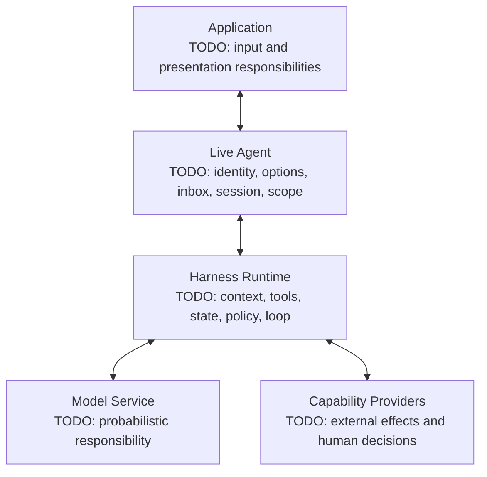

# Module 01 Architecture Map — Learner Deliverable

Complete this file for one bounded task. Keep it to one page when rendered, and remove every `TODO` before retaining or sharing it.

| Field | Value |
|---|---|
| Task | Inspect the current workspace and list its Markdown files without modifying files or running shell commands |
| Application entry point | TODO |
| Provider and model identifier | TODO — never include the credential |
| DSH install package | `@deepseek-ai/dsh@0.1.0-rc.6` |
| Reviewed source | `47f943859bef60e4160492346772ded9b24f765a` |
| Evidence source | TODO — official lifecycle or sanitized session trajectory |
| Author and date | TODO |

## Responsibility map

## Turn trace

| Order | Observation or expected event | Primary owner | Evidence | Uncertainty class |
|---:|---|---|---|---|
| 1 | TODO | TODO | TODO | TODO |
| 2 | TODO | TODO | TODO | TODO |
| 3 | TODO | TODO | TODO | TODO |
| 4 | TODO | TODO | TODO | TODO |
| 5 | TODO | TODO | TODO | TODO |
| 6 | TODO | TODO | TODO | TODO |
| 7 | TODO | TODO | TODO | TODO |
| 8 | TODO | TODO | TODO | TODO |

Use only these uncertainty labels: `specified/replayable`, `probabilistic`, or `external/interactive`.

## Same model, different harness

- Configuration A — listing tool visible: TODO
- Configuration B — listing tool hidden: TODO
- What may change: TODO
- What this comparison cannot guarantee: TODO

## Boundary statements

1. The model proposes; the harness TODO.
2. Durable state belongs to TODO and is rendered by TODO.
3. The application presents approval, while enforcement belongs to TODO.
4. A sandbox mode governs TODO but does not by itself govern TODO.

## Sanitization check

- [ ] No `TODO` remains.
- [ ] No credential, secret, private path, proprietary content, or raw session export is present.
- [ ] Every model-visible claim has a source event or an explicit “expected from official lifecycle” label.
- [ ] Tool proposal, tool admission, tool execution, and tool result are separate responsibilities.
- [ ] The map names one primary owner for every row.

Source lesson: [Module 01 — Agent = Model + Harness](README.md).
