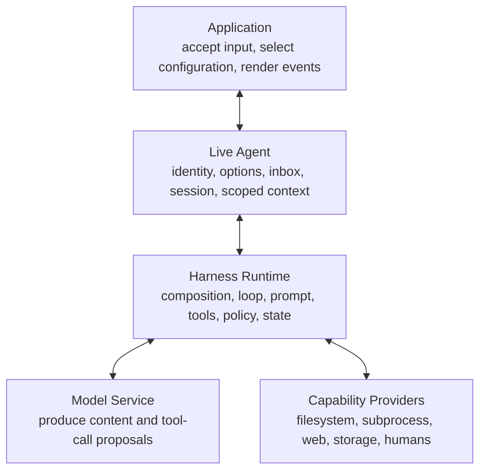
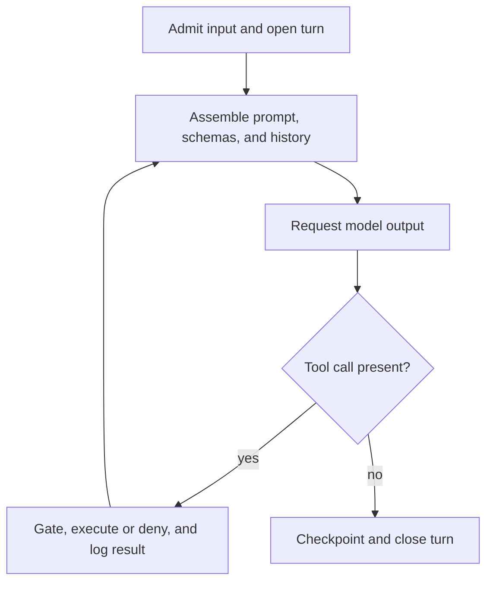

# Module 01 — Agent = Model + Harness

## Outcome

After this module, you can:

- distinguish a model, a live agent, the harness runtime, and an application;
- assign tools, context, state, policy, and loop control to the correct owner;
- explain why the same model can behave differently in two harness configurations;
- separate probabilistic model decisions from engineered control flow and external I/O; and
- produce a one-page architecture map for a DeepSeek Harness task.

Estimated time: **40–55 minutes**.

## Verification status

This lesson is a **source-reviewed draft**, not a verified release.

- The architecture, agent lifecycle, prompt assembly, tool pipeline, session, permission, and application boundaries were reviewed at upstream commit [`47f943859bef60e4160492346772ded9b24f765a`](https://github.com/deepseek-ai/deepseek-harness/commit/47f943859bef60e4160492346772ded9b24f765a).
- npm metadata was checked on 2026-08-13. The current installable CLI package was [`@deepseek-ai/dsh@0.1.0-rc.6`](https://www.npmjs.com/package/@deepseek-ai/dsh/v/0.1.0-rc.6).
- The reviewed source still identified the CLI as `0.1.0-rc.5`, so the install package and immutable source reference remain recorded separately.
- The exercise is documentation-only and requires no model request, credential, or tool execution. Its source links and local Markdown checks were reviewed, but an independent learner pass is still pending.

Do not change this module to `status: verified` until [the repository verification policy](../../../docs/VERSIONING.md) has been satisfied.

## Why this mental model matters

When an agent reads a file, it is tempting to say, “the model read the file.” That sentence hides the most important engineering boundary.

The model generated content that may have included a tool-call request. The harness decided which tool schemas the model could see, routed the request, applied policy, executed or denied the call, recorded the result, and decided whether another model step was owed. An application accepted the user's input and rendered the resulting session.

The module title is therefore a **course mnemonic**, not an upstream TypeScript equation:

> **Observed agent behavior ≈ model behavior + harness composition + current input and durable state.**

In DeepSeek Harness, `Agent` also has a precise runtime meaning: a live handle with a shared session identity, provider/model options, a session, an inbox, status, and an agent-scoped context. The default agent loop drives that handle. Keep the mnemonic and the implementation term distinct.

## Prerequisites

- Read or complete [Module 00 — Quick Start](../00-quick-start/README.md).
- Be able to read a Mermaid diagram and a Markdown table.
- Use a local copy of this repository and a disposable location for your completed map.
- No API key, running DSH process, or model charge is required.

## Lesson 1 — Four boundaries, four jobs

The following diagram is a responsibility map, not a deployment topology. Some application and harness capabilities are themselves mounted as plugins, but they still play different roles during a task.



| Boundary | Owns | Does not own by itself |
|---|---|---|
| **Model** | Producing assistant content and possible tool-call blocks from the request it receives | Direct filesystem or shell access, durable DSH session state, approval enforcement, or UI rendering |
| **Agent** | One live identity and its provider/model options, inbox, session, status, and scoped context | The model weights, every global plugin, or the browser interface |
| **Harness** | Plugin composition, prompt and tool-schema assembly, the turn/step driver, tool dispatch, policy seams, session events, and capability routing | Guaranteed-correct model decisions or automatically trustworthy plugins and tools |
| **Application** | Human or automation entry points such as the Web UI, headless runner, or SDK integration; input, selection, and presentation | Model inference or the authoritative execution policy |

DeepSeek Harness implements these responsibilities through Cordis plugins. The official architecture says the model adapter, tool registry, session log, and agent loop are all plugins. A profile composes ordered bundles and patches; the `web` and `headless` profiles add different application surfaces over a shared base composition.

## Lesson 2 — The five harness responsibilities

### Context

Before each model step, registered plugins assemble ordered prompt sections, dynamic context, variables, and the tool schemas visible to that agent scope. The loop also derives retained model history from the session log. Context is therefore **constructed**, not whatever the model happens to remember.

### Tools

A tool has two relevant surfaces:

1. a schema shown to the model; and
2. an execution path owned by the harness and a capability provider.

Visible schemas advertise the registered calls available to the model; a model can still emit malformed arguments or an unknown call. Seeing a schema is not permission to complete the side effect. DeepSeek Harness records a `tool/call`, runs pre-execution policy and guards, optionally requests one-shot approval, executes or denies the body, runs post-processing, and records one authoritative `tool/result`.

### State

The append-only session event log is the durable source of truth. The loop projects model-visible history from it; UI replay, resume, fork, transcripts, telemetry, and persistence also derive from that event stream. A live `agent/*` notification coordinates current work, while durable `turn/*`, `step/*`, message, call, and result events reconstruct what happened later.

### Policy

Policy is not one switch. The default permission presets bundle two independent knobs:

- the **sandbox mode**, which governs specified filesystem effects for confined processes; and
- the **approval policy**, which governs when a person must decide.

The preset selector records intent and writes those knobs; it does not enforce operations by itself. Enforcement occurs in the relevant tool, filesystem, subprocess, sandbox, approval, and guard seams. In particular, `workspace-write` is not a general privacy boundary: the process-sandbox vocabulary does not cover network or process visibility.

### Feedback loop

DeepSeek Harness defines a **step** as one model request plus the tool executions caused by its response. A **turn** contains zero or more steps. If a tool result or newly admitted input means the model owes another response, the driver opens another step; otherwise it reaches the stopping checkpoint and closes the turn.

This feedback loop is what turns a single completion into agentic work:



## Lesson 3 — Why the same model behaves differently

Holding the provider and model identifier constant does not hold the full request or execution environment constant.

| Harness difference | Likely observable consequence |
|---|---|
| Different persona or system-prompt sections | Different priorities, tone, constraints, or planning style |
| Different visible tool schemas | Different actions are available for the model to propose |
| Different agent scope or tool restrictions | A global capability may be hidden, replaced, or agent-local |
| Different session history or injected context | The model receives different evidence and prior decisions |
| Different policy and capability providers | The same proposed call may run, ask, fail, or be denied |
| Different provider adapter or request options | Serialization, model routing, token limits, and error handling may differ |
| Different profile, bundles, or patches | The runtime may mount a different application and capability graph |

This is why a useful bug report records the model **and** the harness configuration, session evidence, tool/policy outcome, package version, and source baseline.

## Lesson 4 — Deterministic infrastructure around uncertain behavior

“Deterministic harness” is useful shorthand only when its limits are explicit.

| Category | Examples | Engineering response |
|---|---|---|
| **Specified and replayable control** | Plugin/profile order, scoped schema visibility, prompt-section ordering, event vocabulary, tool-pipeline order, session projection | Pin configuration and versions; test invariants and replay |
| **Probabilistic model behavior** | Wording, reasoning path, whether to call a tool, call arguments, stopping behavior | Evaluate across repeated golden tasks; verify evidence rather than exact prose |
| **External or interactive variability** | Provider availability, filesystem contents, network data, process timing, human approval, third-party tool behavior | Bound time and permissions; capture inputs/results; handle denial, timeout, and partial failure |

The harness makes control points inspectable and testable. It does not make a probabilistic model, a changing external service, or an arbitrary plugin deterministic.

## Lesson 5 — What DeepSeek Harness does and does not do

### It does

- compose profiles, bundles, patches, and replaceable plugins;
- route provider/model requests through LLM adapters;
- drive live agents through a turn-and-step loop;
- assemble prompt sections, dynamic context, session history, and tool schemas;
- gate and dispatch tool calls through documented policy and execution seams;
- append durable events for replay and projection; and
- expose Web, headless, and SDK-facing application paths over those capabilities.

### It does not

- own or improve the selected model's weights;
- give the model direct operating-system access outside registered capabilities;
- guarantee that a model proposal is correct, safe, or useful;
- make `workspace-write` a network, process, or data-privacy sandbox;
- make third-party plugins trustworthy merely because they load successfully;
- eliminate the need for human review, evaluation, incident evidence, or upgrade testing; or
- promise compatibility across developer-preview releases.

## Lab — Map one read-only turn

Your deliverable is a completed copy of [ARCHITECTURE-MAP.md](ARCHITECTURE-MAP.md). Use the bounded task below:

> Inspect the current workspace and list its Markdown files. Do not modify files or run shell commands.

You may use a sanitized trajectory from Module 00 if you have one. Otherwise, trace the task from the official lifecycle and tool-pipeline diagrams. This exercise does **not** ask you to run the task again.

### Step 1 — Create a disposable learner copy

From the repository root, run:

```sh
MODULE01_WORK="$(mktemp -d)"
cp course/en/01-agent-model-harness/ARCHITECTURE-MAP.md "$MODULE01_WORK/architecture-map.md"
printf '%s\n' "$MODULE01_WORK/architecture-map.md"
```

**Expected result:** the last line prints the path to an editable Markdown file outside the repository.

### Step 2 — Label the four boundaries

Replace the `TODO` labels in the diagram with:

- the application entry point you are tracing;
- the live agent facts that persist for this task;
- the harness responsibilities used before, during, and after inference; and
- the provider/model route, without any credential value.

**Expected result:** every responsibility appears under one primary owner. Shared responsibilities may name a secondary owner in the notes, but “everything” is not a valid owner.

### Step 3 — Trace one turn

Fill the event trace in causal order:

1. the application sends input to the agent inbox;
2. the driver opens a turn and claims admitted input;
3. the harness assembles prompt sections, visible tool schemas, and history;
4. the LLM adapter sends one request to the selected model;
5. the model returns content and may propose a tool call;
6. the harness records, gates, executes or denies, and records each call result;
7. the driver either owes another step or stops the turn; and
8. the application renders durable session evidence and live status.

If you use a real sanitized trajectory, record only events you observed. If no tool was called, state that the tool branch was not taken; do not invent one.

### Step 4 — Run the same-model perturbation test on paper

Keep the provider and model fixed. Compare these two configurations:

- **A:** a filesystem-listing schema is visible and read operations are permitted;
- **B:** that schema is hidden from the agent scope.

Write one sentence predicting what can change and one sentence naming what cannot be concluded. A strong answer notes that A advertises a registered tool route, while B removes that registered route; neither configuration prevents an invalid proposal or guarantees the model's final correctness.

### Step 5 — Classify uncertainty

Mark every row in your trace as one of:

- `specified/replayable`;
- `probabilistic`; or
- `external/interactive`.

Do not label tool output as deterministic merely because the harness invoked the tool in a specified order.

### Step 6 — Verify the artifact

Run:

```sh
grep -n 'TODO' "$MODULE01_WORK/architecture-map.md"
```

**Expected result:** no output and exit status `1`, meaning no placeholder remains. Then review the map against this ownership key:

| Observation | Primary owner |
|---|---|
| Assistant text or proposed tool-call arguments | Model |
| Visible tool schemas and prompt sections | Harness composition |
| Live identity, inbox, options, and session reference | Agent |
| Tool admission, execution pipeline, and durable result | Harness plus the configured capability/policy providers |
| Session display and user controls | Application |

Save the completed, sanitized map somewhere you control if you want to retain it. The temporary directory may be removed by the operating system.

## Safety notes

- This lab requires no credential, provider request, workspace access, or command execution by an agent.
- Do not paste API keys, private paths, raw prompts, proprietary file contents, or unsanitized session exports into the map.
- A conceptual policy box is not proof that a deployment enforces that policy. Record the configured provider, mode, backend, and observed decision when making a real security claim.
- Treat every third-party plugin and capability provider as executable code that requires its own review.

## Troubleshooting

| Symptom | Likely cause | Correction |
|---|---|---|
| The model box contains “read file” or “run shell” | Proposal and execution were collapsed | Put tool-call generation under the model; put admission and execution under the harness/capability path |
| The agent and harness boxes are identical | The live handle was confused with the runtime that drives it | Keep identity, options, inbox, session, status, and scoped context on the agent; keep composition and the driver on the harness |
| The application box owns approval enforcement | Presentation was confused with authority | The UI may collect a decision; the approval/policy service and tool pipeline apply it |
| Every row is marked deterministic | Model and external effects were ignored | Reclassify model output as probabilistic and external I/O or human decisions as external/interactive |
| The map describes `master` but not a commit | A moving reference was used | Use the immutable source reference in the template |
| `grep` still prints lines | Placeholders remain | Replace each `TODO` with a concrete owner, event, or boundary statement |

## Completion check

- [ ] I can explain why a model does not directly possess filesystem tools.
- [ ] I can distinguish the live `Agent` handle from the agent-loop plugin.
- [ ] My map assigns context, tools, state, policy, and loop control.
- [ ] My trace distinguishes a turn from a step.
- [ ] My map identifies durable session evidence separately from live coordination.
- [ ] I explained one same-model/different-harness behavior change.
- [ ] I classified model, control-flow, and external uncertainty separately.
- [ ] No `TODO`, credential, private path, or unsanitized session content remains.

## Deliverable

One completed, sanitized copy of [ARCHITECTURE-MAP.md](ARCHITECTURE-MAP.md) that another developer can use to identify who owns each decision and observable event in one bounded task.

## Official sources

- [DeepSeek Harness architecture at the reviewed commit](https://github.com/deepseek-ai/deepseek-harness/blob/47f943859bef60e4160492346772ded9b24f765a/docs/architecture.md)
- [Core agent and agent-loop reference at the reviewed commit](https://github.com/deepseek-ai/deepseek-harness/blob/47f943859bef60e4160492346772ded9b24f765a/docs/subsystems/core.md)
- [Agent turn and step lifecycle at the reviewed commit](https://github.com/deepseek-ai/deepseek-harness/blob/47f943859bef60e4160492346772ded9b24f765a/docs/agent-lifecycle.md)
- [System-prompt assembly reference at the reviewed commit](https://github.com/deepseek-ai/deepseek-harness/blob/47f943859bef60e4160492346772ded9b24f765a/docs/subsystems/system-prompt.md)
- [Tool execution pipeline at the reviewed commit](https://github.com/deepseek-ai/deepseek-harness/blob/47f943859bef60e4160492346772ded9b24f765a/docs/tool-execution-pipeline.md)
- [Session subsystem at the reviewed commit](https://github.com/deepseek-ai/deepseek-harness/blob/47f943859bef60e4160492346772ded9b24f765a/docs/subsystems/session.md)
- [Permission preset reference at the reviewed commit](https://github.com/deepseek-ai/deepseek-harness/blob/47f943859bef60e4160492346772ded9b24f765a/docs/subsystems/permission-presets.md)
- [Process sandbox reference at the reviewed commit](https://github.com/deepseek-ai/deepseek-harness/blob/47f943859bef60e4160492346772ded9b24f765a/docs/subsystems/sandbox.md)
- [CLI base composition at the reviewed commit](https://github.com/deepseek-ai/deepseek-harness/blob/47f943859bef60e4160492346772ded9b24f765a/apps/cli/composition.md)

## Next module

[Module 02 — Understanding the Plugin Architecture](../../../SYLLABUS.md#module-02--understanding-the-plugin-architecture) is planned. Until it is published, use the syllabus as the learning map.
