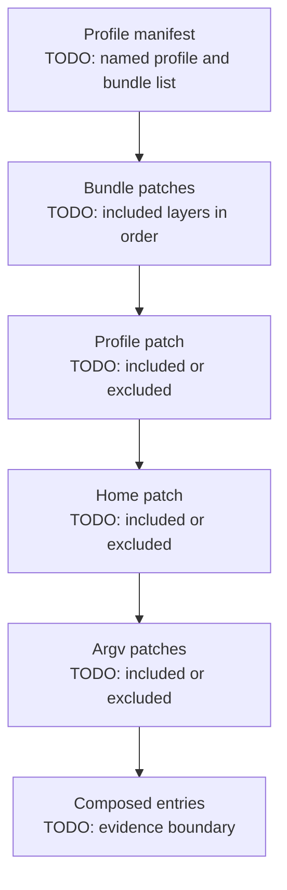
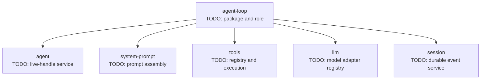
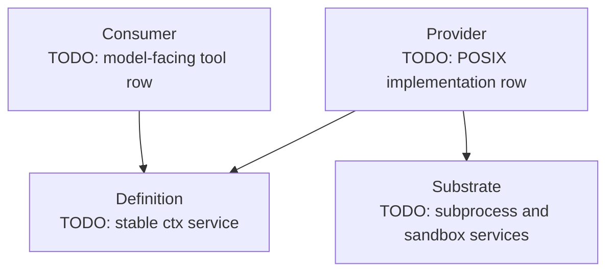

# Module 02 Plugin Map — Learner Deliverable

Complete this file from the boot-free default Web config dump. Replace every placeholder marker before retaining or sharing the map. Do not claim that a composed row reached `ACTIVE` unless you also have sanitized evidence from a real boot.

## Evidence record

| Field | Value |
|---|---|
| Profile | `web` |
| Dump mode | `--dump-default-config` — shipped bundles only |
| DSH install package | `@deepseek-ai/dsh@0.1.0-rc.6` |
| Reviewed source | `47f943859bef60e4160492346772ded9b24f765a` |
| Dump command and date | TODO: record the command without a private path, plus the date |
| Dump result | TODO: record exit status and a sanitized evidence description |
| Runtime evidence | None — composition dump only, unless TODO: add a separate sanitized boot observation |
| Author | TODO: name or pseudonym |

## Composition stack

Label what this dump includes and excludes. The bottom layer has the highest precedence when multiple layers target the same stable row `id`.

| Layer | Evidence in this dump | Precedence or purpose |
|---|---|---|
| Shipped base bundle | TODO: bundle name and evidence | TODO: shared foundation |
| Shipped Web application bundle | TODO: bundle name and evidence | TODO: mode-specific additions or replacements |
| Profile `cordis.patch.yml` | TODO: included or excluded | TODO: precedence |
| Home `cordis.patch.yml` | TODO: included or excluded | TODO: precedence |
| Argv `--patch` overlays | TODO: included or excluded | TODO: precedence |

Whole-config rule: TODO: explain what happens when a later patch targets an existing row and supplies only one configuration key.

## Core runtime slice

Use official service references for dependency arrows. YAML proximity alone is not evidence.

## Replaceable shell seam

Annotate the definition, selected provider, and consumer. Keep disabled platform alternatives distinct from the provider selected for a real host.

| Seam role | Service or package | Evidence and responsibility |
|---|---|---|
| Definition | TODO: stable service key and defining package | TODO: contract owned here |
| Provider | TODO: selected provider row and package | TODO: concrete execution behavior |
| Consumer | TODO: consumer row and package | TODO: model-facing or integration behavior |
| Supporting substrate | TODO: supporting service rows | TODO: process and policy responsibilities |

## Runtime row inventory

Fill at least eight rows. Use `composed` for dump-only evidence; reserve `ACTIVE`, `PENDING`, or `FAILED` for an observed boot.

| Row `id` | Package or module | Layer | Service role or injection | Evidence level | Why it is in this slice |
|---|---|---|---|---|---|
| `llm` | TODO: | TODO: | TODO: | TODO: | TODO: |
| `session` | TODO: | TODO: | TODO: | TODO: | TODO: |
| `agent` | TODO: | TODO: | TODO: | TODO: | TODO: |
| `tools` | TODO: | TODO: | TODO: | TODO: | TODO: |
| `system-prompt` | TODO: | TODO: | TODO: | TODO: | TODO: |
| `agent-loop` | TODO: | TODO: | TODO: | TODO: | TODO: |
| `bash-sandbox` | TODO: | TODO: | TODO: | TODO: | TODO: |
| `tool-bash` | TODO: | TODO: | TODO: | TODO: | TODO: |
| TODO: optional ninth row | TODO: | TODO: | TODO: | TODO: | TODO: |

## Event and durability boundary

| Example | Category | Durable by itself? | Producer or owner | Consumer or purpose | Evidence |
|---|---|---:|---|---|---|
| TODO: one session event | Durable session record | TODO: | TODO: | TODO: | TODO: |
| TODO: one `agent/*` event | Live coordination | TODO: | TODO: | TODO: | TODO: |
| TODO: one capability event | Live service event | TODO: | TODO: | TODO: | TODO: |

Waterfall rule: TODO: explain when a listener must call `next()` and when short-circuiting is intentional.

## Lifecycle observations

| Scenario | Expected fiber behavior | Effects that must unwind | Evidence type |
|---|---|---|---|
| A required service is absent at startup | TODO: | TODO: | Official lifecycle prediction |
| An active provider disappears during reload | TODO: | TODO: | Official lifecycle prediction |
| The provider returns | TODO: | TODO: | Official lifecycle prediction |
| A plugin throws while loading | TODO: | TODO: | Official lifecycle prediction |

One claim that requires a real boot observation: TODO: state a concrete `ACTIVE`, `PENDING`, or failure claim you did not infer from the dump.

## Unapplied patch prediction

Use a non-secret row. Do not weaken sandbox or approval policy, change credentials or endpoints, or enable telemetry for this paper exercise.

| Field | Prediction |
|---|---|
| Target row `id` | TODO: |
| Winning patch layer | TODO: |
| Complete current `config` to preserve | TODO: |
| Complete replacement `config` after one bounded change | TODO: |
| Fiber expected to reconfigure or reload | TODO: |
| Possible dependent consumers | TODO: |
| Security assumption to recheck | TODO: |
| Why this remains unapplied | TODO: |

Patch reasoning: TODO: explain why omitting an old key is deletion-by-replacement, not inheritance through a deep merge.

## Trust and sanitization review

- [ ] The package name and version are exact, and the source reference is immutable.
- [ ] Default bundle evidence is not presented as local effective-config or runtime evidence.
- [ ] Every dependency arrow comes from a service or event contract, not YAML row order.
- [ ] The selected provider is distinguished from disabled platform alternatives.
- [ ] No credential, token, private endpoint, username, absolute private path, proprietary plugin, or raw user configuration is present.
- [ ] Third-party host plugins are treated as trusted code, not as code confined by the model-facing tool sandbox.
- [ ] The hypothetical patch is complete, unapplied, and does not relax a security control.
- [ ] No placeholder marker remains.

Source lesson: [Module 02 — Understanding the Plugin Architecture](README.md).
