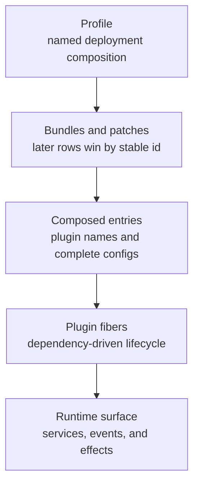
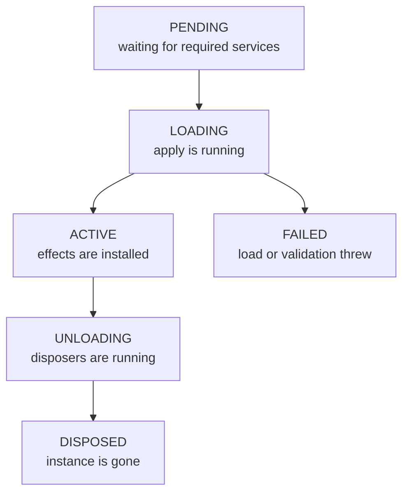
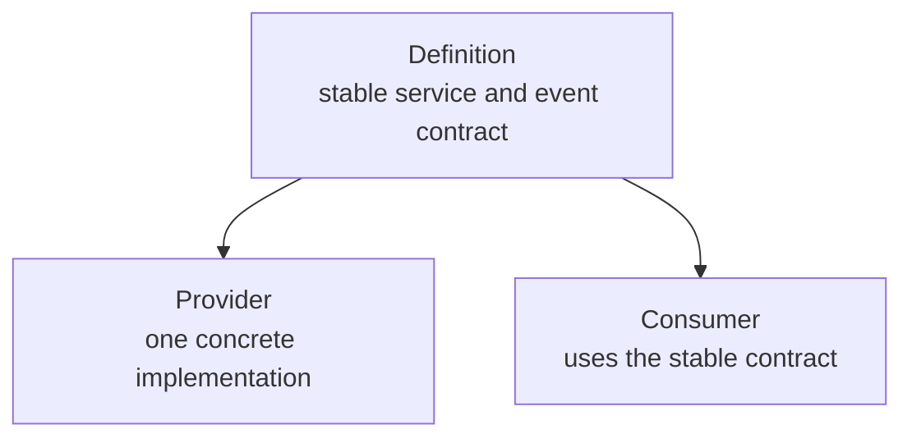

# Module 02 — Understanding the Plugin Architecture

## Outcome

After this module, you can:

- explain how Cordis contexts, plugins, fibers, services, events, and effects fit together;
- trace a DSH profile through bundles and patch layers into an active plugin tree;
- distinguish configuration order from dependency-driven activation order;
- separate durable session events from live extension events;
- identify a capability's definition, provider, and consumer; and
- produce an annotated runtime map from the default `web` profile composition.

Estimated time: **45–60 minutes**.

## Verification status

This lesson is a **source-reviewed draft**, not a verified release.

- The Cordis lifecycle, composition loader, default bundle, capability seams, event boundaries, and CLI dump behavior were reviewed at upstream commit [`47f943859bef60e4160492346772ded9b24f765a`](https://github.com/deepseek-ai/deepseek-harness/commit/47f943859bef60e4160492346772ded9b24f765a).
- npm metadata was checked on 2026-08-13. The current installable CLI package was [`@deepseek-ai/dsh@0.1.0-rc.6`](https://www.npmjs.com/package/@deepseek-ai/dsh/v/0.1.0-rc.6).
- The reviewed source still identified the CLI as `0.1.0-rc.5`, so this course records the package and source baselines separately.
- The documented `--dump-default-config` path is boot-free: it composes configuration without starting application providers, calling a model, or evaluating `!!js` expressions. The command has not yet passed this course's clean-platform verification because the current review environment could not complete the package's native `node-pty` build.
- The lesson's links, Markdown, and diagrams are checked locally. A clean macOS/Linux config dump and an independent learner pass remain pending.

Do not change this module to `status: verified` until [the repository verification policy](../../../docs/VERSIONING.md) has been satisfied.

## Why this architecture matters

DeepSeek Harness does not hide a fixed agent behind one privileged core. The official architecture describes the model adapter, session log, tool registry, agent loop, application surfaces, and many policy or execution capabilities as plugins. A running DSH process is therefore a **composed plugin tree**.

That choice creates useful engineering seams:

- a consumer can depend on a stable service key instead of one concrete package;
- a deployment can replace a provider without rewriting the consumer;
- observers and policies can participate through typed events;
- registrations can disappear cleanly when their owning plugin unloads; and
- profiles can select a complete runtime by layering reusable bundles and local patches.

The practical mental model for this module is:



The arrows describe how to inspect the runtime. They do not mean every entry activates sequentially in file order.

## Prerequisites

- Complete [Module 01 — Agent = Model + Harness](../01-agent-model-harness/README.md).
- Use a local copy of this repository and a POSIX shell on macOS or Linux for the lab commands.
- Have Node.js and npm available. The exact Node.js support range should be checked against the package being installed because DSH is a developer preview.
- Permit `npx` to download only the exact official package named in the command.
- No API key, provider request, running Web server, or model charge is required.

## Lesson 1 — The Cordis runtime vocabulary

Cordis is the vendored plugin framework under DeepSeek Harness. These terms describe different layers of the same runtime; treating them as synonyms makes load failures and extension design unnecessarily difficult.

| Term | Meaning in this course | Question it answers |
|---|---|---|
| **Context** | A scoped repository of services plus plugin, event, and effect APIs | What capabilities can this plugin see here? |
| **Plugin** | A function, object with `apply(ctx)`, or `Service` subclass mounted into a context | What behavior is being installed? |
| **Fiber** | The runtime handle and lifecycle state for one mounted plugin instance | Did this instance wait, load, fail, or unload? |
| **Service** | A capability published under a stable `ctx.<key>` | What direct operation can a dependent call? |
| **Injection** | A declaration of required service keys, conventionally through `inject` | What must exist before this plugin may activate? |
| **Event** | A typed communication contract owned by a service or subsystem | Who may observe, wrap, fan out, or sequence work? |
| **Effect** | A registration or acquired resource with a disposer tied to plugin lifetime | What must be undone on unload? |
| **Entry** | A configuration row with a plugin name, stable `id`, config, and optional metadata | What instance should the loader mount? |
| **Profile** | A named deployment composition with a manifest and local patch | Which application are we booting? |
| **Bundle** | A reusable package of composition rows or patch code | Which shared capability set is included? |
| **Patch** | A later overlay that inserts or replaces rows by stable identity | What differs in this deployment? |
| **Capability seam** | A stable interface whose provider and consumers can vary independently | Where can implementation be replaced safely? |

### Plugins depend on services, not manual timing

A plugin declares the services it requires. If a required service is absent, its fiber remains `PENDING`; when the service appears, loading can continue. The loader mounts entries concurrently, so a row's visual position in YAML is not a promise that its `apply` function runs before the next row.

This is the relevant lifecycle:



The dependency behavior is dynamic. If a required provider disappears during configuration reload or disposal, dependent plugins unload and their effects unwind. If the provider returns, eligible dependents can load again. This is why service injection is both a startup mechanism and a lifecycle relationship.

### Effects make unloading meaningful

Cordis registrations are expected to be reversible. Event listeners registered with `ctx.on()`, child plugins mounted with `ctx.plugin()`, service publications, and harness registrations such as `ctx.tools.register()` participate in plugin-owned cleanup. A timer, socket, watcher, or other resource created outside those helpers belongs inside `ctx.effect()` with a disposer.

This rule is essential for hot reload and provider replacement: unloading must remove the old listener, schema, adapter, or resource before a new instance becomes authoritative.

## Lesson 2 — From a profile to active fibers

The shipped `web` and `headless` profiles are named compositions. On first use, DSH initializes their templates; the `web` template selects the shared base bundle plus the Web application bundle.

The effective tree is composed in this precedence order:

| Order | Layer | Purpose | Included by `--dump-default-config`? |
|---:|---|---|---|
| 1 | Bundles in the profile manifest, in listed order | Shared core followed by mode-specific composition | Yes |
| 2 | Profile `cordis.patch.yml` | Changes local to this named profile | No |
| 3 | `$DSH_HOME/cordis.patch.yml` | Machine-local preferences shared across profiles | No |
| 4 | Each `--patch <path>`, in command-line order | One-run or deployment overlays | No |

Later layers win **per row identity**. A patch can also insert a new row.

### A patch is not a deep merge

When a patch targets an existing `id`, it replaces that row's complete `config` value. It does not recursively merge only the keys shown. For example, if the active row has:

```yaml
- id: example
  name: '@example/plugin'
  config:
    mode: safe
    timeoutMs: 30000
```

a later patch that supplies only `timeoutMs` must be treated as the complete replacement configuration for that row:

```yaml
- id: example
  config:
    timeoutMs: 60000
```

Do not assume `mode: safe` survives. Before applying a real patch, inspect the effective row, restate every configuration value you intend to preserve, and review the resulting security boundary.

### Entries become fibers through dependencies

Composition determines the candidate entries and their complete configuration. Cordis then mounts those entries, resolves plugin modules, and lets required service availability drive activation. Keep these two orders separate:

| Order | Determined by | What it controls |
|---|---|---|
| Composition precedence | Bundle list and patch layers | Which row and complete config survive |
| Activation order | Required services and plugin lifecycle | When a fiber can become active |
| Event order | The event's dispatch contract and listener registration | How listeners observe or transform a dispatch |

If a plugin appears in the composed file but does nothing, first inspect whether it is disabled, unresolved, failed, or waiting in `PENDING`. Moving its row upward is not a dependency fix.

## Lesson 3 — Inspect the composition instead of guessing

The CLI exposes two boot-free inspection modes:

| Command mode | What it composes | Best use |
|---|---|---|
| `--dump-default-config` | Shipped bundle layers only | Establish a clean profile baseline |
| `--dump-config` | Bundles plus profile, home, and argv patch layers | Diagnose the effective local deployment |

Both use the same composition parser and patch algorithm as boot. They print configuration without starting application providers, and unevaluated `!!js` expressions remain visible. A dump proves what was composed; it does not prove that every module resolves or every fiber reaches `ACTIVE` during a real boot.

The default base bundle includes the core spine—such as `llm`, `session`, `agent`, `tools`, `system-prompt`, and `agent-loop`—alongside providers, policy, persistence, and model-facing tool plugins. The Web bundle then adds the application surface. This is a large graph, so the lab maps a bounded slice rather than copying every row.

Use this diagnostic ladder:

1. **Identify the profile and exact package.** A moving `latest` tag is not evidence.
2. **Dump the default composition.** Learn what the shipped bundles contribute.
3. **Dump the effective composition when diagnosing a machine.** Compare later patch layers by stable row `id`.
4. **Inspect the entry.** Confirm `name`, complete `config`, `disabled`, group, and isolation metadata.
5. **Inspect runtime state during a real boot.** Distinguish `PENDING`, `FAILED`, and `ACTIVE` instead of inferring from file order.
6. **Trace the service or event contract.** Confirm the required provider and the owning subsystem.

## Lesson 4 — Services, events, and durable records

Choose the communication surface based on ownership and durability.

### Direct services

Use a service method when a consumer needs one capability directly and the service contract owns the operation. The consumer injects the stable service key and does not need to import a concrete provider.

### Typed live events

Use an event when multiple plugins may observe, intercept, wrap, or sequence behavior without knowing each other. Cordis records the dispatch mode as part of the event contract:

| Mode | Behavior | Typical use |
|---|---|---|
| `emit` | Synchronous observation in registration order; no result | Notifications |
| `waterfall` | Around-middleware; a listener delegates with `next()` or deliberately short-circuits | Policy and transformation pipelines |
| `parallel` | Await all listeners concurrently | Independent asynchronous observers |
| `serial` | Await listeners in order and return a result | Ordered asynchronous processing |

A `waterfall` observer that forgets to call `next()` is not neutral—it stops downstream handling. Short-circuit only when the listener owns that decision.

### Durable session events

DeepSeek Harness also has an append-only session event log. Session events are durable facts used for replay, projection, persistence, and later inspection. When appended, a durable record can also be broadcast live through the session surface; the live notification is not a second source of truth.

Keep three categories distinct:

| Category | Durable by itself? | Examples of purpose |
|---|---:|---|
| Session event record | Yes | Turn, step, message, tool-call, tool-result, and domain state history |
| Live `agent/*` event | No | Current process coordination and status |
| Capability event | No, unless a handler explicitly appends evidence | Policy, interception, observation, and provider-neutral dispatch |

Do not append every transient callback to the session merely for debugging. Define durable events for facts that must survive restart or support replay; use live events for process-local coordination.

## Lesson 5 — Capability seams and safe extension points

A replaceable capability normally has three roles:



The shell path is a concrete example from the official capability map:

| Role | Example | Responsibility |
|---|---|---|
| Definition | `ctx.shell` from the shell contract | Stable execution interface |
| Provider | `bash-local`, `bash-sandbox`, or `pwsh-local` | Concrete execution and platform behavior |
| Consumer | `tool-bash`, `tool-pwsh`, or a hook bridge | Model-facing or integration-facing behavior |

In the default base composition, POSIX platforms select the `bash-sandbox` row while the Windows-specific rows use PowerShell. Replacing a provider should not require rewriting a consumer that depends only on the contract.

Not every service is a replaceable seam. The generated capability map classifies services such as core registries, replaceable seams, and bundle-level composition points. Check the authoritative service map before inventing a provider strategy.

### Select the smallest extension surface

| Need | Prefer | Reason |
|---|---|---|
| Call one owned capability | Inject and call its service | Direct, typed ownership |
| Observe an outcome | Subscribe to the documented event | No dependency on another observer |
| Enforce or transform a pipeline | Use its documented waterfall or policy hook | Preserves the owning pipeline and ordering contract |
| Add an item to a registry | Register through the owning service as an effect | Automatic cleanup on unload |
| Preserve a replayable fact | Append a defined session event | Durable, projectable evidence |
| Replace execution or storage | Implement the documented provider seam | Consumers remain provider-neutral |
| Change a deployment | Patch a stable composition row | Keeps application choice outside consumer code |
| Add a user or automation surface | Build an application plugin over existing services | Does not duplicate the agent core |

Avoid reaching into a concrete provider's internals when the stable service or event already exposes the required behavior. Avoid monkey-patching the loop when a registry, policy event, or provider seam owns the change.

### Host-plugin trust boundary

Cordis plugins are Node.js modules loaded into the host process. **Operational inference:** the tool execution sandbox documented by DSH is not a sandbox for arbitrary plugin module code. Treat third-party plugins and bundles as trusted-code installation:

- review source, dependencies, install scripts, requested services, and configuration;
- pin exact versions and retain an origin record;
- test in a disposable DSH home before using real credentials or workspaces;
- inspect every patch for changes to policy, sandbox, telemetry, storage, or network providers; and
- assume a malicious host plugin can exceed model-facing tool permissions.

## Lab — Annotate the default Web runtime

Your deliverable is a completed copy of [PLUGIN-MAP.md](PLUGIN-MAP.md). The lab uses the official package's boot-free config dump and a temporary DSH home. It does not launch the Web application or contact a model provider.

### Step 1 — Create a disposable learner copy

From the repository root, run:

```sh
MODULE02_WORK="$(mktemp -d)"
cp course/en/02-plugin-architecture/PLUGIN-MAP.md "$MODULE02_WORK/plugin-map.md"
printf '%s\n' "$MODULE02_WORK"
```

**Expected result:** the last line prints a newly created temporary directory. Keep this shell open so the `MODULE02_WORK` value remains available.

### Step 2 — Dump only the shipped Web bundles

Run the exact package version recorded by this lesson:

```sh
DSH_HOME="$MODULE02_WORK/dsh-home" \
  npx @deepseek-ai/dsh@0.1.0-rc.6 web --dump-default-config \
  > "$MODULE02_WORK/web-default.cordis.yml"
test -s "$MODULE02_WORK/web-default.cordis.yml"
```

`npx` may ask before downloading the package. Confirm that the prompt names exactly `@deepseek-ai/dsh@0.1.0-rc.6`; otherwise cancel.

**Expected result:** both commands exit `0`, and `web-default.cordis.yml` is non-empty. The command may initialize files only below the temporary `DSH_HOME`. It must not start a server or request an API key.

### Step 3 — Establish composition evidence

Inspect the start of the dump and locate the core and execution rows:

```sh
sed -n '1,80p' "$MODULE02_WORK/web-default.cordis.yml"
grep -nE 'id: (llm|session|agent|tools|system-prompt|agent-loop)$' \
  "$MODULE02_WORK/web-default.cordis.yml"
grep -nE 'id: (subprocess|sandbox|bash-sandbox|tool-bash|fs-sandbox|tool-fs)$' \
  "$MODULE02_WORK/web-default.cordis.yml"
```

**Expected result:** the first search identifies the core agent spine. On a POSIX package baseline matching the reviewed source, the second search identifies the sandboxed shell and filesystem slice. Platform-disabled rows may still be present because the dump preserves unevaluated expressions.

Record the dump path, package version, profile, command mode, and reviewed source in the map. Do not claim that an entry was `ACTIVE`; a config dump proves composition, not runtime activation.

### Step 4 — Map the composition stack

In `plugin-map.md`:

1. name the base and Web application bundles selected by the shipped profile;
2. mark the profile, home, and argv patch layers as **not included** in this default-only dump;
3. annotate which later layer would win if every layer targeted the same stable row `id`; and
4. note that replacement applies to the row's complete `config`, not individual keys.

**Expected result:** the composition diagram explains both precedence and the evidence limit of the selected dump mode.

### Step 5 — Map two runtime slices

Complete the core-spine and shell-seam diagrams using row names and packages from the dump:

- **Core spine:** `agent-loop` consumes prompt, tool, LLM, agent, and session capabilities to drive work.
- **Shell seam:** the model-facing shell tool consumes the stable shell service; a platform provider uses subprocess and sandbox services to execute.

Then fill at least eight rows in the inventory. For each row, distinguish:

- evidence visible in the dump;
- service dependencies confirmed in an official subsystem or capability reference; and
- a lifecycle claim that would require a real boot observation.

**Expected result:** no arrow is justified only by neighboring YAML line order.

### Step 6 — Classify events and predict one patch

Complete the event table with one durable session record, one live `agent/*` event, and one capability event. State whether each survives process restart by itself.

Choose one non-secret configuration row and write a hypothetical replacement patch **without applying it**. Copy the complete current `config`, make one bounded change, and predict:

- which composition layer would win;
- which plugin fiber would be reconfigured or replaced;
- which dependent services or consumers could be affected; and
- which security assumption must be rechecked.

Do not use a credential, API endpoint, telemetry destination, approval policy, or sandbox relaxation for this paper exercise.

### Step 7 — Verify the artifact

Run:

```sh
grep -n 'TODO:' "$MODULE02_WORK/plugin-map.md"
```

**Expected result:** no output and exit status `1`, meaning no placeholder marker remains. Then confirm the map has:

- the exact package and immutable source reference;
- a clear default-dump evidence boundary;
- at least eight annotated rows;
- definition, provider, and consumer labels for one capability seam;
- durable and live events classified separately; and
- no secret, private path, raw user configuration, or unsanitized output.

Retain the sanitized map somewhere you control if needed. The operating system may eventually remove the temporary directory.

## Safety notes

- The only network action in this lab is the package download that `npx` may require. The config dump itself should not contact a model provider.
- Keep `DSH_HOME` scoped to the temporary directory. Do not experiment against your normal profile or home patch.
- A default config can still reveal package names, environment-expression names, local package resolution, and absolute paths. Review and sanitize it before sharing.
- Do not commit a complete effective `--dump-config` result from a real machine; it may contain local plugins, paths, provider configuration, or other deployment details.
- Reviewing a config row does not establish that the plugin implementation is trustworthy or that its effect is sandboxed.

## Troubleshooting

| Symptom | Likely cause | Correction |
|---|---|---|
| `npx` names a different package or version | A moving tag, typo, or unexpected prompt was accepted | Cancel and rerun the exact versioned command |
| Installation fails while building `node-pty` | Native build prerequisites or the local Node.js/toolchain combination are incomplete | Record the platform and error; use the package's supported Node.js version and native build prerequisites, then retry in a clean environment |
| The dump is empty | The command failed before stdout was written | Rerun without redirection, read stderr, and do not mark the lab complete |
| A searched row is absent | The package composition changed or the wrong package/profile was used | Confirm the exact package, inspect all row ids, and compare against the immutable source baseline |
| The dump unexpectedly contains personal overrides | `--dump-config` or a normal DSH home was used | Return to `--dump-default-config` with the temporary `DSH_HOME` |
| A present entry does nothing during a later real boot | Composition was mistaken for activation | Inspect `disabled`, resolution errors, required services, and fiber state; a missing provider may leave it `PENDING` |
| A patch silently loses an old setting | The patch was treated as a deep merge | Restate the complete intended `config` for the targeted row |
| `grep` still prints lines | Placeholder markers remain | Replace every reported field or diagram label with evidence-backed content |

## Completion check

- [ ] I can trace a profile through bundles and patch precedence into composed entries.
- [ ] I can explain why YAML row order does not determine plugin activation order.
- [ ] I can identify `PENDING`, `ACTIVE`, `FAILED`, and disposal states without conflating them.
- [ ] I can explain how effect cleanup makes hot reload and provider replacement safe to attempt.
- [ ] I can choose between a service call, live event, durable session event, registry contribution, provider seam, and composition patch.
- [ ] I mapped at least one definition/provider/consumer seam from official evidence.
- [ ] I distinguished default composition evidence from real boot evidence.
- [ ] My artifact contains no placeholder, credential, private path, or unsanitized local configuration.

## Deliverable

One completed, sanitized [Module 02 plugin map](PLUGIN-MAP.md) that shows the default Web composition stack, a bounded core runtime slice, one replaceable capability seam, event durability boundaries, and one unapplied patch prediction.

## Official sources

- [DeepSeek Harness architecture at the reviewed commit](https://github.com/deepseek-ai/deepseek-harness/blob/47f943859bef60e4160492346772ded9b24f765a/docs/architecture.md)
- [Cordis primer at the reviewed commit](https://github.com/deepseek-ai/deepseek-harness/blob/47f943859bef60e4160492346772ded9b24f765a/docs/cordis-primer.md)
- [Cordis lifecycle and effects tutorial at the reviewed commit](https://github.com/deepseek-ai/deepseek-harness/blob/47f943859bef60e4160492346772ded9b24f765a/docs/cordis-tutorial/02-lifecycle-and-effects.md)
- [Cordis services tutorial at the reviewed commit](https://github.com/deepseek-ai/deepseek-harness/blob/47f943859bef60e4160492346772ded9b24f765a/docs/cordis-tutorial/03-services.md)
- [Cordis events tutorial at the reviewed commit](https://github.com/deepseek-ai/deepseek-harness/blob/47f943859bef60e4160492346772ded9b24f765a/docs/cordis-tutorial/04-events.md)
- [Cordis composition and HMR tutorial at the reviewed commit](https://github.com/deepseek-ai/deepseek-harness/blob/47f943859bef60e4160492346772ded9b24f765a/docs/cordis-tutorial/06-composition-and-hmr.md)
- [CLI behavior reference at the reviewed commit](https://github.com/deepseek-ai/deepseek-harness/blob/47f943859bef60e4160492346772ded9b24f765a/apps/cli/reference/README.md)
- [Application boot and composition reference at the reviewed commit](https://github.com/deepseek-ai/deepseek-harness/blob/47f943859bef60e4160492346772ded9b24f765a/packages/boot/app-boot/README.md)
- [Base bundle reference at the reviewed commit](https://github.com/deepseek-ai/deepseek-harness/blob/47f943859bef60e4160492346772ded9b24f765a/packages/bundle/base/README.md)
- [Generated base composition at the reviewed commit](https://github.com/deepseek-ai/deepseek-harness/blob/47f943859bef60e4160492346772ded9b24f765a/apps/cli/composition.md)
- [Capability seam map at the reviewed commit](https://github.com/deepseek-ai/deepseek-harness/blob/47f943859bef60e4160492346772ded9b24f765a/docs/capability-seams.md)
- [Event producer and consumer map at the reviewed commit](https://github.com/deepseek-ai/deepseek-harness/blob/47f943859bef60e4160492346772ded9b24f765a/docs/event-producer-consumer.md)

## Next module

[Module 03 — Mastering the Four Runtime Modes](../../../SYLLABUS.md#module-03--mastering-the-four-runtime-modes) is planned. Until it is published, use the syllabus as the learning map.
