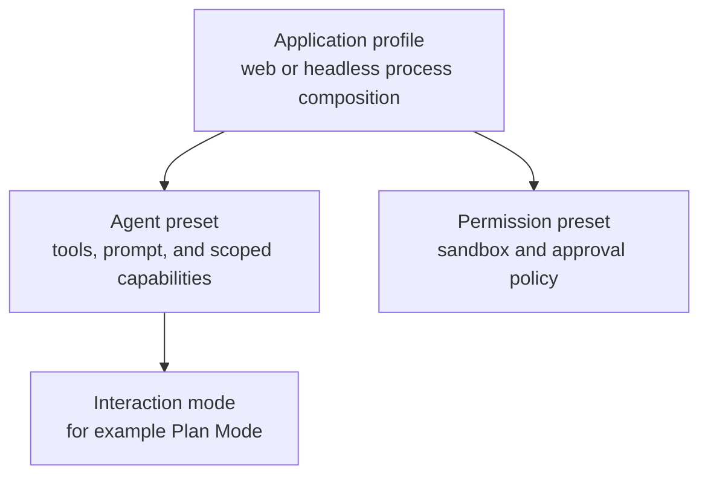
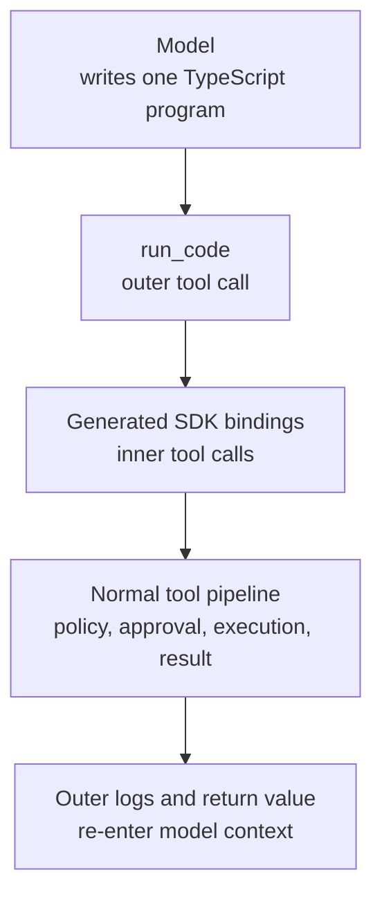
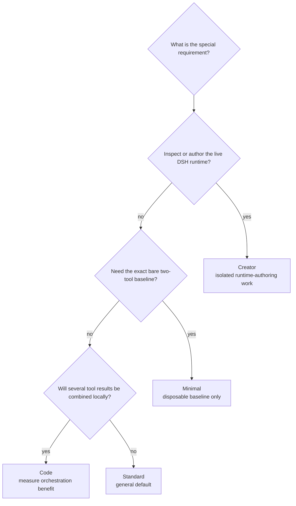

# Module 03 — Mastering the Four Runtime Modes

## Outcome

After this module, you can:

- distinguish an application profile, an agent preset, Plan Mode, and a permission preset;
- explain the capability and trust boundary of Standard, Code, Minimal, and Creator modes;
- choose a mode from task shape rather than from its name;
- explain why a smaller tool catalog is not automatically safer, faster, or cheaper;
- compare Standard and Code mode while holding the model, prompt, workspace, and policy constant; and
- produce a reproducible, sanitized mode-comparison record.

Estimated time: **55–75 minutes**, excluding an optional repeated benchmark.

## Verification status

This lesson is a **source-reviewed draft**, not a verified release.

- The shipped preset roster, four preset compositions, tool-presentation system, Code Mode runtime, Minimal boundary, Creator toolset, Web selector, and trajectory surface were reviewed at upstream commit [`47f943859bef60e4160492346772ded9b24f765a`](https://github.com/deepseek-ai/deepseek-harness/commit/47f943859bef60e4160492346772ded9b24f765a).
- npm registry metadata was checked on 2026-08-13. Both `latest` and `next` resolved to [`@deepseek-ai/dsh@0.1.0-rc.6`](https://www.npmjs.com/package/@deepseek-ai/dsh/v/0.1.0-rc.6).
- The reviewed source still declared the CLI as `0.1.0-rc.5`, so this course records the install package and immutable source reference separately.
- The comparison requires a clean Web launch and two authenticated model runs. Those runs remain pending because the current review environment could not complete the package's native `node-pty` build.
- The lesson's metadata, links, Markdown, diagrams, and source references are checked locally. Clean macOS/Linux execution and an independent learner pass remain pending.

Do not change this module to `status: verified` until [the repository verification policy](../../../docs/VERSIONING.md) has been satisfied.

## First correction — “mode” means agent preset here

The English Web UI calls the four built-ins **Standard mode**, **Code mode**, **Minimal mode**, and **Creator mode**. In the implementation, they are per-session **agent presets** with stable ids:

| English UI label | Preset id | Composition file |
|---|---|---|
| Standard mode | `standard` | `agent-presets/standard/agent.cordis.yml` |
| Code mode | `code` | `agent-presets/code/agent.cordis.yml` |
| Minimal mode | `minimal` | `agent-presets/minimal/agent.cordis.yml` |
| Creator mode | `cordis` | `agent-presets/cordis/agent.cordis.yml` |

This course keeps the familiar UI word “mode,” but uses **preset** when discussing implementation.

Four different controls are easy to confuse:



| Control | Scope | Example | What it changes |
|---|---|---|---|
| **Application profile** | One DSH process | `web`, `headless` | Host services, application surface, providers, persistence, preset roster |
| **Agent preset** | One new session's agent | `standard`, `code`, `minimal`, `cordis` | Agent-scoped tools, prompt sections, presentation, and supporting plugins |
| **Interaction mode** | Behavior inside a compatible session | Plan Mode | Instructions and workflow for a phase of the task |
| **Permission preset** | Session/deployment execution policy | Read only, Workspace write, Full access | Filesystem sandbox mode and approval policy |

Choosing Code mode does not select a different model. Choosing Read only does not convert Standard into Minimal. Entering Plan Mode does not replace the session's agent preset.

## How preset selection behaves

The Web UI exposes the choice before a session starts, beside the workspace picker. It also exposes a default in settings that applies to sessions created later. The session header shows the preset that the current session actually runs.

A preset is fixed once the session has produced anything. This is a correctness boundary: switching after tool calls would leave history created under capabilities the new composition may not provide. To compare two modes, create two fresh sessions; do not try to convert the first run in place.

Running sessions retain the composition generation they began with. Changing the default or editing a custom preset affects later sessions, not an already-running one.

## Four modes at a glance

| Mode | Model-facing surface | Main composition difference | Best starting use | Important warning |
|---|---|---|---|---|
| **Standard** | Native tool schemas | Full coding-agent preset | General repository work | Broad capability set still requires task and permission discipline |
| **Code** | `run_code` plus a generated TypeScript SDK | Standard plus agent-scoped `mode: code` presentation | Multi-step tool orchestration and compact aggregation | Same underlying authority; code execution is not a security boundary |
| **Minimal** | Persistent `bash` and `str_replace_editor` only | Fixed complete prompt, bare two-tool composition, no compaction | Controlled two-tool baselines in disposable environments | Its editor uses bare `fs-local`; fewer tools does not mean least privilege |
| **Creator** | Standard tools plus five Cordis runtime tools and an authoring Skill | Standard plus self-referential runtime inspection and experimentation | Inspecting DSH or creating custom presets | Treat as shell-equivalent trusted access to the live runtime |

## Lesson 1 — Standard mode

Standard is the shipped Web default and the right baseline for ordinary coding-agent work.

Its preset contributes the full model-facing coding set, including:

- sandbox-backed shell and filesystem tools;
- filesystem and Web search;
- background-job controls;
- Skills;
- goals, Plan Mode, and compaction;
- subagent and workflow tools;
- user questions and task tracking; and
- the deployment persona plus repository instructions.

The host profile still owns the model route, persistence, tool registry, sandbox and approval services, execution providers, and shared registries. The preset decides which of those capabilities this agent can see and which agent-scoped plugins it contributes.

Standard does not add an agent-specific tool-presentation row. It inherits the tool registry's default `native` presentation, so the model sees each visible tool's own name and JSON schema.

### Choose Standard when

- the task is ordinary repository discovery, planning, editing, testing, or review;
- you need the complete supported workflow without a special runtime experiment;
- you want the clearest one-tool-call-at-a-time trajectory; or
- you have no measured reason to prefer another preset.

Standard is a default, not an automatic permission grant. Pair it with the narrowest workspace, permission preset, task statement, and approval decisions that fit the work.

## Lesson 2 — Code mode

Code mode uses the same broad capability composition as Standard. Its added `tool-presentation` row selects `mode: code` for that agent.

Instead of presenting every end tool as a directly callable function schema, the registry presents:

1. one reserved `run_code` transport;
2. a generated TypeScript SDK describing the agent's visible tools and exact argument/output types; and
3. a rule that direct model calls may name only `run_code`.

Inside one fresh worker, the model-authored program can call tool bindings, branch, loop, catch failures, run safe independent calls concurrently, and return only the useful aggregate. Each binding call still re-enters the complete tool policy and execution pipeline.



### What Code mode can improve

- Fewer model round trips for multi-read, filter, join, or aggregation work
- Local control flow over intermediate tool values
- Concurrent independent reads when the tool definitions explicitly allow it
- Smaller model-visible intermediate history because only the outer logs and return value return to the conversation

### What Code mode does not guarantee

- It does not reduce the underlying tool authority or bypass policy.
- It does not roll back side effects when a later sub-call or the program fails.
- It does not guarantee lower latency: worker startup, generated SDK text, provider behavior, and task shape all matter.
- It does not guarantee fewer tokens: native schemas are traded for SDK text and one transport schema.
- It does not make model-authored code trusted.

The shipped TypeScript runtime creates a fresh worker for each `run_code`, gives it an empty environment, and applies compute, wall-time, heap, and outer-output bounds. Upstream explicitly describes this as **containment, not a security boundary**, with a bash-equivalent trust posture. Intermediate values also have no byte cap, and operating-system processes started by a program can outlive worker termination.

### Choose Code when

- the task naturally contains several tool calls whose intermediate results can be filtered or combined locally;
- fewer model/tool round trips are more valuable than a simple native trajectory;
- the exact loaded runtime and SDK renderer are known; and
- you will verify the result and inspect nested subtool records.

Use Standard for a simple one- or two-call task unless measurement shows a concrete Code-mode advantage.

## Lesson 3 — Minimal mode

Minimal is not “Standard with fewer buttons.” It is a different two-tool composition:

- a complete fixed persona: `You are a helpful software engineer assistant.`;
- runtime-context prompt contributions suppressed;
- persistent Bash through an isolated terminal service;
- `str_replace_editor` over an isolated bare `fs-local` provider; and
- no context-compaction provider.

It does not include Standard's ordinary filesystem/search tools, Web search, Skills, Plan Mode, goals, subagents, workflows, task tools, or compaction.

### The counterintuitive security boundary

Minimal's persistent Bash still uses host subprocess and sandbox-policy services. Its editor, however, is intentionally mounted over bare `fs-local`, requires absolute paths, and is not confined by the DSH file-sandbox policy. The absence of model-visible runtime context also means the prompt does not narrate the standing sandbox or approval state.

Therefore:

> **A smaller model-facing tool surface is not the same as a smaller operating-system authority surface.**

Minimal is useful for a controlled two-tool training or comparison baseline only when the environment itself is disposable and contains no sensitive paths. It is not the course's “safest mode.”

Without compaction, long sessions can exceed the selected model's context capacity instead of summarizing or replacing earlier history. Persistent Bash also carries shell state across calls and turns, which is useful for experiments but another variable a benchmark must record.

### Choose Minimal when

- the exact two-tool composition is the object being studied;
- the workspace and host environment are disposable;
- the task is short enough not to require compaction; and
- you explicitly accept the bare filesystem-provider boundary.

Do not select Minimal merely because a task “looks small.”

## Lesson 4 — Creator mode

Creator mode uses the internal preset id `cordis`. It carries Standard's broad coding capabilities, then adds:

- the `cordis_inspect` runtime report;
- `cordis_define`, `cordis_run`, `cordis_stop`, and `cordis_undefine` for process-memory plugin experiments; and
- the bundled `editing-cordis-compositions` Skill for authoring custom presets.

Creator can inspect live services, plugin fibers, registered tools, API/event contracts, and browser slot surfaces. A temporary dynamic package can register host behavior or browser UI, affect later turns and potentially other sessions in the same process, and then be stopped. It does not automatically become a plugin file or survive restart.

Custom presets are created by copying an existing whole preset into the user preset root, then editing the copy's files. Shipped presets are read-only installation assets and may be overwritten by an upgrade; never edit them in place.

### Trust stance

The Cordis toolset's VM removes or redirects common globals, but upstream states that host-realm helpers make escape possible. It is containment for honest code, not a security boundary. A user-authored preset is as privileged as the plugins it names.

### Choose Creator when

- the task is specifically to inspect DSH internals;
- you are experimenting with a temporary Cordis plugin;
- you are creating or repairing a custom agent preset; and
- the DSH process, workspace, credentials, and neighboring sessions are suitable for shell-equivalent access.

Return to Standard when the runtime-authoring task is finished.

## Lesson 5 — Compare capability, risk, latency, and debugging

No mode wins every dimension.

| Dimension | Standard | Code | Minimal | Creator |
|---|---|---|---|---|
| Capability breadth | Broad | Broad; same end capabilities as Standard | Exactly two shipped tools | Broad plus live runtime tooling |
| Tool presentation | Native schemas | Generated SDK plus `run_code` | Native schemas | Native schemas |
| Typical trajectory | Direct tool calls | Outer call plus nested subcalls | Direct persistent shell/editor calls | Direct tools plus runtime lifecycle actions |
| Context management | Compaction composed | Compaction composed | No compaction | Compaction composed |
| Likely model round trips | Task-dependent baseline | Can be lower for multi-call orchestration | Task-dependent | Usually not the optimization goal |
| Authority warning | Broad tool set | Same authority plus model-authored code runtime | Bare local editor boundary | Shell-equivalent live-runtime control |
| Debugging surface | Straightforward native calls | Inspect outer program and nested subcalls | Small catalog, persistent state | Largest runtime and cross-session surface |
| Best evidence | Native trajectory | Outer result plus every subcall | Exact two-tool trace and host boundary | Lifecycle report, affected scopes, and cleanup |

### Performance claims require repetitions

One Standard/Code pair can demonstrate different mechanics. It cannot prove that one mode is faster, cheaper, or more accurate. Model sampling, provider load, cache warmth, network timing, and tool choice remain uncontrolled.

For a defensible performance claim, run an alternating sequence such as `Standard → Code → Code → Standard` or at least three fresh sessions per mode. Keep the task, model, reasoning level, workspace snapshot, permissions, and expected answer fixed; report distributions rather than only the best run.

## Lesson 6 — A mode-selection decision tree

Start with Standard, then move only for a specific requirement:



After selecting a preset, make a separate permission decision. The mode name never replaces a review of workspace scope, sandbox provider, approval policy, credentials, network access, and third-party plugins.

## Lab — Compare Standard and Code mode

The experiment holds the broad capability set constant and changes its presentation. Your deliverable is a completed copy of [MODE-COMPARISON.md](MODE-COMPARISON.md).

You will ask both modes to inspect the same synthetic workspace and answer the same four-part question. The expected facts are already known, so result quality is independently checkable.

### Step 1 — Prepare two identical workspace copies

From this repository's root, run:

```sh
MODULE03_WORK="$(mktemp -d)"
cp -R projects/quick-start-workspace "$MODULE03_WORK/reference"
cp -R projects/quick-start-workspace "$MODULE03_WORK/workspace"
cp course/en/03-runtime-modes/MODE-COMPARISON.md \
  "$MODULE03_WORK/mode-comparison.md"
diff -ru "$MODULE03_WORK/reference" "$MODULE03_WORK/workspace"
printf '%s\n' "$MODULE03_WORK"
```

**Expected result:** `diff` prints nothing and exits `0`; the final line prints the temporary experiment directory.

### Step 2 — Start an isolated Web profile

Run:

```sh
DSH_HOME="$MODULE03_WORK/dsh-home" \
  npx @deepseek-ai/dsh@0.1.0-rc.6 web
```

Confirm any `npx` installation prompt names exactly `@deepseek-ai/dsh@0.1.0-rc.6`.

**Expected result:** DSH prints a loopback Web URL and remains running. Only the temporary DSH home is initialized.

### Step 3 — Configure the controlled inputs

In the Web UI:

1. Add a model through **Settings → Models** without pasting the credential into chat or any file.
2. Select `$MODULE03_WORK/workspace` through **Choose workspace**.
3. Select **Read only** in the permission selector.
4. Record the exact provider, model, selectable reasoning level, package, OS, and architecture in the worksheet.
5. Keep those values unchanged for both runs.

If the pinned UI cannot offer Read only or the session reports a materially different policy, stop and record upstream drift. Do not substitute Full access.

### Step 4 — Run A in Standard mode

On the new-session screen, select **Standard mode** in the Agent preset chip. Confirm the header names Standard mode, then paste this prompt exactly:

```text
Inspect only the current workspace. Do not modify files, execute project code,
run shell commands, use the network, or access paths outside this workspace.

Return exactly four bullets:
1. The package name and license from package.json.
2. The exported identifiers and default argument from src/greeting.js.
3. The codename stated by README.md and the codename stated by
   notes/project-goals.md.
4. The exact relative paths you read.
```

Watch the run. Deny any request to mutate, run a command, use the network, or broaden access.

Open **Trajectory** and record:

- the session's preset label;
- model-step count;
- direct tool-call count and names;
- any nested subtool records;
- duration and token fields when present;
- errors, retries, denials, and approvals; and
- whether the four expected facts are correct.

Do not copy chain-of-thought, credentials, private paths, or a raw session export into the worksheet.

### Step 5 — Run B in Code mode

Start a **new blank session**. Select **Code mode** before sending anything, confirm the header, and repeat the exact prompt with the same model, workspace, reasoning level, and Read-only permission.

Inspect the trajectory again. A conforming Code-mode run exposes one outer `run_code` transport when tools are used; its SDK binding calls appear as nested subtool evidence. The model may still require more than one step, and a specific run may not be faster.

Record the same fields as Run A, plus:

- whether `run_code` was used;
- the count and names of nested tool calls;
- what the program printed or returned to model context; and
- whether any inner failure was handled or propagated.

### Step 6 — Verify the workspace and answer

In a second terminal, run:

```sh
diff -ru "$MODULE03_WORK/reference" "$MODULE03_WORK/workspace"
```

**Expected result:** no output and exit status `0`.

Both answers should identify:

- package name `dsh-quick-start-workspace`;
- license `Apache-2.0`;
- exports `projectCodename` and `greeting`;
- the `greeting` default argument `learner`;
- `Aurora` in `README.md` and `Borealis` in `notes/project-goals.md`; and
- only paths that the trajectory proves were actually read.

Mark an answer incorrect if it reaches the right conclusion but invents unread evidence.

### Step 7 — Complete and validate the worksheet

Finish the comparison, separate observation from inference, and run:

```sh
grep -n 'TODO:' "$MODULE03_WORK/mode-comparison.md"
```

**Expected result:** no output and exit status `1`.

Your conclusion must answer two different questions:

1. Which mode produced the stronger result in this pair?
2. Which mode should be the default for this task class before repeated evidence exists?

A reasonable one-pair result may still choose Standard as the default while identifying a Code-mode hypothesis to test.

### Step 8 — Stop and clean up deliberately

Press `Ctrl+C` once in the DSH terminal. If the credential exists only for this experiment, revoke it through the provider and remove it through the product's supported settings flow before allowing the temporary directory to expire.

Retain only the sanitized worksheet you intend to keep. Do not commit the temporary DSH home or session logs.

## Safety notes

- Both model runs send the prompt and selected file contents to the configured provider and may incur charges.
- Read only is a filesystem policy, not a privacy, network, process, plugin, or model-code sandbox.
- The lab does not run Minimal because its bare `fs-local` editor is a materially different authority boundary.
- The lab does not run Creator because live-runtime modification is unnecessary for a presentation comparison.
- Code-mode subcalls pass through normal policy, but model-authored worker code remains bash-equivalent trusted execution according to upstream.
- Use only the synthetic workspace and temporary DSH home; never use a client repository, home directory, or secret-bearing project for this comparison.
- A trajectory can contain prompts, file contents, absolute paths, model output, and tool results. Share only a sanitized summary.

## Troubleshooting

| Symptom | Likely cause | Correction |
|---|---|---|
| The preset chip is missing | The Web deployment has no preset roster or the package differs from the baseline | Confirm the exact package and effective Web composition; stop if the four shipped presets are absent |
| The session header shows the wrong mode | The selection was staged after the session started or the default was reused | Start a fresh blank session and select the preset before sending input |
| The UI refuses a mode change | The session has already produced output | This is expected; create a new session instead of switching history under a new composition |
| Code mode fails to mount | The host has no compatible `codeRuntime` or the preset row is pending | Use the shipped Web composition and capture the exact mount error; do not patch around it during the comparison |
| Code mode calls an end tool directly and gets `UNKNOWN_TOOL` | Under `code`, only `run_code` is directly callable | Keep the failure as evidence; let the model recover through the generated SDK |
| Code mode has no token or latency advantage | The task is too small, SDK cost dominates, or provider/runtime variance is larger | Report the result; do not convert the hypothesis into a benefit claim |
| Minimal appears “safer” because it lists two tools | Catalog size was confused with authority | Re-read its `fs-local` boundary and use a disposable host if evaluating it |
| Creator experiments affect another session | A dynamic package changed process-level behavior | Stop or undefine the package, terminate the process, and repeat only in an isolated DSH home/process |
| `diff` reports changes | A run mutated the fixture | Inspect every difference, mark the run invalid, and recreate the workspace from the reference |
| `grep` still prints lines | Worksheet placeholders remain | Replace every reported marker with observed data or an explicit “not exposed” value |

## Completion check

- [ ] I can distinguish profiles, presets, Plan Mode, and permission presets.
- [ ] I know the four UI labels and their internal preset ids.
- [ ] I can explain why Code mode changes presentation without reducing the underlying capability set.
- [ ] I can explain why Minimal is not automatically the least-privileged choice.
- [ ] I can explain why Creator is a shell-equivalent runtime-authoring surface.
- [ ] Both runs used fresh sessions and identical controlled inputs.
- [ ] I inspected direct and nested trajectory records.
- [ ] Both final answers were scored against the same known facts.
- [ ] The fixture remained byte-for-byte equivalent to its reference copy.
- [ ] My worksheet distinguishes observations, inferences, and untested hypotheses.
- [ ] No credential, private path, raw trajectory, or placeholder remains.

## Deliverable

One completed, sanitized [mode-comparison worksheet](MODE-COMPARISON.md) comparing the same bounded task in Standard and Code mode, including controlled inputs, trajectory evidence, correctness scoring, safety checks, validity threats, and a justified default-mode decision.

## Official sources

- [Agent-preset service at the reviewed commit](https://github.com/deepseek-ai/deepseek-harness/blob/47f943859bef60e4160492346772ded9b24f765a/packages/preset/agent-presets/README.md)
- [Web agent-preset UI at the reviewed commit](https://github.com/deepseek-ai/deepseek-harness/blob/47f943859bef60e4160492346772ded9b24f765a/packages/client/ui-agent-preset/README.md)
- [English mode labels at the reviewed commit](https://github.com/deepseek-ai/deepseek-harness/blob/47f943859bef60e4160492346772ded9b24f765a/packages/client/ui-agent-preset/src/client/locales.ts)
- [Standard preset composition at the reviewed commit](https://github.com/deepseek-ai/deepseek-harness/blob/47f943859bef60e4160492346772ded9b24f765a/apps/cli/config/agent-presets/standard/agent.cordis.yml)
- [Code preset composition at the reviewed commit](https://github.com/deepseek-ai/deepseek-harness/blob/47f943859bef60e4160492346772ded9b24f765a/apps/cli/config/agent-presets/code/agent.cordis.yml)
- [Minimal preset composition at the reviewed commit](https://github.com/deepseek-ai/deepseek-harness/blob/47f943859bef60e4160492346772ded9b24f765a/apps/cli/config/agent-presets/minimal/agent.cordis.yml)
- [Creator preset composition at the reviewed commit](https://github.com/deepseek-ai/deepseek-harness/blob/47f943859bef60e4160492346772ded9b24f765a/apps/cli/config/agent-presets/cordis/agent.cordis.yml)
- [Tool registry and Code Mode at the reviewed commit](https://github.com/deepseek-ai/deepseek-harness/blob/47f943859bef60e4160492346772ded9b24f765a/packages/core/tools/README.md)
- [Per-agent tool presentation at the reviewed commit](https://github.com/deepseek-ai/deepseek-harness/blob/47f943859bef60e4160492346772ded9b24f765a/packages/core/agent-tool-presentation/README.md)
- [Worker-thread Code runtime at the reviewed commit](https://github.com/deepseek-ai/deepseek-harness/blob/47f943859bef60e4160492346772ded9b24f765a/packages/code-runtime/code-runtime-worker-thread/README.md)
- [Minimal two-tool runtime decision at the reviewed commit](https://github.com/deepseek-ai/deepseek-harness/blob/47f943859bef60e4160492346772ded9b24f765a/.agents/notes/implemented/feature/2026-08-11-minimal-profiles-bare-two-tool-runtime.md)
- [Creator Cordis toolset at the reviewed commit](https://github.com/deepseek-ai/deepseek-harness/blob/47f943859bef60e4160492346772ded9b24f765a/packages/extensions/tool-cordis/README.md)
- [Web bundle and default preset at the reviewed commit](https://github.com/deepseek-ai/deepseek-harness/blob/47f943859bef60e4160492346772ded9b24f765a/packages/bundle/web-app/cordis.patch.yml)
- [Trajectory UI at the reviewed commit](https://github.com/deepseek-ai/deepseek-harness/blob/47f943859bef60e4160492346772ded9b24f765a/packages/client/ui-trajectory/README.md)
- [Permission preset reference at the reviewed commit](https://github.com/deepseek-ai/deepseek-harness/blob/47f943859bef60e4160492346772ded9b24f765a/docs/subsystems/permission-presets.md)

## Next module

Continue to [Module 04 — Models, Providers, Workspaces, and Sessions](../04-models-providers-workspaces-sessions/README.md) to separate model routing, credentials, filesystem location, and durable conversation history.
