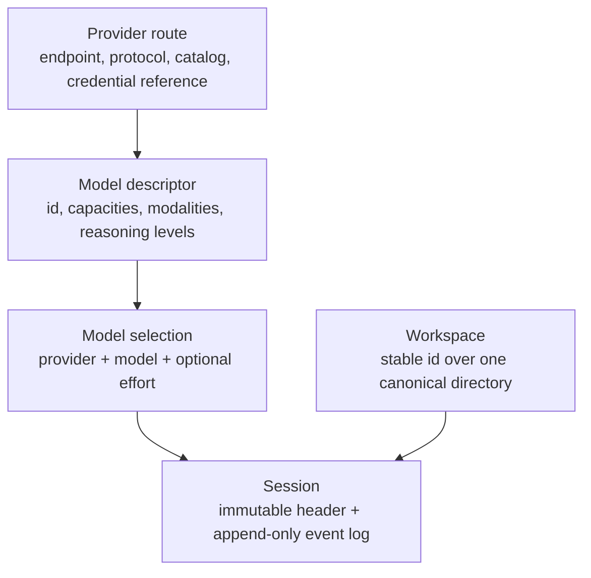
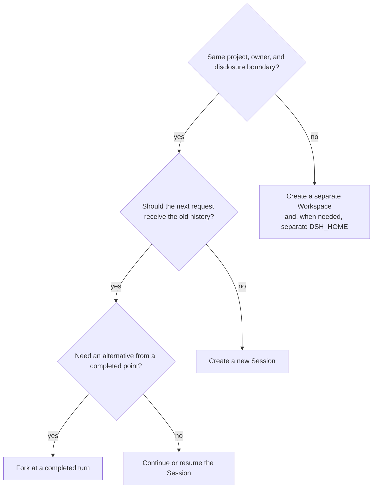

# Module 04 — Models, Providers, Workspaces, and Sessions

## Outcome

After this module, you can:

- distinguish a model, provider route, credential reference, workspace, and session;
- configure a catalog provider or a custom OpenAI-compatible route without placing a secret in settings;
- evaluate model capabilities, including reasoning levels and input modalities, instead of trusting a display name;
- predict which facts change on the next request and which stay bound to an existing session;
- choose between a new session, resume, fork, event-log replay, archive, and export;
- isolate projects and credentials with a deliberate workspace and Harness-home strategy; and
- validate a secret-free provider-boundary plan before opening a real route; and
- produce a sanitized provider configuration and session-boundary record.

Estimated time: **90–120 minutes**, excluding provider signup or an optional second-model comparison.

## Verification status

This lesson is a **source-reviewed draft**, not a verified release.

- Provider configuration, model discovery and selection, credential resolution, workspace identity, Session logging, resume, fork, and export behavior were reviewed at upstream commit [`47f943859bef60e4160492346772ded9b24f765a`](https://github.com/deepseek-ai/deepseek-harness/commit/47f943859bef60e4160492346772ded9b24f765a).
- npm registry metadata was checked on 2026-08-13. Both `latest` and `next` resolved to [`@deepseek-ai/dsh@0.1.0-rc.6`](https://www.npmjs.com/package/@deepseek-ai/dsh/v/0.1.0-rc.6).
- The reviewed source still declared the CLI as `0.1.0-rc.5`, so the install package and immutable source reference remain separate evidence.
- The maintained dependency-free [Provider Configuration Lab](../../../projects/provider-configuration-lab/) passes six keyless tests covering hosted, compatible, and loopback-only plans plus secret, transport, allowlist, workspace, and schema failures. It does not read credentials or call a network.
- The lab requires a clean Web launch, a trusted provider credential, three model runs, one fork, and one restart. Those steps have not yet completed on the required macOS and Linux verification environments.
- The commands that prepare the synthetic workspaces, lesson metadata, links, Markdown, diagrams, and pinned source paths are checked locally. An independent learner pass remains pending.

Do not change this module to `status: verified` until [the repository verification policy](../../../docs/VERSIONING.md) has been satisfied.

## First correction — five identities, not one configuration

“Use this model on this project” crosses five independent boundaries:



| Identity | Stable key | Owns | Does not own |
|---|---|---|---|
| **Provider route** | Provider id such as `deepseek` or `acme-gateway` | Endpoint, wire protocol, model catalog, credential reference, transport policy | Conversation history or workspace files |
| **Model** | Model id inside one provider route | Capacity and capability metadata used by the adapter | API-key value or session history |
| **Model selection** | Provider + model + optional reasoning effort | The route used by the next assembled request | Workspace identity or permission policy |
| **Workspace** | Generated workspace id over a canonical path | Directory registration, title, and ordered Session account | The Session log or model route |
| **Session** | Session id | Immutable creation header and append-only interaction log | Provider configuration values or workspace registration lifecycle |

The provider id and model id are request-routing facts. The workspace path is a filesystem-location fact. The Session log is the durable history fact. A permission preset is yet another policy layer; changing one of these does not silently rewrite the others.

## Lesson 1 — Model names are not capability contracts

A routable model is identified by both its provider route and model id. The same model id under two routes can reach different endpoints, credentials, protocols, or compatibility settings.

The adapter may describe these per-model facts:

- context-window capacity;
- configured output-token cap;
- accepted input modalities, currently `text` and optionally `image`;
- selectable reasoning-effort ids; and
- display metadata used by the picker.

Reasoning effort is not a universal provider switch. The exact selected model advertises the levels it accepts. If it advertises none, the Web picker shows no Effort row. An explicit unsupported level is rejected before network I/O rather than silently reduced.

### Modality declarations are claims

For a hand-declared custom model, unknown input capability defaults conservatively to text. A vision-capable custom route can declare `input: [text, image]` on one model, or `defaultInput: [text, image]` as the fallback for otherwise undescribed models on that route.

These declarations are not endpoint tests:

- **Under-claiming** refuses an image before it is sent.
- **Over-claiming** admits an image, then lets the provider reject it after the user message is durable in the Session log.

That durable failed image can make the same Session fail again and can prevent switching to a text-only model. Recover with a genuinely image-capable model, a fork from before the image, or a new Session. Do not “fix” the problem by declaring image support that the endpoint does not have.

### Model switching has a request boundary

The Web picker submits one complete selection: provider, model, and optional effort. A running request keeps the selection captured when that step was assembled. A change applies to the next assembled step.

The first request that consumes a selection stores it in the Session's `request/header`. Merely opening the menu adds no history. A consumed selection survives reconnect and resume.

In the shipped Web composition, selecting a model also saves the deployment default used by later blank Sessions. It does not redirect another Session whose existing request log already records its own route.

> **Privacy consequence:** switching an established Session to another provider sends the retained model-visible history on the following request through the new route. Start a new Session when the new provider must not receive the old conversation or file-derived context.

## Lesson 2 — Choose the provider setup path deliberately

The Models page supports three different paths.

| Setup path | Use when | Defaults supplied | What you must verify |
|---|---|---|---|
| **Official DeepSeek card** | You want the shipped DeepSeek route | Shipped adapter and catalog | Key, selected model, text-only limitation of the chat-completions route |
| **Add provider** | The installed catalog already knows the provider | Endpoint, protocol, and model catalog | Native authentication requirements and the models you intend to expose |
| **Add a custom provider** | A trusted gateway, self-hosted endpoint, or absent provider speaks a supported protocol | None beyond adapter fallbacks | Permanent provider id, HTTPS endpoint, protocol, credential reference, models, capacities, modalities |

Some catalog providers do not authenticate with a simple API key. Bedrock, Vertex, Azure, and Codex may require provider-native credentials, project/region values, API versions, or OAuth. A filled API-key field does not invent those missing mechanisms.

### A custom provider is a declaration

A custom route requires:

- a unique lowercase provider id;
- a base URL you trust;
- a supported API protocol;
- at least one uniquely identified model; and
- either an appropriate credential reference or a provider-native authentication path.

The provider id is permanent because settings, defaults, request headers, saved Sessions, and credential references use it. “Renaming” means creating a new route and deliberately retiring the old one after checking every consumer.

**Fetch available models** is a one-time interrogation of the draft form, not a live catalog service. For a custom OpenAI-compatible route, it may issue an authenticated `GET /models` to the URL currently shown. The candidates are not stored until you select them and save. Unsupported protocols fall back to manual entry.

Never probe an endpoint you do not operate or trust. The Host sends the request, the typed credential participates in that request, and a model listing says nothing about whether the endpoint is safe, private, compatible, or authorized for your data.

### Sanitized custom-route example

This example uses the reserved `.invalid` domain and cannot be a working endpoint. It demonstrates separation of settings from secret values:

```yaml
llm-pi-ai:
  providers:
    example-gateway:
      displayName: Example Gateway
      apiKeyEnv: EXAMPLE_GATEWAY_API_KEY
      api: openai-completions
      baseURL: https://gateway.example.invalid/v1
      defaultInput: [text]
      models:
        - id: example-large
          name: Example Large
          contextWindow: 65536
          maxTokens: 4096
```

The settings document contains `EXAMPLE_GATEWAY_API_KEY`, the **reference**, never its value. The actual key belongs behind the credential seam.

On a catalog route, a non-empty `models` list replaces the installed catalog rather than appending to it. Use `modelOverrides` when correcting one installed model while retaining the others. Advanced fields such as timeouts, retry policy, headers, compatibility switches, and modality declarations remain `settings.yaml` responsibilities when the Web form does not expose them.

Do not place an `Authorization` value in the ordinary `headers` dictionary: that dictionary is not a write-only secret surface and can be returned by configuration descriptions.

## Lesson 3 — Credential references are safer, not secret-proof

The Models page receives a redacted descriptor after saving a key. Settings retain only a credential reference. The local credential provider resolves the value once per model request, so a rotated managed key reaches the next request without restarting the process.

Resolution follows this precedence:

| Priority | Source | Credential-provider status | Operational meaning |
|---:|---|---:|---|
| 1 | Inherited launch environment | Read-only | Explicit per-run or CI override |
| 2 | `$DSH_HOME/.credentials.yaml` | Writable | Harness-managed credential store |
| 3 | Invocation directory `.env` | Writable fallback | A Models write stores a managed override rather than editing this file |
| 4 | `$DSH_HOME/.env` | Writable fallback | A Models write stores a managed override rather than editing this file |

An inherited environment value shadows every writable layer. The UI should report it as read-only; attempting to store another value would appear successful while resolution kept using the environment value, so the credential seam rejects that write.

On POSIX, the managed credential document is created as `0600` under a `0700` directory and refuses broader file modes. This protects against other operating-system users. It does **not** protect the key from an agent tool process running as the same user. The shipped filesystem policy constrains mutations more than reads, and no sandbox mode makes `.credentials.yaml` unreadable merely because it contains a secret.

Therefore:

- select only a narrow, synthetic workspace for course labs;
- keep `$DSH_HOME` outside that workspace;
- never reveal its path to the model or ask the agent to inspect Harness configuration;
- use provider-scoped, revocable, low-limit credentials where available;
- never paste a key into chat, a worksheet, shell history, `settings.yaml`, screenshots, or Git; and
- use process or operating-system isolation when the agent itself must be unable to read provider credentials.

File permissions and UI redaction are useful discretion controls, not a same-user security boundary.

## Lesson 4 — A Workspace is a registration over a canonical directory

A Workspace is not a copy of a project. It is a durable record containing:

- a generated stable id;
- the `realpath`-canonicalized directory path;
- a display title; and
- an ordered account of Sessions that belong to it.

Trailing slashes, `..`, and symlinks resolve before path identity is decided. Two spellings of the same real directory reuse one Workspace. Two different canonical paths may share the same basename and display title while remaining separate id-keyed Workspaces.

A new Session receives its working directory when it is created. That canonical `cwd` is stored in the immutable Session header. Selecting another Workspace targets a new or blank Session; it does not transplant an existing Session's history into another directory.

Deleting a Workspace registration is intentionally non-destructive. It removes the group and its Session account, but retains the directory, user files, live Sessions, and persisted Session logs. Those Sessions become **Ungrouped**.

### Workspace strategy

Use a separate Workspace when any of these changes:

- project or repository;
- client or data owner;
- confidentiality class;
- required filesystem scope; or
- retention and evidence policy.

Do not register a home directory, monorepo parent, secrets directory, or broad client-data root merely to avoid switching Workspaces. A narrow path improves evidence and reduces accidental reads, but it does not replace permission review.

For stronger separation, also use a separate `DSH_HOME` and process. Workspace separation alone does not separate credentials, settings, global defaults, or all Session-storage concerns.

## Lesson 5 — Session operations preserve different boundaries

A Session is an append-only log of typed events. Model-visible message history is derived from that log; it is not stored as a second mutable transcript. Replaying a stored Session means rebuilding projections from recorded events. It does **not** rerun provider requests, tools, or side effects.

| Operation | History | Workspace `cwd` | Model route | Side-effect warning |
|---|---|---|---|---|
| **New Session** | Empty | Chosen at creation | Current default until first request consumes it | Cleanest boundary for a new task or provider |
| **Continue/open** | Same append-only log | Same immutable header | Latest consumed Session selection | Later requests resend retained visible context |
| **Resume after restart** | Restored from persistence | Restored target directory | Reconstructed from logged request header | Interrupted effects must be verified before retry |
| **Fork** | Deep-cloned completed-turn prefix | Inherited from source | Inherited request history; later selection may change | Parent and child diverge independently after boundary |
| **Replay** | Re-derived from recorded events | No new directory decision | No new request by replay alone | Recorded tool results are evidence, not re-execution |
| **Archive** | Retained | Retained | Retained | Removes ordinary list visibility; not deletion |
| **Export** | Raw durable artifact in ZIP | Header is included | Request headers and messages are included | Treat as sensitive debugging material |

### Fork only at a stable boundary

The Web Session-row action forks at the latest completed turn. Eligible message actions can fork at the completed turn ending at that message. A prefix ending inside an open turn is rejected rather than silently clipped.

The child records lineage and inherits the source `cwd`, but it appears as an ordinary peer Session rather than a nested branch. Later child events do not alter the parent.

Use a fork when you want an alternative analysis that may reuse the same historical disclosures. Use a new Session when the task, provider trust, data boundary, workspace, or modality assumptions change.

### Resume is not side-effect replay

Crash recovery can record that a tool call was interrupted before it started or that its outcome is unknown. Retry a missing read-only result when appropriate. For a potentially mutating call with unknown outcome, inspect external state or ask the user before retrying.

The shipped persistence root lives under the Harness home and groups logs by normalized Session `cwd`. In TUI flows, cross-Workspace resume enters the recorded target directory before replacing the process. In the Web flow used below, reopening a persisted Session restores its existing header and history.

### Export only sanitized evidence

The Web `/export` command and Session-header action can stream a ZIP containing the raw root Session log and descendant logs. It may include prompts, provider/model ids, tool arguments and results, file contents, absolute paths, errors, attachments, and other Session data.

Do not commit or share a raw export by default. Prefer a purpose-written sanitized worksheet. If support requires the archive, inspect it locally, remove unrelated data through a supported redaction workflow, and obtain authorization from the data owner.

## Lesson 6 — A practical boundary decision

Use this order:



After this decision, separately choose the provider/model and permission preset. If the provider changes, explicitly decide whether it may receive the retained Session history. If the filesystem boundary changes, create a new Session under the intended Workspace rather than relying on conversation instructions to simulate isolation.

## Pre-lab — Validate the boundary plan without a key

Before opening a real provider route, run the maintained
[Provider Configuration Lab](../../../projects/provider-configuration-lab/):

```sh
cd projects/provider-configuration-lab
npm run check
npm test
npm run demo
cd ../..
```

The lab validates three synthetic plans and emits a deterministic digest for
each sanitized decision record. It deliberately does not use the DSH settings
schema, resolve an environment variable, make a provider request, or prove
model compatibility. Record the strategy name and digest in your worksheet,
then independently verify the real UI and runtime behavior below.

## Lab — Prove route, Workspace, fork, and resume boundaries

The deliverable is a completed copy of [CONFIG-AND-SESSION-STRATEGY.md](CONFIG-AND-SESSION-STRATEGY.md). The lab uses two synthetic Workspaces and one isolated Harness home.

### Step 1 — Prepare two controlled Workspace copies

From this repository's root, run:

```sh
MODULE04_WORK="$(mktemp -d)"
cp -R projects/quick-start-workspace "$MODULE04_WORK/alpha-reference"
cp -R projects/quick-start-workspace "$MODULE04_WORK/alpha"
cp -R projects/quick-start-workspace "$MODULE04_WORK/beta-reference"
cp -R projects/quick-start-workspace "$MODULE04_WORK/beta"
printf 'alpha\n' > "$MODULE04_WORK/alpha-reference/WORKSPACE-ID.txt"
printf 'alpha\n' > "$MODULE04_WORK/alpha/WORKSPACE-ID.txt"
printf 'beta\n' > "$MODULE04_WORK/beta-reference/WORKSPACE-ID.txt"
printf 'beta\n' > "$MODULE04_WORK/beta/WORKSPACE-ID.txt"
cp course/en/04-models-providers-workspaces-sessions/CONFIG-AND-SESSION-STRATEGY.md \
  "$MODULE04_WORK/config-and-session-strategy.md"
diff -ru "$MODULE04_WORK/alpha-reference" "$MODULE04_WORK/alpha"
diff -ru "$MODULE04_WORK/beta-reference" "$MODULE04_WORK/beta"
printf '%s\n' "$MODULE04_WORK"
```

**Expected result:** both `diff` commands print nothing and exit `0`; the final line prints the temporary experiment directory.

### Step 2 — Start an isolated Web profile

Run:

```sh
DSH_HOME="$MODULE04_WORK/dsh-home" \
  npx @deepseek-ai/dsh@0.1.0-rc.6 web
```

Confirm any `npx` prompt names exactly `@deepseek-ai/dsh@0.1.0-rc.6`. Record the loopback URL, but do not place it in the worksheet if it contains machine-specific data.

### Step 3 — Configure one trusted provider

Open **Settings → Models** and choose one path:

1. configure the official DeepSeek route;
2. add a provider from the installed catalog; or
3. declare a trusted custom OpenAI-compatible route.

Enter the credential only in the write-only API-key field or through an approved launch-environment mechanism. Do not open, copy, or commit `.credentials.yaml`.

In the worksheet, record only:

- provider id and sanitized display name;
- setup path;
- model id;
- advertised reasoning levels and selected level;
- advertised input modalities;
- credential reference and source layer, never its value; and
- for a custom route, a sanitized endpoint origin and protocol.

If the provider, endpoint, data terms, or credential authority is not trusted, stop the lab.

### Step 4 — Register both Workspaces

Use **Choose workspace → Add workspace...** to register:

- `$MODULE04_WORK/alpha`
- `$MODULE04_WORK/beta`

The picker may display both with their directory basenames. Confirm their full-path hover details point to different canonical directories. Select `alpha`.

Choose **Standard mode** and **Read only**. Stop if Read only is unavailable; never substitute Full access for this lab.

### Step 5 — Create Session A in alpha

Select the intended model and effort, then send exactly:

```text
Read only WORKSPACE-ID.txt and package.json in the current workspace.
Do not use shell, network, or any path outside the workspace.

Return exactly three bullets:
- workspace id
- package name
- exact relative paths read
```

**Expected facts:** workspace id `alpha`, package name `dsh-quick-start-workspace`, and only the two proven relative paths.

Inspect Trajectory and record the visible provider/model/effort, direct tool calls, paths read, approvals, errors, and final-answer correctness. Deny any request to broaden access.

### Step 6 — Fork Session A

Wait until the turn is complete. Use the Session-row **Fork** action, open the child, and send:

```text
Read only README.md in the inherited workspace. Return its codename and the
exact relative path read. Do not use shell, network, or outside paths.
```

**Expected facts:** the child retains the earlier alpha history, reads `README.md`, and reports `Aurora`. Reopen the parent and confirm the child's second prompt and answer are absent there.

Record the parent and child as separate Session ids or sanitized labels. Do not copy raw ids if they reveal local conventions.

### Step 7 — Create Session B in beta

Start a new blank Session and select `beta`. Before sending, record whether the model picker inherited the selection saved in Step 5. Keep the same provider, model, effort, mode, and Read-only permission, then repeat the Step 5 prompt exactly.

**Expected facts:** workspace id `beta`, the same package name, and the two beta-relative paths. Any alpha answer invalidates the run.

This is the isolation check: the prompt and model route are controlled while the new Session's Workspace changes.

### Step 8 — Restart and reopen

Wait until every run is idle, then press `Ctrl+C` once in the DSH terminal. Restart with the same command and the same `DSH_HOME`:

```sh
DSH_HOME="$MODULE04_WORK/dsh-home" \
  npx @deepseek-ai/dsh@0.1.0-rc.6 web
```

Open Session A, its fork, and Session B. Confirm:

- each transcript is present;
- alpha Sessions still resolve to alpha and beta still resolves to beta;
- the consumed provider/model/effort is restored;
- recorded tool results are displayed without executing those old calls again; and
- parent and child remain independent peer Sessions.

Do not send another prompt merely to prove that replay occurred. Opening and inspecting the restored record is sufficient.

### Step 9 — Verify both Workspaces remained unchanged

In another terminal, run:

```sh
diff -ru "$MODULE04_WORK/alpha-reference" "$MODULE04_WORK/alpha"
diff -ru "$MODULE04_WORK/beta-reference" "$MODULE04_WORK/beta"
```

**Expected result:** no output and exit status `0` from both commands.

### Step 10 — Complete and sanitize the strategy

Finish the worksheet, then run:

```sh
grep -n 'TODO:' "$MODULE04_WORK/config-and-session-strategy.md"
```

**Expected result:** no output and exit status `1`.

Retain only the sanitized worksheet. Do not retain or share the raw Session export, `.credentials.yaml`, absolute temporary path, credential, or browser screenshot containing sensitive details.

## Safety notes

- Every model request may transmit the prompt, retained Session history, and selected file contents to the configured provider and may incur charges.
- A custom base URL is a data destination and a Host network target, not a harmless label. Verify ownership, TLS, retention, jurisdiction, and authorization before use.
- Switching providers in an existing Session can disclose its retained history to the new provider.
- Read only constrains filesystem effects; it is not a credential vault, network firewall, privacy guarantee, or same-user read barrier.
- Workspace registration narrows the intended directory but does not isolate global settings, credentials, or the Harness home.
- A raw Session export is a sensitive evidence bundle. Do not publish it with a bug report without inspection and authorization.
- Do not test image modality with personal or proprietary images. Use a synthetic image in a new disposable Session when that behavior is the object of a later exercise.

## Troubleshooting

| Symptom | Boundary involved | Correction |
|---|---|---|
| `MISSING_CREDENTIAL` | Credential reference | Store the named key through Models or supply the intended launch environment; do not paste it into settings |
| API-key field is read-only | Credential precedence | A launch-environment value shadows the managed store; restart without the override only if policy permits |
| `UNKNOWN_MODEL` | Provider/model catalog | Select an advertised model or add the exact model to the intended route |
| Composer reports model unavailable | Provider route lifecycle | Restore the adapter/route or deliberately select a new trusted route; no silent fallback occurs |
| Custom provider cannot be saved | Route declaration | Check lowercase unique id, endpoint, supported protocol, and at least one unique model id |
| Fetch available models returns 401/403 | Endpoint interrogation | Verify the trusted endpoint and credential; enter models manually only when the endpoint is known not to support listing |
| Discovery is unsupported | Protocol boundary | Enter the model metadata manually; do not relabel the protocol to force an OpenAI-shaped request |
| Image is refused before sending | Model modality metadata | Correct the declaration only if the endpoint truly supports images |
| Provider rejects an admitted image | Over-claimed modality | Use a verified image-capable model, fork before the image, or start a new Session |
| Two path spellings open one Workspace | Canonical path identity | This is expected when both resolve to the same real directory |
| Deleted Workspace Sessions appear Ungrouped | Registration boundary | This is expected; registration deletion retains files and logs |
| Fork action is unavailable | Session boundary | Wait for a completed turn; an in-flight prefix is not a stable fork point |
| Resumed Session targets a missing directory | Immutable Session `cwd` | Restore or deliberately relocate the directory through a documented migration; do not point the old history at an unrelated path |
| Old project-local Sessions are absent from TUI `/resume` | Persistence-root change | Use their explicit legacy resume path or retain the old root; the current shared default performs no migration |
| Worksheet contains absolute paths or raw ids | Evidence sanitization | Replace them with labels such as `alpha`, `beta`, `session-a`, and `fork-a1` |

## Completion check

- [ ] I can distinguish provider route, model, model selection, Workspace, and Session identities.
- [ ] The keyless provider plan passed and I recorded its sanitized digest.
- [ ] I recorded a credential reference and source without exposing its value.
- [ ] I know why a provider id cannot be casually renamed.
- [ ] I treated modality metadata as a declaration rather than an endpoint test.
- [ ] I can explain when a model switch takes effect and what history the new provider receives.
- [ ] Alpha and beta produced their own Workspace ids under identical prompts.
- [ ] The fork inherited a completed prefix and diverged without changing its parent.
- [ ] Restart restored the consumed route, Workspace, and transcript without rerunning old tools.
- [ ] Both Workspace integrity checks returned exit status `0`.
- [ ] My strategy says when to use new, resume, fork, archive, and export.
- [ ] No credential, absolute private path, raw Session export, or placeholder remains.

## Deliverable

One completed, sanitized [configuration and Session strategy](CONFIG-AND-SESSION-STRATEGY.md) containing the keyless provider-plan digest, provider/model facts, credential handling, Workspace boundaries, Session-operation decisions, authenticated lab evidence, integrity checks, and explicit unverified assumptions.

## Official sources

- [Web UI guide at the reviewed commit](https://github.com/deepseek-ai/deepseek-harness/blob/47f943859bef60e4160492346772ded9b24f765a/docs/user/guide/index.md)
- [Provider configuration guide at the reviewed commit](https://github.com/deepseek-ai/deepseek-harness/blob/47f943859bef60e4160492346772ded9b24f765a/docs/user/guide/providers.md)
- [Models settings UI at the reviewed commit](https://github.com/deepseek-ai/deepseek-harness/blob/47f943859bef60e4160492346772ded9b24f765a/packages/client/ui-settings-models/README.md)
- [Per-Session model selection at the reviewed commit](https://github.com/deepseek-ai/deepseek-harness/blob/47f943859bef60e4160492346772ded9b24f765a/packages/client/ui-model-selection/README.md)
- [Generic multi-provider adapter at the reviewed commit](https://github.com/deepseek-ai/deepseek-harness/blob/47f943859bef60e4160492346772ded9b24f765a/packages/llm/llm-pi-ai/README.md)
- [Default-model service at the reviewed commit](https://github.com/deepseek-ai/deepseek-harness/blob/47f943859bef60e4160492346772ded9b24f765a/packages/core/agent-default-model/README.md)
- [Credential subsystem at the reviewed commit](https://github.com/deepseek-ai/deepseek-harness/blob/47f943859bef60e4160492346772ded9b24f765a/docs/subsystems/credentials.md)
- [Local credential provider and security boundary at the reviewed commit](https://github.com/deepseek-ai/deepseek-harness/blob/47f943859bef60e4160492346772ded9b24f765a/packages/credentials/credentials-local/README.md)
- [Workspace subsystem at the reviewed commit](https://github.com/deepseek-ai/deepseek-harness/blob/47f943859bef60e4160492346772ded9b24f765a/docs/subsystems/workspace.md)
- [Workspace UI at the reviewed commit](https://github.com/deepseek-ai/deepseek-harness/blob/47f943859bef60e4160492346772ded9b24f765a/packages/client/ui-workspace/README.md)
- [Session subsystem at the reviewed commit](https://github.com/deepseek-ai/deepseek-harness/blob/47f943859bef60e4160492346772ded9b24f765a/docs/subsystems/session.md)
- [Core Session package at the reviewed commit](https://github.com/deepseek-ai/deepseek-harness/blob/47f943859bef60e4160492346772ded9b24f765a/packages/core/session/README.md)
- [JSONL Session persistence at the reviewed commit](https://github.com/deepseek-ai/deepseek-harness/blob/47f943859bef60e4160492346772ded9b24f765a/packages/session/session-persistence-jsonl/README.md)
- [Web Session fork behavior at the reviewed commit](https://github.com/deepseek-ai/deepseek-harness/blob/47f943859bef60e4160492346772ded9b24f765a/.agents/notes/implemented/feature/2026-07-27-web-session-fork-actions.md)
- [Cross-Workspace resume at the reviewed commit](https://github.com/deepseek-ai/deepseek-harness/blob/47f943859bef60e4160492346772ded9b24f765a/.agents/notes/implemented/feature/2026-07-28-cross-workspace-resume.md)
- [Web Session-log export at the reviewed commit](https://github.com/deepseek-ai/deepseek-harness/blob/47f943859bef60e4160492346772ded9b24f765a/packages/session-query/session-log-export/README.md)

## Next module

Continue to [Module 05 — Safe Agentic Coding Workflows](../05-safe-agentic-coding-workflows/README.md) to turn those boundaries into a least-privilege, test-first change process.
