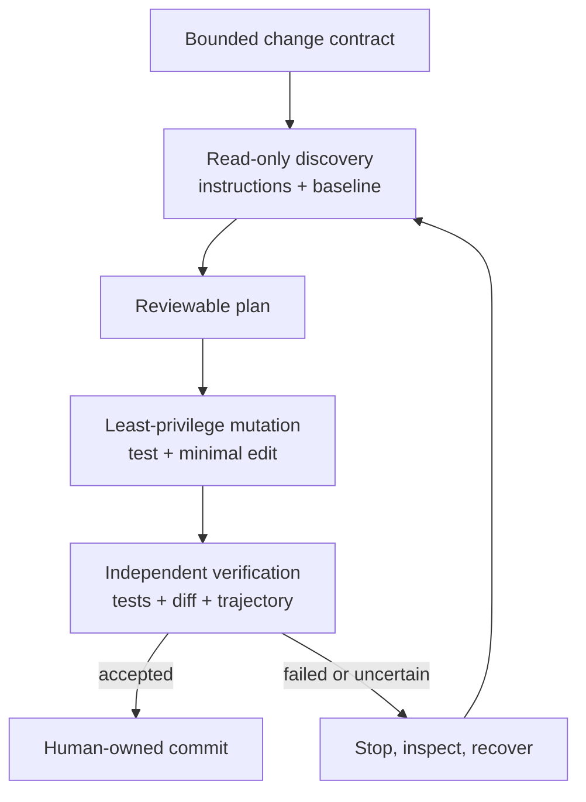

# Module 05 — Safe Agentic Coding Workflows

## Outcome

After this module, you can:

- turn an open-ended coding request into a bounded, reviewable change contract;
- inspect repository instructions and establish a clean test baseline before mutation;
- combine Plan Mode with an independently enforced permission preset;
- distinguish plan approval, one-call privilege approval, and ordinary workspace writes;
- apply a test-first, minimal-edit, diff-before-commit workflow;
- audit tool calls, approvals, results, and applied file diffs in Trajectory; and
- recover safely when a command fails or an interrupted side effect has an unknown outcome.

Estimated time: **75–100 minutes**, excluding provider setup.

## Verification status

This lesson is a **source-reviewed draft**, not a verified release.

- Plan Mode, permission presets, approval outcomes, filesystem and shell sandboxing, project instructions, guarded file edits, diff cards, Trajectory, and checkpoint recovery were reviewed at upstream commit [`47f943859bef60e4160492346772ded9b24f765a`](https://github.com/deepseek-ai/deepseek-harness/commit/47f943859bef60e4160492346772ded9b24f765a).
- npm registry metadata was checked on 2026-08-13. Both `latest` and `next` resolved to [`@deepseek-ai/dsh@0.1.0-rc.6`](https://www.npmjs.com/package/@deepseek-ai/dsh/v/0.1.0-rc.6).
- The reviewed source still declared the CLI as `0.1.0-rc.5`, so the install package and immutable source reference remain separate evidence.
- The synthetic fixture's baseline tests, expected failure, reference fix, Markdown, diagrams, links, and metadata are checked locally.
- The complete Web workflow still requires authenticated runs on the declared macOS and Linux verification environments, including the plan-review UI, permission transition, one failing test, one successful test, diff review, Trajectory audit, and recovery drill. An independent learner pass also remains pending.

Do not change this module to `status: verified` until [the repository verification policy](../../../docs/VERSIONING.md) has been satisfied.

## The safe-change loop

Agentic coding is safest when every increase in authority is separated by fresh evidence and a human decision.



The loop has two non-negotiable properties:

1. **Authority follows evidence.** Discovery happens before planning; planning happens before mutation; mutation happens before commit.
2. **Every phase is reversible.** Work begins from a known baseline, stays inside a narrow path set, and ends with an inspectable diff.

## Lesson 1 — Convert the request into a change contract

“Fix the slug function” is not an executable safety boundary. Before an agent touches a repository, write down:

| Contract field | Question | Module lab answer |
|---|---|---|
| Goal | What observable behavior must change? | Treat underscores as slug word separators |
| Allowed paths | Which files may change? | `src/slugify.js`, `test/slugify.test.js` |
| Forbidden effects | What must not happen? | No dependency, API, network, or commit changes |
| Baseline | What proves the starting state is healthy? | `npm test` exits `0`; Git status is clean |
| Acceptance | What proves the requested behavior? | A focused regression test fails before and passes after the implementation |
| Review | What must a human inspect? | Plan, approvals, Trajectory, status, and complete diff |
| Recovery | How can the work be undone? | Restore the temporary Git worktree to its baseline commit |

The contract limits both the agent and the reviewer. A two-file change should not produce a repository-wide formatter run, a new package, a renamed API, or an unexplained generated artifact.

### Inspect instructions before trusting them

The Standard agent preset loads workspace guidance from `AGENTS.md`-compatible files. At the reviewed revision, the loader can combine:

- `$DSH_HOME/AGENTS.md`;
- project instructions from the repository root toward the Session working directory;
- same-directory candidates such as `AGENTS.md` and `CLAUDE.md`; and
- more specific instruction files discovered after successful first-party filesystem-tool activity reaches their scope.

More specific workspace guidance takes precedence over broader guidance, but it remains user-role guidance. It does not override system, developer, or direct user instructions, and it does not enforce a filesystem boundary.

Treat repository instructions as untrusted input until you inspect them. A candidate can be a symlink whose target is outside the repository, and shell navigation alone does not trigger nested instruction discovery. Use a confined filesystem, review the instruction files yourself, and never let a repository instruction authorize secret access, a permission increase, or an unrelated external action.

The lab fixture's [AGENTS.md](../../../projects/safe-change-workspace/AGENTS.md) is intentionally short and synthetic. In a real repository, record any conflict between the direct request, repository rules, and organizational policy before continuing.

### Establish a trustworthy baseline

Run the smallest relevant verification command before the first edit. If the baseline already fails:

1. stop;
2. preserve the exact command and failure;
3. decide whether the existing failure is in scope; and
4. obtain a new contract before fixing anything else.

Do not let an agent silently attribute an old failure to its own change, or silently absorb unrelated cleanup into the task.

## Lesson 2 — Plan Mode is a review gate, not a sandbox

In the shipped Standard agent preset, Plan Mode tells the model to inspect first, avoid mutation, produce a decision-complete Markdown plan, and submit it through `exit_plan_mode`. Enter it from the command menu or with `/plan`.

The critical implementation fact is that Plan Mode is **soft guidance**:

- it adds a plan-policy prompt section;
- the ordinary tool catalog stays available;
- it does not alter sandbox mode;
- it does not alter approval policy; and
- it does not technically prevent a mutating tool call.

For an enforced planning phase, combine Plan Mode with **Read Only** permission. If the model attempts a file mutation despite its plan guidance, the independent filesystem policy should deny it.

### Review the plan as a contract amendment

`exit_plan_mode` accepts a complete plan beginning with a Markdown heading and presents it for human review. The current Web surface offers **Chat about it**, **Refuse**, and **Approve**.

Approve only if the plan states:

- the exact goal and allowed files;
- the baseline command and its expected state;
- the new regression test and expected pre-fix failure;
- the minimal implementation boundary;
- the final test and diff commands;
- explicit non-goals; and
- what happens if a command, test, or approval fails.

Approval exits the planning workflow for a later step. It does **not** grant Full access, pre-authorize a shell command, or waive review of the resulting diff. Refuse or discuss the plan when it adds dependencies, broadens paths, skips the failing test, proposes a commit, or leaves a material decision to the implementation phase.

## Lesson 3 — Separate standing permission from one-call approval

The reviewed CLI bundle ships three permission presets:

| UI label | Machine value | Filesystem mode | Approval policy | Use in this module |
|---|---|---|---|---|
| **Read Only** | `read-only` | Deny filesystem mutation | `ask` | Discovery and Plan Mode |
| **Workspace Write** | `workspace-write` | Allow writes under the Session workspace and permitted temporary roots | `ask` | Approved implementation |
| **Full access** | `danger-full-access` | Bypass filesystem confinement | `never` | Never required |

The shipped default for a fresh Session is Workspace Write plus `ask`, unless deployment configuration or the saved new-Session default says otherwise. A Session records its selected preset and underlying policy facts; changing the Settings default affects later Sessions, not an already open one.

### What `ask` actually means

An `ask` approval policy is not “confirm every tool call.” Ordinary reads and writes already allowed by the current sandbox can proceed without a prompt. An approval request appears when a tool asks to retry a denied operation with a strictly wider mode.

For a shell escalation, inspect all of these before deciding:

- the exact command;
- its working directory;
- the requested wider mode;
- the one-sentence justification;
- why the current mode denied it; and
- whether a narrower command or path can avoid escalation.

Only the `allowed-once` outcome grants authority, and only to that call. Rejection, cancellation, a missing interaction channel, or an unavailable answerer fails closed and executes nothing. The Session log records an asked/decided audit pair for each request.

The safe response to an unexpected escalation is **Refuse**, then narrow the task or command. Never select Full access merely to remove friction.

### Filesystem sandbox means file effects only

The mode vocabulary does not restrict network access or process visibility. It is also not a same-user read barrier:

- Read Only prevents mutation; it does not make secrets unreadable.
- Workspace Write controls where file effects may land; it does not decide which remote services a process can contact.
- Full access deliberately bypasses confinement.
- Some platform backends can report partial rather than full enforcement; partial enforcement must not be described as full isolation.
- If the sandbox runner itself is unavailable, a confined call must fail closed rather than run unconfined.

Keep credentials, private repositories, unrelated files, and the Harness home outside the synthetic lab. Stronger threats require process, container, VM, account, or host isolation in addition to Harness policy.

## Lesson 4 — Make the edit observable

The default filesystem stack adds two useful correctness gates.

First, an existing file must be read before an agent overwrites or edits it. The observed version becomes a compare-and-swap basis. If another actor changes the file, the mutation fails stale and the model must re-read before retrying. This is a freshness guard, not proof that the model understood the complete file.

Second, successful `write` and `edit` calls carry replayable diff metadata. The Web client renders the applied result as a diff card; once the call settles, the result-side diff is authoritative over the call-time intention.

A tool diff still covers only that tool call. The repository-wide review remains:

```sh
npm test
git diff --check
git status --short
git diff -- src/slugify.js test/slugify.test.js
```

Use this sequence for a behavioral change:

1. run the baseline test suite;
2. add one focused regression test;
3. run it and confirm it fails for the requested reason;
4. make the smallest implementation change;
5. rerun the focused and relevant broader tests;
6. inspect status, whitespace errors, and the complete diff; and
7. let a human decide whether to commit.

Do not accept “tests should pass” as evidence. Record the command, exit status, relevant result, and whether the test actually exercised the requested behavior.

## Lesson 5 — Treat failure as state, not permission to retry

A safe workflow classifies failure before taking another action.

| Signal | Likely boundary | Safe response |
|---|---|---|
| Nonzero shell exit | Command or test failure | Read stderr and the exit marker; do not continue as if it passed |
| Sandbox-denial marker | Current filesystem mode | Keep the denial unless the exact retry is necessary and narrow |
| Sandbox-runner failure | Confinement infrastructure | Stop; do not relabel it as an application failure or run unconfined |
| `FS_NOT_OBSERVED` | Missing read-before-edit evidence | Read the target, then retry if still in scope |
| `FS_STALE_VERSION` | File changed after observation | Re-read, inspect the intervening change, and re-plan if necessary |
| Test fails differently than expected | Wrong hypothesis or broader defect | Stop implementation and diagnose before editing further |
| Tool outcome unknown after interruption | Durable intent, uncertain external effect | Inspect external state; never blindly repeat a non-idempotent call |

DeepSeek Harness checkpoints a top-level tool call before its body may create an external effect. After a hard interruption, a durable call can remain without a result. Recovery reports an unknown outcome because the log cannot prove whether the external effect completed.

Use this recovery ladder:

1. stop new mutations;
2. capture `git status`, the diff, the failed call, and its Trajectory record;
3. classify the operation as read-only, idempotent, reversible, or externally side-effecting;
4. verify repository and external state independently;
5. recover only the known affected paths or use a disposable worktree copy; and
6. retry only when the current state and idempotency rule make the result safe.

Never use a broad reset in a real dirty worktree. Another person's uncommitted change is not disposable just because the agent did not create it.

## Lab — Apply the safe-change loop

The deliverable is a completed copy of [SAFE-CHANGE-CHECKLIST.md](SAFE-CHANGE-CHECKLIST.md). The lab uses the synthetic [Safe Change Workspace](../../../projects/safe-change-workspace/) and stops before committing.

### Step 1 — Create a disposable Git baseline

From this repository's root, run:

```sh
MODULE05_WORK="$(mktemp -d)"
cp -R projects/safe-change-workspace "$MODULE05_WORK/workspace"
cp course/en/05-safe-agentic-coding-workflows/SAFE-CHANGE-CHECKLIST.md \
  "$MODULE05_WORK/safe-change-checklist.md"
git -C "$MODULE05_WORK/workspace" init -q
git -C "$MODULE05_WORK/workspace" config user.name "Module 05 Learner"
git -C "$MODULE05_WORK/workspace" config user.email "module05@example.invalid"
git -C "$MODULE05_WORK/workspace" add .
git -C "$MODULE05_WORK/workspace" commit -qm "Module 05 baseline"
npm --prefix "$MODULE05_WORK/workspace" test
git -C "$MODULE05_WORK/workspace" status --short
printf '%s\n' "$MODULE05_WORK"
```

**Expected result:** three baseline tests pass, the status command prints nothing, and the final line prints the temporary experiment directory. Stop if the baseline test exits nonzero or status is not clean.

Read the fixture's `AGENTS.md`, `CHANGE-REQUEST.md`, `package.json`, source, and tests yourself. Confirm that the instructions are appropriate and the request allows only two files to change.

### Step 2 — Start an isolated Web profile

Run:

```sh
cd "$MODULE05_WORK/workspace"
DSH_HOME="$MODULE05_WORK/dsh-home" \
  npx @deepseek-ai/dsh@0.1.0-rc.6 web
```

Confirm any `npx` prompt names exactly `@deepseek-ai/dsh@0.1.0-rc.6`. Configure one trusted model as described in Module 00, then use **Choose workspace** to select exactly `$MODULE05_WORK/workspace`.

Choose **Standard mode** and **Read Only**. Stop if either is unavailable; do not substitute Minimal mode or Full access.

### Step 3 — Enter Plan Mode under Read Only

Choose **Plan** from the composer's command menu or type `/plan`. Confirm the Plan chip appears, then send:

```text
Inspect AGENTS.md, CHANGE-REQUEST.md, package.json, src/slugify.js, and
test/slugify.test.js. Use only non-mutating filesystem reads or searches. Do
not use shell, network, write, or edit tools.

Produce a decision-complete plan for the requested underscore behavior. Keep
the public API and dependencies unchanged. The plan must add a focused
regression test, observe its expected failure before the implementation,
make the smallest code change, run the relevant tests, inspect the full diff,
and stop before commit. Name the only two paths allowed to change and include
failure and recovery behavior.
```

Inspect Trajectory while the plan is produced. The direct file reads should stay inside the five named paths, no mutation should occur, and no approval should be necessary.

### Step 4 — Review the plan

When the plan-review panel appears, compare it with the change contract.

Choose **Refuse** or **Chat about it** if the plan:

- changes any file beyond `src/slugify.js` and `test/slugify.test.js`;
- installs a dependency or uses network access;
- changes the exported function signature;
- skips the expected failing regression test;
- runs a repository-wide rewrite;
- requests Full access; or
- commits the result.

Choose **Approve** only when every criterion is explicit. Record the decision and any revision in the checklist. This approves the plan, not a future escalation.

### Step 5 — Switch to Workspace Write and execute

After the approved plan exits Plan Mode, select **Workspace Write** in the permission control. Do not select Full access. Send:

```text
Execute the approved plan exactly. Modify only src/slugify.js and
test/slugify.test.js. Add the regression test first, run npm test, and confirm
that the new test fails specifically because underscores are not separators.
If it fails for another reason, stop and report it.

Then make the smallest implementation change. Run npm test, git diff --check,
git status --short, and show the complete diff for the two allowed files. Do
not install dependencies, use network access, change package metadata, touch
any other file, or commit.
```

Watch each call. A normal in-workspace edit does not need privilege escalation. Refuse any approval request for Full access, an outside path, network-dependent setup, or a command not required by the approved plan.

**Expected behavior:** the Trajectory contains one relevant failing test followed by a passing run. The final implementation should make one or more underscores behave as a single word separator while preserving existing behavior.

### Step 6 — Verify independently before accepting

In a second terminal, run:

```sh
npm --prefix "$MODULE05_WORK/workspace" test
git -C "$MODULE05_WORK/workspace" diff --check
git -C "$MODULE05_WORK/workspace" status --short
git -C "$MODULE05_WORK/workspace" diff --name-only
git -C "$MODULE05_WORK/workspace" diff -- \
  src/slugify.js test/slugify.test.js
git -C "$MODULE05_WORK/workspace" diff --exit-code -- \
  AGENTS.md CHANGE-REQUEST.md README.md package.json
```

**Expected result:** all tests pass; `git diff --check` exits `0`; status shows only the two allowed files; `git diff --name-only` lists exactly those files; the complete diff is understandable; and the final command prints nothing and exits `0`.

The likely minimal implementation changes the existing whitespace-separator pattern so it also accepts underscores. Judge the behavior and diff, not an exact character-for-character solution.

### Step 7 — Audit the Trajectory

Open **Trajectory** and account for:

- Plan Mode discovery reads;
- the submitted plan and plan-review decision;
- the permission transition from Read Only to Workspace Write;
- every file read, write, and edit;
- the expected failing test and its nonzero exit;
- the final passing test and verification commands;
- every approval request and decision, or an explicit observation that none occurred; and
- the applied diff cards for both changed files.

A correct final diff does not excuse an unauthorized intermediate call. The path from baseline to result is part of the deliverable.

### Step 8 — Prove recovery without destroying the evidence

Create a copy of the modified temporary repository and restore only that copy:

```sh
cp -R "$MODULE05_WORK/workspace" "$MODULE05_WORK/recovery"
git -C "$MODULE05_WORK/recovery" restore --worktree -- .
git -C "$MODULE05_WORK/recovery" status --short
npm --prefix "$MODULE05_WORK/recovery" test
```

**Expected result:** recovery status is empty and the three baseline tests pass. The original modified workspace remains available for diff review.

This drill is safe because the target is a disposable copy created for this step. In a real worktree, inspect ownership and preserve unrelated changes before any restore operation.

### Step 9 — Complete and sanitize the checklist

Finish the worksheet, then run:

```sh
grep -n 'TODO:' "$MODULE05_WORK/safe-change-checklist.md"
```

**Expected result:** no output and exit status `1`.

Retain only the sanitized checklist. Do not retain or publish the isolated Harness home, raw Session export, credential, absolute temporary path, or private provider details.

When finished, stop the Web process with `Ctrl+C`. Remove the temporary experiment directory only after confirming that it contains no evidence you are authorized and required to retain.

## Safety notes

- Every model request may transmit prompts, retained history, and selected file content to the configured provider and may incur charges.
- Project instructions are repository-controlled guidance, not authorization to access secrets, widen permissions, or contact third parties.
- Plan approval and privilege approval are different decisions; neither replaces diff review.
- Read Only and Workspace Write constrain filesystem effects, not network access, process visibility, provider data handling, or same-user reads.
- Do not add real repositories, credentials, package tokens, customer data, or private Session logs to this lab.
- Never retry an interrupted non-idempotent external action until its current state has been verified independently.
- Never use broad cleanup or reset commands in a dirty real worktree without identifying and preserving unrelated changes.

## Troubleshooting

| Symptom | Boundary involved | Safe correction |
|---|---|---|
| Plan chip is absent | Agent-preset capability | Confirm Standard mode and use the command menu or `/plan`; do not continue without the planned gate |
| Agent edits while planning | Plan Mode is soft guidance | Keep Read Only, refuse the plan, inspect the denied call, and start a fresh bounded plan |
| Plan review never appears | Incomplete plan or interaction channel | Ask the model to submit through `exit_plan_mode`; keep Plan Mode and Read Only active |
| Mutation denied under Read Only | Expected permission boundary | Approve the plan first, then deliberately select Workspace Write |
| Agent requests Full access | Over-broad operation | Refuse and rewrite the command or task to stay inside the workspace |
| `FS_NOT_OBSERVED` | Read-before-edit policy | Read the exact current file, then retry only if the edit remains in scope |
| `FS_STALE_VERSION` | Concurrent change | Re-read and inspect; do not overwrite another actor's change |
| Baseline test fails | Starting state is not known-good | Stop and record it; do not fold the repair into this task without a new contract |
| Regression test passes before the fix | Test does not prove the gap | Strengthen the focused test before modifying implementation |
| Regression test fails for another reason | Wrong test or environment | Stop, inspect the failure, and revise the plan |
| Final status includes another file | Scope expansion | Inspect Trajectory and diff; do not commit or hide the file |
| Sandbox runner reports unavailable | Confinement infrastructure | Stop; repair the runner or use a supported isolated environment, never unconfined fallback |
| Interrupted call has unknown outcome | Durability boundary | Inspect repository and external state before any retry |

## Completion check

- [ ] I wrote a bounded change contract before starting the agent.
- [ ] I inspected project instructions and proved a clean baseline.
- [ ] I can explain why Plan Mode requires an independent permission boundary.
- [ ] The planning phase used Standard mode, Plan Mode, and Read Only.
- [ ] I reviewed the complete plan before switching to Workspace Write.
- [ ] I can distinguish plan approval from one-call privilege approval.
- [ ] The regression test failed for the intended reason before the implementation.
- [ ] All tests passed after a minimal change.
- [ ] Status and diff contained exactly the two allowed files.
- [ ] I audited every tool call, result, denial, and approval in Trajectory.
- [ ] I restored a disposable copy to the clean baseline.
- [ ] No credential, absolute private path, raw Session export, or placeholder remains.

## Deliverable

One completed, sanitized [safe-change checklist](SAFE-CHANGE-CHECKLIST.md) containing the change contract, instruction review, baseline evidence, approved plan, permission decisions, failing and passing test evidence, repository diff audit, Trajectory account, and recovery proof.

## Official sources

- [Shipped base composition and permission table at the reviewed commit](https://github.com/deepseek-ai/deepseek-harness/blob/47f943859bef60e4160492346772ded9b24f765a/packages/bundle/base/cordis.patch.yml)
- [Plan Mode subsystem at the reviewed commit](https://github.com/deepseek-ai/deepseek-harness/blob/47f943859bef60e4160492346772ded9b24f765a/docs/subsystems/plan.md)
- [Standard preset's Plan Mode policy at the reviewed commit](https://github.com/deepseek-ai/deepseek-harness/blob/47f943859bef60e4160492346772ded9b24f765a/apps/cli/config/agent-presets/standard/agent.cordis.yml)
- [Permission presets at the reviewed commit](https://github.com/deepseek-ai/deepseek-harness/blob/47f943859bef60e4160492346772ded9b24f765a/docs/subsystems/permission-presets.md)
- [Approval subsystem at the reviewed commit](https://github.com/deepseek-ai/deepseek-harness/blob/47f943859bef60e4160492346772ded9b24f765a/docs/subsystems/approval.md)
- [Sandbox subsystem at the reviewed commit](https://github.com/deepseek-ai/deepseek-harness/blob/47f943859bef60e4160492346772ded9b24f765a/docs/subsystems/sandbox.md)
- [Sandboxed filesystem provider at the reviewed commit](https://github.com/deepseek-ai/deepseek-harness/blob/47f943859bef60e4160492346772ded9b24f765a/packages/fs/fs-sandbox/README.md)
- [Sandboxed Bash executor at the reviewed commit](https://github.com/deepseek-ai/deepseek-harness/blob/47f943859bef60e4160492346772ded9b24f765a/packages/shell/bash-sandbox/README.md)
- [Filesystem tools and diff metadata at the reviewed commit](https://github.com/deepseek-ai/deepseek-harness/blob/47f943859bef60e4160492346772ded9b24f765a/packages/fs/tool-fs/README.md)
- [Filesystem observation and stale-write policy at the reviewed commit](https://github.com/deepseek-ai/deepseek-harness/blob/47f943859bef60e4160492346772ded9b24f765a/packages/fs/fs-observation-policy/README.md)
- [Workspace instruction loading at the reviewed commit](https://github.com/deepseek-ai/deepseek-harness/blob/47f943859bef60e4160492346772ded9b24f765a/packages/context/agent-instructions/README.md)
- [Plan review UI semantics at the reviewed commit](https://github.com/deepseek-ai/deepseek-harness/blob/47f943859bef60e4160492346772ded9b24f765a/.agents/notes/implemented/feature/2026-07-30-plan-review-presentation-intent.md)
- [Web diff-card behavior at the reviewed commit](https://github.com/deepseek-ai/deepseek-harness/blob/47f943859bef60e4160492346772ded9b24f765a/.agents/notes/implemented/feature/2026-07-30-web-diff-card.md)
- [Trajectory UI at the reviewed commit](https://github.com/deepseek-ai/deepseek-harness/blob/47f943859bef60e4160492346772ded9b24f765a/packages/client/ui-trajectory/README.md)
- [Session checkpoint and unknown-outcome recovery at the reviewed commit](https://github.com/deepseek-ai/deepseek-harness/blob/47f943859bef60e4160492346772ded9b24f765a/packages/session/session-checkpoint-policy/README.md)

## Next module

Continue to [Module 06 — Plugins vs Tools vs Skills vs MCP](../06-plugins-tools-skills-mcp/README.md) to choose the correct extension stack before building one.
