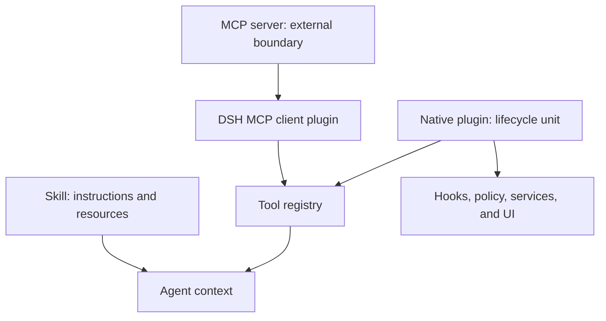

# Module 06 — Plugins vs Tools vs Skills vs MCP

## Outcome

After this module, you can:

- separate a model-callable Tool from the mechanism that supplies it;
- use a Skill for reusable instructions without pretending it grants new authority;
- choose MCP when an external service boundary and cross-host portability matter;
- choose a native DeepSeek Harness plugin for lifecycle, hooks, policy, services, persistence, or UI;
- combine the four layers into one architecture instead of forcing a false four-way choice;
- reject an extension design when a hard safety or lifecycle requirement is unmet;
- review third-party Skills, MCP servers, and plugins before installation; and
- complete a lightweight, evidence-labeled decision matrix for three realistic integrations.

Estimated time: **70–90 minutes**.

## Verification status

This lesson is a **source-reviewed draft**, not a verified release.

- Tool registration and execution, Skill discovery and loading, the MCP client bridge, Cordis plugin lifecycle, bundle installation, and plugin inventory behavior were reviewed at upstream commit [`47f943859bef60e4160492346772ded9b24f765a`](https://github.com/deepseek-ai/deepseek-harness/commit/47f943859bef60e4160492346772ded9b24f765a).
- The dated MCP specification and architecture pages for protocol concepts, tools, resources, prompts, and transports were reviewed on 2026-08-13.
- npm registry metadata was checked on 2026-08-13. Both `latest` and `next` resolved to [`@deepseek-ai/dsh@0.1.0-rc.6`](https://www.npmjs.com/package/@deepseek-ai/dsh/v/0.1.0-rc.6).
- The reviewed source still declared the CLI as `0.1.0-rc.5`, so the install package and immutable source reference remain separate evidence.
- The matrix-completeness validator, its positive and negative tests, Markdown, links, diagrams, and metadata are checked locally.
- An independent learner pass and clean-platform review of the decision workflow remain pending. No third-party extension is installed by this module.

Do not change this module to `status: verified` until [the repository verification policy](../../../docs/VERSIONING.md) has been satisfied.

## First correction — these are not four interchangeable boxes

The shortest useful definitions are:

| Term | What it is | What it is not |
|---|---|---|
| **Tool** | A model-callable capability with a name, description, input schema, execution path, and rendered result | A deployment or trust boundary by itself |
| **Skill** | Reusable instructions plus optional supporting resources, loaded into context when needed | New executable authority by itself |
| **MCP** | An interoperable protocol boundary between a host and an external server | A security sandbox or a promise that every MCP primitive is exposed by DSH |
| **Native DSH plugin** | A Cordis lifecycle and composition unit that can register capabilities, hooks, policy, services, persistence, and UI | Necessarily a model-callable Tool |

They can be composed:



An MCP server can expose operations that the DSH MCP client registers as Tools. A native plugin can also register Tools. A Skill can teach the agent when and how to call already available Tools. The right answer is therefore often a **stack**, not one label.

## Lesson 1 — Tool: the model-callable surface

In the reviewed implementation, a Tool is a registered `ToolDefinition`. Only its model-facing name, description, and parameter schema need to enter the model request. Its execution function, canonical output, renderer, scheduling metadata, and host policy stay outside that request.

A typed definition couples validation and execution:

```ts
import { defineTool } from '@deepseek-ai/dsh-tools'

const inspectRelease = defineTool({
  name: 'inspect_release',
  description: 'Inspect one synthetic release manifest.',
  parameters: {
    path: { type: 'string', required: true },
  },
  output: {
    schema: { type: 'string' },
    render: (_args, value) => [{ type: 'text', text: value }],
  },
  execute: async ({ path }) => `Inspected ${path}`,
})
```

The exact imports and package APIs can change during the developer preview; Module 07 will pin and test a complete plugin. The architectural point here is stable: the model requests a capability through a schema, while the host owns execution and presentation.

### Execution is governed, not direct

The reviewed Tool registry runs a call through ordered policy and lifecycle seams:

1. `tools/pre-execute` can allow, deny, or ask for approval.
2. Monotonic guards can reduce permission but cannot restore permission denied earlier.
3. `tools/execute` wrappers surround the operation for concerns such as timeout, retry, or metrics.
4. `tools/post-execute` can transform successful output with execution context.
5. The renderer produces model-visible and durable content.
6. `tools/result` publishes the immutable finalized result for observation.

A thrown error or unknown Tool becomes a structured Tool error rather than silently becoming a successful result. Tool implementations should still define bounded output, cancellation, timeout, concurrency, idempotency, and side-effect semantics.

### Choose a Tool surface when

- the model must invoke one atomic capability;
- inputs can be expressed as a narrow schema;
- the result can be bounded and rendered safely; and
- policy can decide whether that individual call is allowed.

Do not expose organizational policy as a Tool the model must remember to call. Enforcement belongs in an independent hook or guard. Also remember that every visible Tool schema consumes context on requests where it is advertised; an unnecessarily large catalog increases token and selection cost.

## Lesson 2 — Skill: reusable instructions and resources

A Skill is an instruction artifact. Its small catalog entry advertises a name and bounded description. The model can then load the full body on demand through the `skill` Tool. The body may point to scripts, references, or assets that are read only when needed.

The filesystem provider recognizes either of these forms:

```text
<skill-root>/release-review/SKILL.md
<skill-root>/release-review.md
```

Skill names use kebab-case. Frontmatter declares at least the name and description, with optional invocation controls such as `disable-model-invocation` and `user-invocable`. Malformed invocation policy fails closed in the reviewed implementation.

### Discovery and scope

At the reviewed revision, the filesystem provider resolves duplicate names by layer, with the lower rank winning:

| Rank | Source |
|---:|---|
| 100 | Project `.dsh/skills` |
| 200 | Project `.agents/skills` |
| 300 | Configured custom directories |
| 400 | `$DSH_HOME/skills` |
| 500 | `$DSH_AGENTS_HOME/skills` |
| 600 | Configured bundled Skills |

The project root is the nearest `.git` ancestor, falling back to the working directory. This makes a Skill useful for repository-local conventions and reusable workflows without building a runtime extension.

### Choose a Skill when

- existing Tools already provide every required capability;
- the missing ingredient is procedure, domain guidance, examples, or references;
- content should be project-scoped or portable as an instruction package; and
- loading the full instructions only when relevant is valuable.

A Skill does not grant authority merely because its prose asks for an action. However, its instructions and referenced scripts can persuade an agent to use existing authority. Review the body, frontmatter, linked resources, scripts, and symlinks as untrusted instructions and code. A body-only edit can affect later loads without a new catalog announcement, and the loaded body is not size-capped by the small catalog description limit.

## Lesson 3 — MCP: an external interoperable boundary

The Model Context Protocol defines a host-client-server architecture. A host creates a client connection for each server; the protocol standardizes context exchange but does not dictate the host's agent loop, model choice, approvals, or sandbox.

The protocol includes several server primitives. In the dated MCP documentation, Tools are model-controlled operations, Resources are passive context, and Prompts are user-controlled templates. The reviewed DSH MCP bridge currently consumes **Tools only**. Do not claim that configuring an MCP server in DSH automatically exposes its Resources or Prompts.

### The reviewed DSH bridge

`@deepseek-ai/dsh-mcp-client` is itself a native plugin, configured once per MCP server. It:

- supports local `stdio` and remote `streamable-http` transports;
- discovers server Tools and registers them into `ctx.tools`;
- gives model-visible names the qualified form `mcp__<serverName>__<rawName>` after deterministic normalization;
- uses a per-call timeout, defaulting to 60 seconds in the reviewed implementation;
- re-synchronizes after `tools/list_changed`; and
- preserves the previous generation of Tools if a later discovery refresh fails.

Initial discovery failure can leave the server with no registered Tools unless `failOnStartupError` is enabled. During a later outage, last-known Tool definitions can remain visible even though calls fail until recovery. Those behaviors belong in operational design and testing.

### Choose MCP when

- an integration should work with more than one compatible host;
- the service has its own process, deployment, release cycle, or owner;
- remote or local process isolation is an intentional boundary;
- the capability already exists as a maintained MCP server; or
- independent scaling and language choice outweigh same-process simplicity.

MCP is not a security sandbox. A `stdio` server is a local process with the command, working directory, environment, and filesystem access you give it. A Streamable HTTP server is a network and credential boundary. Review both the server and the DSH-side Tools it produces.

## Lesson 4 — Native DSH plugin: lifecycle and composition

Cordis is the plugin framework underneath DeepSeek Harness. A native plugin can be a function, object, or `Service` subclass mounted into a context. It declares required services through `inject`, registers effects through `ctx`, and is unloaded predictably during teardown or hot replacement.

Use a native plugin when the extension must own one or more of these DSH-specific seams:

- Tool registration and custom rendering;
- `tools/pre-execute`, guards, execution wrappers, result observation, or other typed events;
- prompt sections, providers, adapters, or reusable services;
- Session or Host state and persistence;
- browser contributions or configuration UI; or
- composition, configuration validation, lifecycle, and cleanup.

Prefer events for interception and policy, and service methods for direct capability calls. Attach every listener, Tool, timer, connection, and other effect to the plugin lifecycle so hot replacement does not leave duplicate registrations or orphaned resources.

### Packaging changes the trust decision

An installable DSH **bundle** is an npm package whose `dsh.bundle` manifest points to a configuration patch. A **profile** is the runnable composition that lists bundles in order. They are distinct concepts.

Installing a plugin from Git can require an allowlisted `prepare` script to build source. That permission executes package code on the user's machine at install time, outside the agent sandbox. Pin the exact commit and inspect the build path before allowing it. Prebuilt registry packages or tarballs can avoid that build step, but the plugin still runs as trusted same-process code at runtime.

The Web plugin inventory is useful evidence, but its reviewed snapshot is read-only and exposes only entry id, module specifier, enablement, and current lifecycle phase. It does not prove provenance, safety, install source, history, or who approved the package.

## Lesson 5 — Decide with hard gates before scores

Start with the requirement that cannot be compromised:

| Hard requirement | Architectural consequence |
|---|---|
| Only reusable guidance is missing | Start with a Skill; do not add new authority |
| The model must invoke an atomic operation | A Tool surface is required, supplied natively or through MCP |
| The integration must be usable by multiple MCP hosts | Put the service behind MCP |
| Every Tool call must be intercepted or denied independently of model choice | Use a native plugin hook or guard |
| The extension owns DSH UI, typed events, services, or hot-reload cleanup | Use a native plugin |
| The service must deploy and scale independently | Prefer an external boundary such as MCP |

A candidate that fails a hard requirement is vetoed even if it has a high convenience score.

For candidates that survive, score each criterion from `0` to `2`:

| Criterion | `0` — mismatch | `1` — workable compromise | `2` — strong fit |
|---|---|---|---|
| Requirement fit | Misses the core job | Needs another layer | Directly serves the job |
| Portability | Locked to the wrong host or scope | Adapter or duplication required | Matches the required hosts and scope |
| Privilege boundary | Authority is unclear or excessive | Can be constrained with work | Least privilege is natural and reviewable |
| Latency and operations | Adds unacceptable hops or failure modes | Manageable operational cost | Simple for the required deployment |
| State and lifecycle | Cannot own required state or cleanup | External coordination required | Natural ownership and disposal |
| Maintenance | Fragile or duplicated | Acceptable ongoing burden | Clear owner, versioning, tests, and rollback |

The maximum is `12`, but the total is a conversation aid, not proof. Record the hard veto, assumptions, and evidence beside the number.

## Lesson 6 — Review a third-party extension before installation

Review the exact artifact and configuration you intend to run, not only its landing page.

### Universal review

- Record package or repository identity, immutable version or commit, maintainer, source, license, and expected update path.
- Inspect install scripts, transitive dependencies, executable entry points, and uninstall or rollback behavior.
- Map every read, write, network destination, subprocess, environment variable, credential, and external side effect.
- Inspect model-visible names, descriptions, schemas, catalog size, output bounds, error behavior, timeouts, retries, and idempotency.
- Define approvals, logging, data retention, failure behavior, health checks, and a synthetic smoke test.
- Test with fake credentials and least privilege before exposing real data.

### Mechanism-specific review

| Mechanism | Additional questions |
|---|---|
| Tool | Is the schema narrow? Are writes obvious? Can output or concurrency grow without bound? Does cancellation stop the effect? |
| Skill | What does the full body instruct? Which scripts, assets, references, and symlinks can it reach? Who may invoke it? |
| MCP over `stdio` | What exact executable runs? Is the package pinned? Which environment variables and working directory does it receive? Does stdout remain protocol-only? |
| MCP over HTTP | What exact TLS endpoint receives data? How is authentication scoped and rotated? What are the service's retention and outage behaviors? |
| Native plugin | Which services and hooks does it inject? Can it alter policy, prompts, persistence, or UI? Does every effect dispose cleanly? Does installation run code? |

Re-review on every update that changes source, dependencies, Tool schemas, permissions, endpoints, credentials, or lifecycle behavior.

## Lesson 7 — Produce an evidence-labeled architecture stack

For each scenario, write three kinds of statements:

- **Observed:** directly supported by the scenario, a pinned source, a command, or an inspected artifact.
- **Inferred:** an architectural conclusion derived from observed facts.
- **Unverified:** an assumption or runtime behavior that still needs a test.

Then name:

1. the primary mechanism;
2. any supporting mechanism;
3. the execution and credential boundary;
4. the lifecycle and failure owner;
5. the rejected alternatives and their decisive gaps; and
6. the next smallest test that could disprove the choice.

This turns “use MCP because it is modern” into a falsifiable design decision.

## Lab — Complete the extension decision matrix

The deliverable is a completed copy of [EXTENSION-DECISION-MATRIX.md](EXTENSION-DECISION-MATRIX.md). The dependency-free [Extension Selection Lab](../../../projects/extension-selection-lab/) supplies three synthetic scenarios and a structural validator. It installs and contacts nothing.

### Step 1 — Prepare a disposable worksheet

From the repository root:

```sh
MODULE06_WORK="$(mktemp -d)"
cp course/en/06-plugins-tools-skills-mcp/EXTENSION-DECISION-MATRIX.md \
  "$MODULE06_WORK/extension-decision-matrix.md"
sed -n '1,240p' projects/extension-selection-lab/SCENARIOS.md
printf '%s\n' "$MODULE06_WORK/extension-decision-matrix.md"
```

The scenarios deliberately require different stacks:

- `S1` adds repository-local release guidance but no new capability.
- `S2` connects an independently deployed issue service to several compatible hosts.
- `S3` enforces organization policy across all DSH Tool calls and adds audit status to the Web UI.

### Step 2 — Apply hard vetoes

For each scenario:

1. restate the non-negotiable requirement;
2. decide whether a Skill alone is sufficient;
3. decide whether a model-callable Tool surface is needed;
4. decide whether an external MCP boundary is required; and
5. decide whether DSH-specific lifecycle, policy, or UI requires a native plugin.

Write the veto before assigning any scores.

### Step 3 — Score surviving candidates

Score Tool, Skill, MCP, and native DSH plugin roles from `0` to `2` on all six criteria. A Tool score means “make this a model-callable operation”; it does not pretend that a Tool deploys itself. Name the mechanism that supplies it.

Complete the authority map, evidence ledger, rejected alternatives, smallest disconfirming test, and third-party review section. Replace every `TODO:` and check every box only after the evidence exists.

### Step 4 — Validate completeness

The first command should fail against the untouched template because placeholders remain. After completing the temporary copy, it should pass:

```sh
node projects/extension-selection-lab/src/validate-matrix.js \
  course/en/06-plugins-tools-skills-mcp/EXTENSION-DECISION-MATRIX.md

node projects/extension-selection-lab/src/validate-matrix.js \
  "$MODULE06_WORK/extension-decision-matrix.md"

npm --prefix projects/extension-selection-lab test
```

The validator checks structure and placeholder removal. It does not certify architectural correctness.

### Step 5 — Compare the reference stacks

Review these only after recording your own decisions:

| Scenario | Reference primary mechanism | Supporting layers | Why |
|---|---|---|---|
| `S1` | Skill | Existing built-in Tools | The missing asset is scoped procedure and references; no new authority is required |
| `S2` | MCP | DSH MCP client plugin and registered Tools | The service is independently deployed and must serve multiple compatible hosts |
| `S3` | Native DSH plugin | Hooks, guard, result observer, UI; optional status Tool | Enforcement must run independently of model choice and participate in DSH lifecycle and UI |

Different scores can be defensible if the scenario facts, hard gates, and boundaries are preserved. For example, `S2` still needs a model-callable Tool surface in DSH, but MCP owns the external integration boundary.

### Step 6 — Clean up

After saving a sanitized deliverable outside the temporary directory if desired:

```sh
rm -r "$MODULE06_WORK"
```

The variable points to the one directory created in Step 1. Inspect its value before removal.

## Completion checklist

- [ ] I can explain why the four terms are composable layers rather than peers.
- [ ] I can distinguish a Tool surface from its native or MCP supplier.
- [ ] I can explain why a Skill adds guidance but not authority.
- [ ] I recorded that the reviewed DSH MCP bridge exposes Tools, not MCP Resources or Prompts.
- [ ] I used hard vetoes before numeric scores.
- [ ] I completed all three scenario decisions with observed, inferred, and unverified evidence.
- [ ] I mapped credentials, data, side effects, state, lifecycle, and failure ownership.
- [ ] I reviewed the exact third-party artifact and install path for one proposed component.
- [ ] The matrix validator and project tests passed.
- [ ] No credential, private endpoint, absolute private path, or placeholder remains.

## Deliverable

One completed, sanitized [extension decision matrix](EXTENSION-DECISION-MATRIX.md) containing three architecture stacks, hard vetoes, candidate scores, authority and lifecycle maps, evidence labels, rejected alternatives, third-party review, and the next disconfirming test for each choice.

## Official sources

- [DeepSeek Harness Tool subsystem at the reviewed commit](https://github.com/deepseek-ai/deepseek-harness/blob/47f943859bef60e4160492346772ded9b24f765a/docs/subsystems/tools.md)
- [Core Tool registry at the reviewed commit](https://github.com/deepseek-ai/deepseek-harness/blob/47f943859bef60e4160492346772ded9b24f765a/packages/core/tools/README.md)
- [DeepSeek Harness Skill subsystem at the reviewed commit](https://github.com/deepseek-ai/deepseek-harness/blob/47f943859bef60e4160492346772ded9b24f765a/docs/subsystems/skills.md)
- [Filesystem Skill provider at the reviewed commit](https://github.com/deepseek-ai/deepseek-harness/blob/47f943859bef60e4160492346772ded9b24f765a/packages/skill/skill-filesystem/README.md)
- [MCP client bridge at the reviewed commit](https://github.com/deepseek-ai/deepseek-harness/blob/47f943859bef60e4160492346772ded9b24f765a/packages/mcp/mcp-client/README.md)
- [Extension cookbook at the reviewed commit](https://github.com/deepseek-ai/deepseek-harness/blob/47f943859bef60e4160492346772ded9b24f765a/docs/cookbook/extension-cookbook.md)
- [Cordis primer at the reviewed commit](https://github.com/deepseek-ai/deepseek-harness/blob/47f943859bef60e4160492346772ded9b24f765a/docs/cordis-primer.md)
- [Native plugin tutorial at the reviewed commit](https://github.com/deepseek-ai/deepseek-harness/blob/47f943859bef60e4160492346772ded9b24f765a/docs/user/develop/basic/index.md)
- [Plugin packaging and install-time trust at the reviewed commit](https://github.com/deepseek-ai/deepseek-harness/blob/47f943859bef60e4160492346772ded9b24f765a/docs/user/develop/basic/publish.md)
- [Plugin inventory limitations at the reviewed commit](https://github.com/deepseek-ai/deepseek-harness/blob/47f943859bef60e4160492346772ded9b24f765a/packages/host/plugin-inventory/README.md)
- [MCP architecture, version 2026-07-28](https://modelcontextprotocol.io/docs/2026-07-28/learn/architecture)
- [MCP server concepts, version 2026-07-28](https://modelcontextprotocol.io/docs/2026-07-28/learn/server-concepts)
- [MCP Tools specification, version 2026-07-28](https://modelcontextprotocol.io/specification/2026-07-28/server/tools)
- [MCP `stdio` transport, version 2026-07-28](https://modelcontextprotocol.io/specification/2026-07-28/basic/transports/stdio)
- [MCP Streamable HTTP transport, version 2026-07-28](https://modelcontextprotocol.io/specification/2026-07-28/basic/transports/streamable-http)
- [MCP security best practices](https://modelcontextprotocol.io/specification/draft/basic/security_best_practices)

## Next module

[Module 07 — Build Your First DSH Plugin](../../../SYLLABUS.md#module-07--build-your-first-dsh-plugin) will turn the native side of this decision into a tested plugin.
