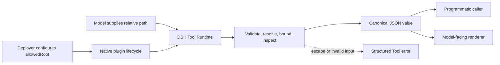

# Module 07 — Build Your First DSH Plugin

## Outcome

After this module, you can:

- explain the difference between a plugin module, a bundle, and a profile;
- implement a native plugin entry point with explicit service dependencies;
- register a typed Tool with separate input, canonical-output, and rendering contracts;
- validate deployment configuration before filesystem access begins;
- design a read-only capability around a deployment-fixed permission boundary;
- bound both acquisition and returned data;
- prove Tool registration, execution, error handling, cancellation, and unload cleanup without an API key; and
- load the built plugin through a temporary overlay or an isolated local profile.

Estimated time: **100–130 minutes**.

## Verification status

This lesson is a **source-reviewed and locally tested draft**, not a verified
release.

- Plugin entry points, dependency injection, configuration schemas, effect
  cleanup, typed Tool definitions, canonical output, bundle manifests, profile
  installation, and upstream testing policy were reviewed at commit
  [`47f943859bef60e4160492346772ded9b24f765a`](https://github.com/deepseek-ai/deepseek-harness/commit/47f943859bef60e4160492346772ded9b24f765a).
- npm registry metadata was checked on 2026-08-13. The course pins
  [`@deepseek-ai/dsh@0.1.0-rc.6`](https://www.npmjs.com/package/@deepseek-ai/dsh/v/0.1.0-rc.6)
  and the fixture pins
  [`@deepseek-ai/dsh-tools@0.1.0-rc.6`](https://www.npmjs.com/package/@deepseek-ai/dsh-tools/v/0.1.0-rc.6)
  explicitly.
- The reference plugin type-checks, builds, and passes eight keyless tests on
  the recorded Linux environment. Those tests include the real Cordis and DSH
  Tool Runtime.
- An exact rc.6 CLI installed into a disposable Linux prefix. The local bundle
  was added to an isolated Web profile, appeared in `--dump-config`, booted
  through the real Loader, returned HTTP success, shut down cleanly on SIGTERM,
  and was removed with its bundle row.
- The package file set was inspected with a dry-run pack. The module's
  Markdown, links, diagram, metadata, and repository navigation are checked
  locally.
- An independent clean-platform reproduction, browser inspection of the Tool,
  authenticated model call, live reload observation, macOS and Windows review,
  and independent learner pass remain pending.

The exact commands and evidence are in
[PLUGIN-BUILD-RECORD.md](PLUGIN-BUILD-RECORD.md). Do not change this module to
`status: verified` until the remaining gates in the
[verification policy](../../../docs/VERSIONING.md) pass.

## Why this plugin

Module 06 chose a native plugin when a capability needs Harness lifecycle and
Tool registration. This module turns that decision into a small artifact:

> `inspect_repository` reports bounded directory metadata beneath one root
> selected by the deployer.

The task is intentionally less ambitious than a general file reader. A first
plugin should make its authority easy to audit. The model cannot choose an
absolute root, receive file bodies or package-script commands, write files,
spawn a process, or make a network request.



## Prerequisites

- Complete [Module 06](../06-plugins-tools-skills-mcp/README.md).
- Use Node.js `^22.19.0 || >=24.0.0` and pnpm `11.19.0`.
- Install the exact CLI package `@deepseek-ai/dsh@0.1.0-rc.6` if you plan to
  run the optional profile lab.
- Clone this course repository and use only the synthetic fixture under
  `plugins/repository-inspector/test/fixtures/`.
- Do not point the Tool at a home directory, credential directory, customer
  repository, or other sensitive tree.

The type check and automated tests require no model account, API key, browser,
network request after dependency installation, or global DSH installation.

## Reference artifact

Open [the Repository Inspector package](../../../plugins/repository-inspector/)
before writing new code. Its maintained source is the deliverable for this
module:

```text
plugins/repository-inspector/
├── package.json
├── pnpm-lock.yaml
├── tsconfig.json
├── cordis.patch.yml
├── src/
│   ├── index.ts
│   └── inspect-repository.ts
├── scripts/
│   ├── clean.mjs
│   └── create-overlay.mjs
└── test/
    ├── repository-inspector.test.js
    └── fixtures/sample-repository/
```

Read the package's [README](../../../plugins/repository-inspector/README.md)
for its complete permission boundary and known limitations.

## Lesson 1 — Package and plugin anatomy

Three related objects are easy to conflate:

| Object | What it owns | This module's example |
|---|---|---|
| **Plugin module** | Runtime `name`, dependencies, configuration schema, and `apply` lifecycle | `lib/index.js` built from `src/index.ts` |
| **Bundle** | An installable package plus a configuration layer | `package.json` declares `dsh.bundle.patch` |
| **Profile** | An ordered, runnable composition of bundles plus user patches | A temporary `web` profile in the lab |

A plugin can be loaded directly through an absolute-path overlay during local
development. A distributable plugin package becomes active through its bundle
patch. Installing an ordinary library without `dsh.bundle` adds a dependency
but no configuration layer.

The fixture keeps its public contract in `src/index.ts` and filesystem logic in
`src/inspect-repository.ts`. That separation allows most edge cases to be
tested without constructing a Harness runtime, while the runtime smoke test
still exercises the real registered Tool.

The package records exact rc.6 dependencies. This matters because the reviewed
upstream checkout still declared rc.5 and the npm `latest` tag for
`@deepseek-ai/dsh-tools` did not identify rc.6 when the module was researched.
An exact package version and an immutable source commit are different evidence;
neither should be silently substituted for the other.

## Lesson 2 — Implement the plugin entry point

A function-form plugin needs only an `apply` export, but a production-minded
entry also names itself and declares required services:

```ts
import type { Context } from '@deepseek-ai/cordis'

export const name = 'borealbit-repository-inspector'
export const inject = ['tools']

export function apply(ctx: Context, config: Config): void {
  // Validate deployment config, then register effects through ctx.
}
```

`inject = ['tools']` tells Cordis not to run `apply` until the Tool service is
available. Accessing `ctx.tools` without declaring the dependency makes load
order implicit and fragile.

Registration through `ctx` is lifecycle-owned. When the plugin fiber is
disposed during an unload or replacement, its Tool registration is removed.
That cleanup is not merely convenient: without it, a reload could leave a
stale callback, duplicate name, or old configuration active.

Function form is sufficient here. Object form is useful for packaging several
fields as one default export; a `Service` class is appropriate when the plugin
provides a reusable service to other plugins. Do not introduce a service class
just to make a one-Tool package look larger.

## Lesson 3 — Register a typed Tool

The entry calls `ctx.tools.register(defineTool({...}))`. The definition has
three contracts:

1. `parameters` describes and validates model-generated arguments.
2. `execute(args, exec)` performs the operation and returns one canonical JSON
   value while honoring `exec.signal`.
3. `output.render(args, value)` converts that value into model-facing content.

The Tool accepts one optional argument:

```ts
parameters: {
  path: {
    type: 'string',
    description: 'Directory path relative to the configured repository root.',
  },
}
```

The schema DSL validates declared types, but it does not express every useful
constraint. The implementation separately rejects an empty path, an absolute
path, traversal, and unknown root arguments. It also honors a pre-aborted
signal and checks cancellation while acquiring entries and manifest bytes.

Do not return rendered prose from `execute`. The canonical result is the
programmatic API used by Code Mode and other same-process callers:

```ts
interface InspectionResult {
  rootLabel: string
  path: string
  entries: Array<{ name: string; kind: 'directory' | 'file' | 'symlink' | 'other' }>
  truncated: boolean
  manifest: {
    name?: string
    version?: string
    private?: boolean
    scriptNames: string[]
  } | null
  warnings: string[]
  readOnly: true
  untrusted: true
}
```

The renderer may produce friendly text, but consumers never need to parse that
text to recover `entries`, `truncated`, or package metadata. A throw, invalid
return value, or renderer failure follows the Tool Runtime's structured error
path rather than masquerading as successful content.

## Lesson 4 — Configuration schema and dependency declarations

The plugin exports both a TypeScript `Config` type and a same-named Schemastery
schema:

```ts
export interface Config {
  allowedRoot: string
  maxEntries?: number
  maxManifestBytes?: number
}

export const Config: Schema<Config> = Schema.object({
  allowedRoot: Schema.string().required(),
  maxEntries: Schema.number().default(40),
  maxManifestBytes: Schema.number().default(32_768),
})
```

The schema fills defaults and rejects missing or wrong primitive types during
plugin load. `normalizeInspectorOptions` adds constraints not expressed there:
`allowedRoot` must be absolute, both bounds must be integers, and their values
must remain within hard ranges. Those structural errors fail before the Tool
registers. Root existence, directory type, and readability are checked on each
call so transient mount changes become structured Tool errors.

Configuration and Tool arguments have different owners:

| Value | Owner | Can the model change it? |
|---|---|---:|
| `allowedRoot` | Deployer | No |
| Entry and manifest limits | Deployer within hard caps | No |
| Relative `path` | Tool caller | Yes |

The package manifest puts `@deepseek-ai/cordis` and
`@deepseek-ai/dsh-tools` in `peerDependencies`, because the running Harness
owns those shared runtimes. It mirrors them in `devDependencies` for local
builds and tests. Schemastery is a runtime validator, so it is a regular
dependency. The lockfile fixes the complete development resolution.

## Lesson 5 — Return structured, bounded results

“Read-only” is not a complete permission model. A read can still expose secrets
or consume unbounded memory. The reference plugin therefore applies several
independent controls:

| Risk | Control |
|---|---|
| Model selects a sensitive root | Root is deployment configuration, never a Tool argument |
| `../` traversal | Lexical containment check after path resolution |
| Directory symlink escape | Real path must remain beneath the configured root |
| Manifest symlink | Rejected; POSIX open also uses `O_NOFOLLOW` |
| Huge directory | Acquisition stops after `maxEntries + 1` entries |
| Huge manifest | File acquisition stops at the configured byte cap plus one sentinel byte |
| Script secret or command disclosure | Only bounded script **names**, never values |
| Prompt-like text in names or metadata | Canonical value marks data untrusted; renderer emits one-line JSON plus an explicit data-only warning |
| Large or hostile strings | Text length, script count, entry count, and config hard caps |
| Hidden side effects | No write, subprocess, environment read, or network API exists |

The result includes `truncated` so a caller never mistakes a bounded sample for
a complete directory. Warnings explain why a manifest was skipped instead of
quietly returning misleading metadata.

Repository-controlled strings remain untrusted even after JSON serialization.
The renderer keeps control characters escaped on one data line and states that
the strings are not instructions; the canonical result also carries
`untrusted: true`. A downstream agent or application must preserve that trust
label rather than promoting a filename into policy or instruction text.

The Tool is still not an OS sandbox. Filenames can be sensitive, the Harness
process retains its operating-system authority, concurrent filesystem mutation
can create race conditions, and the current Windows symlink path is unverified.
Use a synthetic or deliberately scoped root. For a higher-risk deployment,
combine this narrow Tool with an independent `tools/pre-execute` policy or
`ctx.tools.guard()` and an operating-system containment mechanism.

## Lesson 6 — Unit tests and runtime smoke tests

Install and run the fixture from its directory:

```sh
cd plugins/repository-inspector
pnpm install --frozen-lockfile
pnpm typecheck
pnpm test
```

**Expected result:** TypeScript exits successfully and Node reports eight
passing tests.

The suite covers four distinct layers:

| Layer | Evidence |
|---|---|
| Pure operation | Expected metadata, deterministic presentation order, caps, and cancellation |
| Negative security paths | Absolute path, traversal, directory-link escape, manifest link, and invalid bounds |
| Real Tool Runtime | Register, inspect schema, execute success, contain errors, render content |
| Lifecycle and loader input | Dispose the plugin fiber, assert no Tool remains, and generate a safe absolute overlay |

The runtime smoke uses real `Context`, `SystemPrompt`, and `ToolRuntime`
packages, not a hand-written registry mock. It needs no model. A separate
disposable smoke proves the exact rc.6 CLI Loader, bundle/profile composition,
Web HTTP boot, shutdown, and removal. Upstream testing policy also requires a
user-visible scenario for a shipped model-visible plugin; browser schema
inspection and an authenticated synthetic-fixture call remain promotion gates.

To inspect the files that would enter a future tarball without publishing:

```sh
npm pack --dry-run
```

Confirm that `src/`, tests, fixtures, local overlays, and credentials are absent;
the built `lib/`, bundle patch, package documentation, license, notice, and
overlay helper should be present. Module 11, not this lesson, owns registry and
Git-install packaging.

## Lesson 7 — Load, reload, and inspect the plugin

Choose one of the two local paths below. Both require a completed build.

### Path A — one-run source overlay

The loader does not resolve a relative module path from the overlay file's
directory. Generate an absolute overlay instead of hand-writing private paths:

```sh
pnpm build
node scripts/create-overlay.mjs \
  --allowed-root "$PWD/test/fixtures/sample-repository" \
  --output "$PWD/module07.patch.yml"
```

Inspect before booting:

```sh
dsh web --patch "$PWD/module07.patch.yml" --dump-config
```

**Expected result:** the dump includes a row with id
`borealbit-repository-inspector`, an absolute `lib/index.js` entry, and the
synthetic fixture as `allowedRoot`. A config dump composes files but does not
execute the plugin.

Boot only after the dump is understood:

```sh
dsh web --patch "$PWD/module07.patch.yml"
```

For a guaranteed source refresh, stop the process, run `pnpm build`, and restart
the same command. The overlay generator uses exclusive creation and refuses to
overwrite an existing file; inspect and remove the old generated overlay before
creating a different one.

### Path B — local bundle in an isolated profile

Use a temporary DSH home so the exercise does not change your normal Web
profile:

```sh
export MODULE07_DSH_HOME="$(mktemp -d)"
export DSH_HOME="$MODULE07_DSH_HOME"
export DSH_REPOSITORY_INSPECTOR_ROOT="$PWD/test/fixtures/sample-repository"
dsh plugin --profile web add .
dsh --profile web --dump-config
```

**Expected result:** the Web profile lists the local package as a dependency,
its ordered bundle layers include the Repository Inspector patch, and the dump
shows the `borealbit-repository-inspector` row. The `!!js` expression remains
unevaluated in a dump; it resolves the environment value during plugin boot.

Then start the isolated Web profile:

```sh
dsh --profile web
```

If an authenticated provider is deliberately configured, create a disposable
session and use this controlled prompt:

```text
Use inspect_repository with path ".". Report the relative path, package name,
script names, and truncated flag. Do not call any other tool.
```

**Expected result:** the Tool reports `sample-release-app`, script names
`build` and `test`, `path: .`, and `truncated: false`. It must not reveal the
script command values from the fixture.

The framework hot-replaces a plugin when a watched configuration edit changes
its instance. Whether a reload is triggered that way or by a deliberate
restart, the essential contract is the same: disposal removes the old
registration before the replacement is active. The automated fiber-disposal
test proves that lifecycle property independently of UI behavior.

Remove the isolated installation after the lab:

```sh
dsh plugin --profile web remove @borealbit/dsh-repository-inspector
unset DSH_REPOSITORY_INSPECTOR_ROOT DSH_HOME MODULE07_DSH_HOME
```

Do not delete a broad directory through an unset variable. If you later remove
the temporary directory, use the exact path printed by `mktemp -d` and inspect
it first.

## Troubleshooting

| Symptom | Likely cause | Check | Resolution |
|---|---|---|---|
| `ERR_PNPM_OUTDATED_LOCKFILE` | Manifest and lockfile differ | `git diff -- package.json pnpm-lock.yaml` | Restore the pair or intentionally regenerate and review the lock |
| Cannot resolve `lib/index.js` | Package was not built | `test -f lib/index.js` | Run `pnpm build` |
| `allowedRoot must be...` | Missing, relative, or invalid deployment config | Inspect the overlay or environment; do not print secrets | Use an absolute synthetic fixture path |
| `path escapes allowedRoot` | Traversal or external symlink | Inspect only the relative request and fixture link | Keep the request beneath the configured root |
| Tool is absent from the schema list | Plugin did not load or `tools` was unavailable | Read boot diagnostics and config dump | Fix the first load error; retain `inject = ['tools']` |
| Duplicate Tool after a code change | Old instance was not disposed or a second row loaded | Inspect composed rows and lifecycle test | Remove the duplicate row; register through `ctx` effects |
| Profile install activates no layer | Package was added as a library rather than bundle | Inspect `package.json.dsh.bundle` | Keep the bundle manifest and patch in the package |
| Browser boots but the model never calls the Tool | Provider, prompt, or schema selection issue | First confirm the keyless runtime test and visible schema | Use the controlled prompt; do not weaken boundaries to force a call |

## Completion check

- [ ] I can distinguish the plugin module, bundle, and profile.
- [ ] `pnpm install --frozen-lockfile` completed from the plugin directory.
- [ ] `pnpm typecheck` exited `0`.
- [ ] `pnpm test` reported eight passes.
- [ ] I inspected the canonical output separately from rendered content.
- [ ] I can explain why `allowedRoot` is deployment configuration.
- [ ] I observed both a successful call and a traversal rejection in the tests.
- [ ] I observed that disposing the plugin removes its Tool.
- [ ] I inspected a generated overlay or isolated profile dump before booting.
- [ ] I used only the synthetic fixture and recorded no credential or private path.
- [ ] I marked authenticated Web and cross-platform evidence honestly if skipped.

## Deliverable

Retain the tested
[Repository Inspector plugin](../../../plugins/repository-inspector/) and a
completed copy of [PLUGIN-BUILD-RECORD.md](PLUGIN-BUILD-RECORD.md). The build
record must separate observed, inferred, and unverified claims; never include
API keys, private absolute paths, customer filenames, raw Session data, or a
generated overlay containing a private path.

## Official sources

- [Your first plugin](https://github.com/deepseek-ai/deepseek-harness/blob/47f943859bef60e4160492346772ded9b24f765a/docs/user/develop/basic/index.md)
- [Build a Tool](https://github.com/deepseek-ai/deepseek-harness/blob/47f943859bef60e4160492346772ded9b24f765a/docs/user/develop/basic/tool.md)
- [Plugin configuration](https://github.com/deepseek-ai/deepseek-harness/blob/47f943859bef60e4160492346772ded9b24f765a/docs/user/develop/basic/config.md)
- [Package and install a plugin](https://github.com/deepseek-ai/deepseek-harness/blob/47f943859bef60e4160492346772ded9b24f765a/docs/user/develop/basic/publish.md)
- [Tool authoring reference](https://github.com/deepseek-ai/deepseek-harness/blob/47f943859bef60e4160492346772ded9b24f765a/docs/cookbook/adding-a-tool.md)
- [`dsh-tools` runtime and extension points](https://github.com/deepseek-ai/deepseek-harness/blob/47f943859bef60e4160492346772ded9b24f765a/packages/core/tools/README.md)
- [Harness testing policy](https://github.com/deepseek-ai/deepseek-harness/blob/47f943859bef60e4160492346772ded9b24f765a/docs/testing.md)
- [`dsh` CLI behavior reference](https://github.com/deepseek-ai/deepseek-harness/blob/47f943859bef60e4160492346772ded9b24f765a/apps/cli/reference/README.md)

## Next module

Continue to **Module 08 — Hooks, Context, and Session Engineering** after its
English draft is published.
