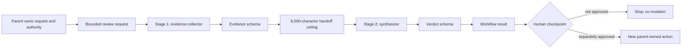

# Module 09 — Subagents, Workflows, and Automation

## Outcome

After this module, you can:

- decide when delegation reduces context coupling rather than merely adding
  latency and failure modes;
- distinguish one-shot subagent runs, continuable child Sessions, workflow
  runs, scheduled reminders, and production background jobs;
- choose a subagent provider by its advertised capabilities and context
  boundary instead of assuming all providers behave alike;
- define a structured output contract between two stages;
- apply a concurrency ceiling, total-agent ceiling, handoff-size limit, and
  cancellation signal;
- interpret workflow lifecycle events without treating observers as owners;
- keep mutation authority with the parent and stop at an explicit human
  checkpoint; and
- run and audit a two-stage review workflow without a model key.

Estimated time: **110–145 minutes**.

## Verification status

This lesson is a **source-reviewed and locally tested draft**, not a verified
release.

- The subagent registry, provider capability, one-shot and continuable child,
  workflow lifecycle, worker-thread engine, workflow Tool, and schedule
  contracts were reviewed at upstream commit
  [`47f943859bef60e4160492346772ded9b24f765a`](https://github.com/deepseek-ai/deepseek-harness/commit/47f943859bef60e4160492346772ded9b24f765a).
- The course pins `@deepseek-ai/dsh@0.1.0-rc.6`. The maintained project pins
  `@deepseek-ai/dsh-subagent`, `@deepseek-ai/dsh-workflow`, and
  `@deepseek-ai/dsh-workflow-worker-thread` at rc.6. The reviewed source
  manifests still declared rc.5, so the immutable source review and installed
  package run remain separate evidence.
- The maintained project passed syntax checks, seven keyless Node tests, a
  deterministic demo, and an offline lockfile replay on the recorded Linux
  runner. Its tests use the real rc.6 subagent service and workflow engine with
  a deliberately powerless deterministic provider.
- No authenticated model call, remote subagent provider, continuable child,
  persisted schedule, detached production job, browser presentation,
  independent learner pass, or clean macOS/Windows run is claimed.

Do not change this module to `status: verified` until the applicable gates in
the [verification policy](../../../docs/VERSIONING.md) pass.

## The artifact

The maintained
[`Delegated Review Workflow`](../../../projects/delegated-review-workflow/)
implements the module deliverable:

> Stage 1 returns bounded structured evidence. Stage 2 sees only that handoff
> and returns a structured recommendation. The parent receives both and must
> make the decision; neither stage mutates anything.



The fixture provider validates both structured values but has no model, Tools,
filesystem, process, environment, network, continuation, or mutation surface.
It proves orchestration mechanics, not model judgment.

## Prerequisites

- Complete [Module 08](../08-hooks-context-session-engineering/README.md).
- Use Node.js `^22.19.0 || >=24.0.0` and npm `11.9.0`.
- Clone this course repository and work only from
  `projects/delegated-review-workflow/` during the keyless lab.
- Do not add a provider key, customer data, private repository content, or a
  mutating Tool to the maintained fixture.

Dependency installation contacts the configured npm registry unless the exact
packages already exist in a trusted cache. The syntax check, tests, and demo
make no external request after installation.

## Lesson 1 — Delegate only a separable contract

Delegation is useful when a child can own a bounded question with an explicit
input and output. Good candidates include independent evidence gathering,
review against a fixed rubric, or parallel analysis whose results can be
reconciled mechanically.

Do not delegate merely because a task has several steps. One parent is usually
better when the work:

- depends on the same rapidly changing context;
- requires frequent negotiation between steps;
- contains one or two small lookups;
- cannot state a useful completion contract;
- needs one authority holder for a sensitive mutation; or
- would cost more to explain and reconcile than to perform directly.

Use this decision test before adding a child:

| Question | Delegate when | Keep with the parent when |
|---|---|---|
| Can the input be bounded? | The child needs a narrow brief | It needs the entire evolving conversation |
| Can the output be checked? | A schema or evidence rubric exists | “Use your judgment” is the only contract |
| Is the work independent? | It can finish without steering sibling work | Each result changes the next question |
| Is authority separable? | The child can remain read-only | The child must approve or perform a sensitive action |
| Is the cost justified? | Isolation or concurrency creates clear value | Handoff, latency, and failure handling dominate |

The reference workflow uses exactly two sequential children because the
boundary is useful: the second stage must not receive the raw request. Adding a
manager agent, critic agent, or vote would not create another independent
contract, so the project does not add them.

## Lesson 2 — The subagent seam is a provider registry

`ctx.subagents` is a named provider registry. A caller selects a provider and
passes a one-shot request containing a parent, content blocks, one cancellation
signal, and optional composition controls. Each provider advertises four
start-time capability flags:

| Capability | Requested field | Meaning |
|---|---|---|
| `outputSchema` | `outputSchema` | Child may return a schema-validated structured value |
| `depthLimit` | `maxDepth` | Child creation observes an absolute delegation-depth cap |
| `toolFilter` | `toolFilter` | Child Tool visibility and execution can be restricted |
| `persona` | `persona` | Child receives a scoped persona |

The service rejects a requested capability that the selected provider does not
advertise. It does not silently omit the option.

Provider names describe implementations, not interchangeable personalities.
The official tree includes fresh in-process spawn, in-process fork, and
out-of-process integrations such as ACP, Claude Code, Codex, and DSH SDK
providers. Review the selected package, its transport, and its exact
capabilities before relying on it.

Two context descriptions matter:

- A fresh **spawn** child starts without the parent's completed conversation.
- A **fork** child may seed a balanced completed-turn prefix from the parent.

`inheritsParentContext` describes that completed conversation prefix only. It
does not prove that Tools, credentials, approval authority, sandbox policy, or
every service is inherited. Context inheritance is not authority inheritance.

## Lesson 3 — Own every one-shot run

`ctx.subagents.start(name, request)` is asynchronous. Before it fulfills, the
provider owns partial setup. After it fulfills, the caller owns the published
`SubagentRun` and must dispose it on every path.

```js
const run = await ctx.subagents.start('chosen-provider', request)
try {
  const result = await run.result
  // Branch on result.stopReason and validate any expected structured value.
} finally {
  await run.dispose()
}
```

A child-level failure resolves `run.result` with a non-completed stop reason.
An infrastructure fault that cannot be represented by that vocabulary may
reject it. `dispose()` is idempotent and owns cancellation, quiescence, and
resource release.

The published run is **one foreground delegation with one terminal result**.
It is not a durable conversation and not a queue record.

## Lesson 4 — Continuable children are durable conversations

A continuable child has a stable child Session and processes accepted messages
through its Agent inbox in FIFO order. Its creation call returns
`{ childId, messageId }` after the initial prompt is accepted into the inbox;
it does not wait for that turn to finish.

Later controls have deliberately narrow meanings:

- a follow-up becomes a later FIFO turn and cannot redirect a turn already in
  progress;
- interrupt requests cancellation of the current turn but retains unclaimed
  inbox work, the Activation, and published descendants;
- a child report delivers selected content to its direct parent but does not
  end the child's turn; and
- list operations project durable child identity and status without granting
  control authority.

An Activation is the process-local residency of a continuable Session. It may
execute several turns and survive while descendants settle. It is not a Task,
result wrapper, exactly-once mailbox, or generic background-job handle.

Use a continuable child only when later conversational turns are part of the
product. Use a one-shot child when one result is the complete contract. This
module's review uses one-shot runs because neither stage should remain alive
after returning its object.

## Lesson 5 — A workflow owns orchestration, not child authority

The workflow seam exposes one `ctx.workflowEngine` per Cordis context. The
worker-thread implementation executes a JavaScript body and bridges its
`agent()` calls back to `ctx.subagents` on the host.

The start request contains:

- validated `meta` data;
- a script string;
- optional plain-JSON `args`;
- the parent Agent for every child;
- an optional provider override;
- an optional per-run total-agent ceiling; and
- an optional cancellation signal.

Inside the worker, the documented hooks are:

| Hook | Purpose |
|---|---|
| `agent(prompt, options)` | Start one child; return structured data with a schema, text otherwise, or `null` for an ordinary child failure |
| `parallel(thunks)` | Run independent calls under the configured concurrency limit |
| `pipeline(items, ...stages)` | Move bounded items through sequential stages |
| `phase(title)` | Emit progress vocabulary; it creates no execution barrier |
| `log(message)` | Emit observer narration |

The reference script uses `agent()` twice. Its schemas travel as data in
`args`, and each child result must cross the plain-JSON worker boundary. The
script explicitly handles `null`, limits the serialized handoff, and returns a
plain result with `humanCheckpointRequired: true` and
`mutationPerformed: false`.

Workflow policy is owned by the host. The script cannot raise its total-agent
ceiling or select a different child provider after the run starts. The current
`agent()` options do not expose every subagent composition capability; in
particular, do not assume a workflow script can enforce a Tool restriction for
its children. Choose and configure a provider whose deployment policy already
matches the workflow.

## Lesson 6 — Failure, observation, cancellation, and disposal

Once a workflow run is published, its `result` resolves rather than rejects:

```text
completed | cancelled | error
```

`value` is meaningful only for `completed`. A workflow can intentionally turn
an ordinary child failure (`agent()` returns `null`) into a completed,
structured `blocked` value. Misuse such as a malformed option, unsupported
schema, provider-start failure, cancellation, or tripped agent cap is fatal and
settles the workflow as `error` or `cancelled`.

The caller owns the live `WorkflowRun`:

```js
const run = ctx.workflowEngine.start(request)
try {
  const result = await run.result
} finally {
  await run.dispose()
}
```

Cancellation uses one run signal for pending and published children. The
worker-thread engine applies a bounded disposal grace and can terminate an
uncooperative worker. Normal settlement also drains child disposal.

Lifecycle events are observation, not ownership:

```text
workflow/start
workflow/phase
workflow/log
workflow/agent-start  <->  workflow/agent-end
workflow/end
```

Observers receive data snapshots, not the live run. `workflow/end` omits the
script's result value. A listener cannot acquire cancel or dispose authority by
subscribing, and a throwing listener is contained.

The worker thread protects the host event loop from a synchronous script loop
and enables forced termination. Its `node:vm` context is **not a security
sandbox**. Treat model-written workflow code with the same trust premise as
model-written shell code unless a different isolated engine supplies a real
security boundary.

## Lesson 7 — Foreground workflows are not background jobs

The reviewed workflow engine collects a result in the foreground. It does not
publish a detached start/poll handle, durable journal, pause/resume checkpoint,
saved workflow, or exactly-once execution contract.

Do not rename a capability to make it sound stronger:

| Mechanism | What it is | What it is not |
|---|---|---|
| One-shot subagent run | Disposable foreground child with one result | Durable conversation or queue job |
| Continuable child | Session-backed FIFO conversation with Activations | Exactly-once task executor |
| Workflow run | Foreground orchestration with bounded cancellation | Detached resumable background workflow |
| Schedule entry | Durable Session-local future reminder | Workflow executor or external notification service |
| Production job system | External durable execution, retries, idempotency, checkpoints | Supplied by this teaching fixture |

If a workflow must outlive a process, survive arbitrary restarts, retry safely,
and expose operational state, place execution in a production job system or a
purpose-built plugin/MCP service. Define an idempotency key, durable input and
output records, retry policy, lease/heartbeat behavior, cancellation semantics,
and a human escalation path. A prompt saying “continue in the background” is
not that architecture.

## Lesson 8 — Schedule reminders inject later work

The official schedule service stores Session-local reminders and reconstructs
timers from durable Session state. It supports delays, absolute times, and
fixed intervals with a minimum interval of five minutes.

When due, a reminder queues a normal later follow-up for a live root Agent. It
does not interrupt or steer the current turn. “Dispatched” means the reminder
was recorded and queued; it does not mean the model completed work or a human
read a notification.

Operational consequences include:

- Session persistence is required for durable restart behavior;
- an inactive Session cannot send an external notification by itself;
- overdue reminders are processed when the Session resumes; and
- a crash window can produce duplicate dispatch, so exactly-once delivery is
  not guaranteed.

Use schedule for “bring this question back into this Session later.” Do not use
it as proof that a workflow ran in the background.

## Lesson 9 — Put the human checkpoint in the parent

The child should return evidence and a recommendation, not silently convert a
recommendation into authority. This matters especially for delegated work:
the reviewed in-process child policy makes interactive approval unavailable to
delegated child work rather than letting it wait indefinitely. Remote provider
semantics can differ, so never use the child's ability to ask as your control
plane.

A safe long-running design uses explicit states:

```text
collecting -> synthesizing -> awaiting-human -> approved | rejected | expired
```

Persist the state transition and the exact artifact a human reviewed. Bind any
later mutation to the approved artifact's identity, scope, and expiry. If the
facts change, return to review. The reference workflow stops before that state
machine begins; it records only that a checkpoint is required.

Prompt instructions such as “do not mutate” are useful guidance, not
enforcement. In the maintained keyless fixture, the provider has no Tools at
all. In a real deployment, enforce read-only capability in provider
composition, Tool policy, sandbox policy, or the external service boundary.

## Lab — Run and audit the two-stage workflow

### Step 1 — Inspect the contract

```sh
cd projects/delegated-review-workflow
sed -n '1,320p' src/review-workflow.mjs
sed -n '1,320p' src/fixture-runtime.mjs
```

Confirm that:

- the review request rejects unknown fields and applies hard size limits;
- both stages request object-rooted structured output;
- the second prompt is built from the first structured result, not the raw
  review request;
- a 6,000-character handoff ceiling blocks stage 2;
- the run ceiling is two children; and
- every terminal value requires a human checkpoint and claims no mutation.

### Step 2 — Reproduce the exact dependency graph

```sh
npm ci
npm run check
```

`npm ci` must honor `package-lock.json`. Review unexpected lock changes before
continuing; do not replace exact rc.6 pins with a moving tag.

### Step 3 — Run the seven tests

```sh
npm test
```

Expected: seven pass, zero fail, zero skip. The suite proves:

1. bounded input normalization and defensive detachment;
2. two real workflow-engine stages and paired lifecycle events;
3. a raw-request sentinel does not enter the stage-2 prompt;
4. ordinary stage-1 failure becomes an explicit blocked result;
5. oversized structured evidence blocks before synthesis;
6. a one-child run ceiling fails loudly on the second call; and
7. cancelling an in-flight child settles and disposes the run.

The sentinel test proves this fixture's handoff path. It is not a general
secret scanner: a real first-stage model could copy input into an allowed
string field. Do not supply secrets in the first place, and add acquisition
redaction where the real data enters.

### Step 4 — Run the deterministic demo

```sh
npm run demo
```

Expected terminal facts:

```json
{
  "status": "ready-for-human-checkpoint",
  "humanCheckpointRequired": true,
  "mutationPerformed": false,
  "providerStarts": 2,
  "providerDisposals": 2
}
```

The full output also contains the evidence, verdict, and ten workflow events.
Run ids are random and must not be copied into a golden assertion.

### Step 5 — Inspect failure evidence

Read the tests for the `failStage`, oversized handoff, `maxTotalAgents: 1`,
and cancellation scenarios. Notice the difference between:

- a **completed blocked value**, where the script handled an ordinary child
  failure; and
- a workflow **error**, where engine policy rejected another agent start.

Operational code must branch on both `stopReason` and the completed value's
domain status.

### Step 6 — Optional real-provider design review

Do not edit the maintained fixture to add credentials. In a separate private
experiment, document these decisions before selecting a real provider:

1. Does it support the requested output schema?
2. Does it start fresh or inherit completed parent history?
3. Which model, directory, Tools, sandbox, and network capabilities exist?
4. Where is read-only behavior enforced outside prompt text?
5. How are token, time, depth, concurrency, and total-agent budgets bounded?
6. Which request and result fields may contain sensitive data?
7. Who owns cancellation and disposal on every failure path?
8. Where does the parent stop for human approval?

An authenticated provider run remains an unverified extension of this module.

## Troubleshooting

### A provider is not found

The workflow engine resolves the selected provider before publishing a run.
Confirm the exact registry name and load order. Do not fall back silently to a
provider with a different context or authority boundary.

### Structured output is rejected

Check both layers: the schema must belong to Harness's enforced object-rooted
subset, and the provider must advertise `outputSchema`. Then validate the
returned value. A schema request does not turn a failed child into successful
structured data.

### The workflow reports `completed`, but review is blocked

That is an intentional domain result. The script handled an ordinary child
failure. Read `result.value.status`; do not interpret workflow completion as
business approval.

### Cancellation returns before all application work looks quiet

Call and await `run.dispose()`. The live run owner, not an event listener,
owns bounded settlement and child cleanup. For continuable children, remember
that interrupt preserves queued work by design; it is not whole-conversation
deletion.

### A scheduled reminder did not run the workflow

That is expected. A schedule entry queues later Session input. The resumed
parent must decide what to do with it. Use an external durable executor if the
requirement is unattended background execution.

### The second stage sees sensitive text

Structured handoff is shape control, not automatic redaction. Inspect whether
stage 1 copied the text into one of its string fields. Redact at acquisition,
minimize the stage-1 input, constrain the schema, and treat model-written
output as potentially sensitive.

## Completion checklist

- [ ] I can explain why delegation helps this two-stage contract.
- [ ] I can distinguish spawn history, fork history, Tools, and authority.
- [ ] I understand the one-shot publication and disposal boundary.
- [ ] I can explain why a continuable child is not a job queue.
- [ ] I can branch on workflow stop reason and domain status separately.
- [ ] I can account for every accepted child with start/end evidence.
- [ ] The syntax check, seven tests, and deterministic demo pass locally.
- [ ] The stage-2 prompt excludes the raw-request sentinel.
- [ ] The agent cap, handoff cap, cancellation, and disposal checks pass.
- [ ] I can explain why a schedule reminder is not background execution.
- [ ] I keep mutation authority and the human checkpoint with the parent.
- [ ] I label provider, persistence, browser, and cross-platform claims as
  verified or unverified honestly.

## Deliverable

Submit a sanitized workflow run record containing:

- the immutable upstream source commit and exact package versions;
- platform, architecture, Node.js, npm, and lockfile mode;
- the two stage labels and both schema roles;
- input and handoff limits;
- test and demo results;
- child start/disposal counts and paired workflow event counts;
- the successful domain status and human-checkpoint flags;
- one ordinary blocked case, one fatal cap case, and one cancelled case; and
- every unverified provider, continuation, schedule, UI, persistence, and
  platform gate.

Start from [WORKFLOW-RUN-RECORD.md](WORKFLOW-RUN-RECORD.md). Do not attach
credentials, raw customer prompts, private Session logs, or unsanitized child
output.

## Official sources

- [Subagent subsystem](https://github.com/deepseek-ai/deepseek-harness/blob/47f943859bef60e4160492346772ded9b24f765a/docs/subsystems/subagent.md)
- [Subagent service README](https://github.com/deepseek-ai/deepseek-harness/blob/47f943859bef60e4160492346772ded9b24f765a/packages/subagent/subagent/README.md)
- [Subagent Tool README](https://github.com/deepseek-ai/deepseek-harness/blob/47f943859bef60e4160492346772ded9b24f765a/packages/subagent/tool-subagent/README.md)
- [Subagent control Tool README](https://github.com/deepseek-ai/deepseek-harness/blob/47f943859bef60e4160492346772ded9b24f765a/packages/subagent/tool-subagent-control/README.md)
- [Subagent report Tool README](https://github.com/deepseek-ai/deepseek-harness/blob/47f943859bef60e4160492346772ded9b24f765a/packages/subagent/tool-subagent-report/README.md)
- [Workflow subsystem](https://github.com/deepseek-ai/deepseek-harness/blob/47f943859bef60e4160492346772ded9b24f765a/docs/subsystems/workflow.md)
- [Workflow capability family](https://github.com/deepseek-ai/deepseek-harness/tree/47f943859bef60e4160492346772ded9b24f765a/packages/workflow)
- [Workflow Tool README](https://github.com/deepseek-ai/deepseek-harness/blob/47f943859bef60e4160492346772ded9b24f765a/packages/workflow/tool-workflow/README.md)
- [Worker-thread workflow engine README](https://github.com/deepseek-ai/deepseek-harness/blob/47f943859bef60e4160492346772ded9b24f765a/packages/workflow/workflow-worker-thread/README.md)
- [Schedule service README](https://github.com/deepseek-ai/deepseek-harness/blob/47f943859bef60e4160492346772ded9b24f765a/packages/schedule/schedule/README.md)

## Next

Continue with **Module 10 — Tracing, Evaluation, and Failure Recovery** when
its draft is published.
