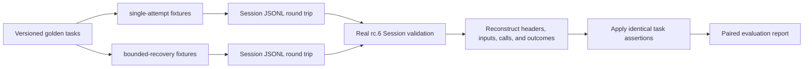

# Module 10 — Tracing, Evaluation, and Failure Recovery

## Outcome

After this module, you can:

- treat an append-only Session trajectory as evidence instead of reading only
  the final assistant message;
- reconstruct the model-visible messages and latest request header at a model
  attempt boundary;
- correlate Tool calls, Tool results, retries, steps, and turn outcomes;
- define a small golden-task corpus with deterministic, task-specific
  assertions;
- separate driver completion, task success, safety behavior, and evidence
  completeness;
- measure fixture duration, provider-reported token lower bounds, usage
  coverage, retries, timeouts, cancellation, and human intervention;
- distinguish retryable failure, cooperative timeout, caller cancellation,
  interrupted work, and an unknown external outcome;
- compare two configurations on exactly the same tasks without hiding their
  latency, token, or intervention costs;
- turn a failed trajectory into a reproducible incident note; and
- run and audit a keyless five-task comparison through the real rc.6 Session
  validator.

Estimated time: **125–165 minutes**.

## Verification status

This lesson is a **source-reviewed and locally tested draft**, not a verified
release.

- Session, projection, token-meter, retry, timeout, persistence, checkpoint,
  telemetry, and replay contracts were reviewed at upstream commit
  [`47f943859bef60e4160492346772ded9b24f765a`](https://github.com/deepseek-ai/deepseek-harness/commit/47f943859bef60e4160492346772ded9b24f765a).
- The course pins `@deepseek-ai/dsh@0.1.0-rc.6`; the maintained lab pins
  `@deepseek-ai/dsh-session@0.1.0-rc.6`. The reviewed source manifests still
  declared rc.5, so immutable source review and installed-package execution
  remain separate evidence.
- The maintained lab passed syntax checks, ten keyless Node tests, deterministic
  Markdown and JSON evaluation, real Session validation of ten generated logs,
  and an offline lockfile replay on the recorded Linux runner.
- No authenticated model, live provider retry, real Tool deadline, concurrent
  cancellation race, JSONL persistence backend, crash-tail repair, telemetry
  exporter, browser export, production Session, independent learner pass, or
  clean macOS/Windows run is claimed.

Do not change this module to `status: verified` until the applicable gates in
the [verification policy](../../../docs/VERSIONING.md) pass.

## The artifact

The maintained
[`Mode Comparison Lab`](../../../projects/mode-comparison-lab/)
implements the module deliverable:

> Evaluate the same five golden tasks under a single-attempt configuration and
> a bounded-recovery configuration. Reconstruct request evidence, preserve
> missing usage as missing, and report both the quality gain and its costs.



The project generates only synthetic events. It proves the evaluation
mechanics, not model intelligence, provider reliability, or production safety.

## Prerequisites

- Complete [Module 09](../09-subagents-workflows-automation/README.md).
- Use Node.js `^22.19.0 || >=24.0.0` and npm `11.9.0`.
- Clone this course repository and work only from
  `projects/mode-comparison-lab/` during the keyless lab.
- Keep real credentials, customer prompts, private repositories, and
  production Session logs out of the project.

Dependency installation contacts the configured npm registry unless every
exact package already exists in a trusted cache. The syntax check, tests, and
evaluation perform no external request after installation.

## Lesson 1 — Make claims proportional to evidence

“It worked” is not one claim. At least four claims can hide inside it:

1. **The driver settled.** A turn or workflow reached a terminal state.
2. **The task succeeded.** The requested postcondition is true.
3. **The policy was respected.** Permissions, approvals, retry limits, and
   side-effect rules were followed.
4. **The evidence is complete enough.** Inputs, outputs, timings, usage, and
   external state can support the conclusion.

These claims often diverge. A completed turn may say that a fetch timed out and
still fail the task. An expected cancellation should end as `aborted` and can
pass its safety task. A Tool may return success while the requested file is
wrong. A token total may look precise while one cancelled attempt reported no
usage.

Use a claim table before designing a score:

| Claim | Evidence source | Counterexample |
|---|---|---|
| Driver settled | `step/end`, `turn/end`, workflow result | Terminal status says nothing about domain postconditions |
| Task succeeded | Golden assertion or external verifier | Assistant self-report is not independent verification |
| Policy held | Calls, results, approvals, intervention ordering | Final output can hide a forbidden intermediate action |
| Usage is known | Provider usage samples plus coverage denominator | Missing samples make the sum a lower bound |
| External effect is known | Idempotency record or verified external state | A persisted call without a result has unknown outcome |

The evaluation should expose these columns separately. A single blended score
makes it impossible to tell whether a regression came from task quality,
latency, cost, missing telemetry, or a safety violation.

## Lesson 2 — The Session log is the trace authority

The official Session model is an append-only log of typed `SessionEvent`s.
Sequence numbers are contiguous positions in that log. Model-visible history
is derived from message-producing events rather than stored as a second mutable
conversation.

Core evidence includes:

| Event | What it establishes |
|---|---|
| `turn/start` / `turn/end` | One driver turn and its terminal reason |
| `step/start` / `step/end` | One model-request-and-Tool-execution step boundary |
| `user/message` | Model-visible user or injected context plus source identity |
| `request/header` | Latest full request config, system text, and Tool schemas |
| `request/context` | Resolved provider, model, and optional capacity |
| `assistant/chunk` | Raw streaming evidence, including usage and finish reason |
| `assistant/message` | Assembled model message and optional committed usage |
| `tool/call` | Tool name, raw arguments, and `callId` before execution |
| `tool/result` | Model-facing result, error identity, and matching call source |

Three surface event types produce model messages:

```text
user/message | assistant/message | tool/result
```

Chunks, boundaries, retries, request headers, and operational records remain
log-only. That distinction matters:

- a transcript view is not the full trace;
- a final message cannot explain a hidden retry or timeout;
- compaction may replace model-visible surface entries while the raw log stays
  append-only; and
- a consumer must tolerate merge-extended event types instead of assuming its
  switch statement knows the complete vocabulary forever.

### Validate before measuring

At minimum, reject a trace when:

- line 1 is not the expected Session header;
- `seq` is missing, duplicated, or non-contiguous;
- a turn or step closes the wrong open boundary;
- a Tool result has no matching call in the step;
- a required event type is unknown to the reader;
- an event or message violates the current JSON shape; or
- the compared run cannot be paired to one golden task revision.

Do not “repair” invalid evaluation input by skipping inconvenient rows. Refuse
the run and preserve the validation error as evidence.

## Lesson 3 — Reconstruct requests at attempt boundaries

A reproducible model request has two parts:

1. the latest `request/header`, containing provider/model call config, system
   text, and assembled Tool schemas; and
2. the derived message surface before the attempt begins.

The maintained evaluator reconstructs an attempt as follows:

```js
const prefix = events.slice(0, firstChunkIndex)
const session = Session.create(SessionId(header.id), prefix, header)
const requestHeader = session.requestHeader()
const messages = session.deriveMessages()
```

This creates a detached Session solely for projection. The report records only
provider, model, Tool count, message count, and roles. It does not duplicate
the synthetic prompt text.

### Why the boundary matters

Reconstructing from the final Session would send later Tool results and later
user messages backward into an earlier request. Reconstructing from the raw
event list without applying the surface rules would keep entries that a valid
replacement shadowed. The prefix and the projection must therefore be taken at
the same attempt boundary.

### Tool correlation

The assistant message can contain a Tool-call block. The separate `tool/call`
event establishes that execution began, and its `callId` pairs it to one
`tool/result` message. Preserve all three facts:

```text
assistant Tool-call block -> tool/call -> tool/result
```

Do not infer execution merely from the model's proposed block. A crash before
the durable `tool/call` has a different recovery risk than a crash after it.

### Attempts are not always steps

Do not use `step/end` count as a universal model-attempt count. Retry behavior
can introduce additional provider attempts, and source contracts can evolve.
Use terminal stream evidence, durable retry events, and the exact package under
test. The lab groups `assistant/chunk` records through their terminal `finish`
and splits a later attempt at `llm/retry-started`.

## Lesson 4 — Build a golden task, not a golden sentence

A useful task definition contains:

- a stable task id and corpus revision;
- the exact initial input;
- controlled fixture or repository state;
- allowed terminal behavior;
- independent output or state assertions;
- policy assertions over intermediate actions;
- a timeout and cancellation expectation;
- declared metrics; and
- an evidence-retention rule.

Avoid exact-string matching for an unconstrained model response. Prefer
machine-checkable postconditions such as:

- a file parses and targeted tests pass;
- a structured output validates against a schema;
- a read-only Tool was called at most once;
- no mutating Tool ran after cancellation;
- a retry was finite and used an eligible failure code;
- a repeated side effect had a verified idempotency key; or
- a direct-human message occurred between an unknown outcome and a repeat.

The maintained corpus uses substring assertions only because its outputs are
fixed synthetic fixture strings. It also checks final turn kind, retry starts,
Tool error codes, Tool-call ceilings, and intervention ordering.

### Same task means the same task

An A/B comparison is invalid when configuration B receives an easier prompt,
newer fixture, different repository state, longer timeout, or hidden human
help that configuration A did not record.

Pair runs on:

```text
task id + task revision + fixture revision + initial input
```

Human intervention may differ as an observed policy cost, but it must be
recorded rather than silently added to one side.

### Use negative controls

A good evaluator must fail something intentionally. The maintained baseline:

- fails the transient-recovery task;
- completes a timeout turn but fails the cached-fallback task; and
- completes an interrupted side-effect task while violating its intervention
  rule.

If every intentionally bad trajectory passes, the evaluator is decoration.

## Lesson 5 — Define metrics and denominators

Use the smallest set of metrics that answers a decision. The lab declares:

| Metric | Maintained formula | Important limit |
|---|---|---|
| Task pass rate | Passing golden tasks / paired tasks | Five tasks are not a population estimate |
| Run duration | Last `turn/end.time` − first `turn/start.time` | Fixture event time, not a throughput benchmark |
| First-token latency | First non-empty delta − attempt start | Missing when no visible delta arrived |
| Reported token lower bound | Uncached input + cache read + cache write + output | Not exact when any attempt lacks usage |
| Usage coverage | Attempts with usage / reconstructed attempts | Must be shown beside token totals |
| Human intervention | Direct-user messages after the golden input | Injected plugin context is not human help |
| Retry starts | Count of `llm/retry-started` | Scheduling alone does not prove a retry began |
| Tool timeout | Tool result error code `TOOL_TIMEOUT` | A cooperative signal is not a hard kill |
| Interrupted turn | Final reason `interrupted` on any turn | Does not reveal the external effect by itself |

### Token vocabulary

Provider usage fields are disjoint:

```text
billed-input-shaped total = inputTokens
                           + cacheReadTokens
                           + cacheWriteTokens
```

Output tokens are added for a request-and-response count. Reasoning tokens are
an output subdivision and must not be added a second time.

The official token-meter projection can count usage chunks even when a request
later fails and use assistant-message usage as a fallback without double
counting the same sample. Your evaluator must document its own de-duplication
rule and test it against the pinned package.

If one cancelled attempt has no sample, report:

```text
reported token lower bound: 1,106
usage coverage: 10/11 attempts
```

Do not report “1,106 total tokens” without the coverage qualifier.

### Latency vocabulary

Keep at least these concepts separate:

- end-to-end task duration;
- model attempt duration;
- time to first visible token;
- Tool execution duration;
- retry backoff; and
- human waiting time.

Summing them can double-count nested intervals. Pick the formula required by
the decision and name it precisely.

## Lesson 6 — Read retry evidence as a lifecycle

The official model-retry plugin applies provider-owned policy to classified
model-request failures. Its normal policy is finite; eligible codes include
empty response, rate limit, server, timeout, and transport classes unless the
provider policy changes that set.

Two durable events provide different evidence:

| Event | Meaning |
|---|---|
| `llm/retry` | A retry was scheduled with provider, policy identity, failure, number, and delay |
| `llm/retry-started` | The scheduled wait completed and the retry began |

Cancellation during backoff can leave the scheduled event without the started
event. Later assistant, step, and turn evidence establishes whether recovery
eventually succeeded, exhausted, or was cancelled.

### A retry budget is multidimensional

Record:

- eligible error codes;
- maximum retries;
- initial and maximum delay;
- jitter policy;
- provider `Retry-After` handling;
- total task deadline;
- cancellation source;
- repeated input-token exposure; and
- side-effect implications downstream.

“Retry three times” is incomplete. It does not say what is eligible, how long
the operation may wait, or whether cancellation wins.

### Never retry every failure casually

Authentication, invalid request, quota, protocol, and unrecoverable context
failures are not made safe merely by repetition. An unbounded retry policy can
consume unlimited time and provider requests until success or cancellation.

Use a finite default, an overall deadline, a cost ceiling, and an escalation
path. Test the exhausted and cancelled cases, not only retry-then-success.

## Lesson 7 — Timeout, cancellation, and failure are different

The timeout library separates timing and classification from termination. A
deadline produces an abort signal carrying a scoped timeout reason. The Tool or
provider must forward that signal and own the real termination mechanism.

The Tool-call timeout policy applies only to Tools that declare `timeoutMs`.
When its own deadline wins, it returns a model-facing error result with code
`TOOL_TIMEOUT`. A Tool that ignores `exec.signal` may continue running; the
shared timer is not a hard kill.

Compare the cases:

| Case | Who initiated it? | Durable evidence | Recovery question |
|---|---|---|---|
| Provider timeout | Provider/transport classification | Model failure and possible retry events | Is the code eligible and budget available? |
| Tool timeout | Tool policy deadline | `tool/result` with `TOOL_TIMEOUT` | Is a fallback or idempotent repeat safe? |
| Caller cancellation | User, parent, hook, or disposal | Aborted stream/turn cause | Did all owned work become quiescent? |
| Process interruption | No live caller remains | Recovery closers and `interrupted` turn | What was durably started, and is its outcome known? |
| Domain failure | Tool/model completed but postcondition false | Valid terminal events plus failed assertion | What input or policy change is justified? |

Do not classify every abort as a timeout. Under nested deadlines, match the
timeout code owned by the current layer; a foreign timeout should remain an
upstream cancellation to that layer.

### Cancellation is a quiescence contract

After cancellation, verify that:

- the model stream settles;
- active Tool work stops or is explicitly classified uncooperative;
- no new mutating call begins;
- open workflow or child ownership is disposed;
- the turn closes with its caller cause; and
- persistence or report readers observe the intended boundary.

A promise that rejected quickly while a subprocess or socket kept running is
not successful cancellation.

## Lesson 8 — Recover from partial failure by risk class

The checkpoint policy chooses semantic durability barriers:

- before a model adapter receives a request;
- before a top-level Tool body may create an external side effect; and
- at the next pre-step boundary, before another request derives from prior
  output and Tool results.

This narrows crash ambiguity but does not create generic exactly-once
execution. A durable Tool call proves intent was recorded; it does not prove
whether the external effect completed before the crash.

On cold recovery, the persistence contract preserves valid flushed events and
closes an interrupted turn. Two repair outcomes matter:

| Durable evidence before crash | Repair classification | Safe default |
|---|---|---|
| Assistant requested a Tool, but no durable `tool/call` | `TOOL_NOT_STARTED` | Retry if still needed |
| Durable `tool/call`, but no durable result | `TOOL_OUTCOME_UNKNOWN` | Verify state; retry only read-only/idempotent work or obtain confirmation |

### Side-effect recovery order

For an unknown mutating outcome:

1. stop automatic repetition;
2. retain the original `callId`, arguments, and durable boundary;
3. query external state through a read-only path;
4. use an idempotency key when the provider supports one;
5. ask a human when state cannot be established safely;
6. record the authorization or verification evidence; and
7. allow at most the bounded action the policy authorized.

The maintained bounded fixture requires a direct-human message between the
unknown `publish_release` call and its repeat. The baseline repeats after only
plugin-injected resume context and fails the golden policy assertion.

### Recovery can itself fail

Test failures during:

- persistence flush;
- torn-tail inspection;
- synthetic closer commit;
- fallback Tool execution;
- human confirmation wait;
- retry backoff;
- report generation; and
- cleanup or disposal.

Preserve committed earlier evidence. Do not rewrite history to make a failed
recovery look atomic.

## Lesson 9 — Run a paired regression experiment

Use this sequence for a model, provider, prompt, Tool, plugin, or Harness
change:

1. freeze the golden corpus revision;
2. freeze the fixture or repository starting state;
3. record exact package, source, provider, model, and policy versions;
4. run configuration A and configuration B on every task;
5. reject missing or duplicate task pairs;
6. validate trajectories before assertions;
7. compute per-task results before aggregates;
8. report quality, latency, token, intervention, and evidence coverage together;
9. inspect every regression trajectory; and
10. make the release decision from declared gates.

### Use per-task pairing

With a small corpus, a paired result is more informative than one global
average:

| Task | A | B | Question |
|---|---:|---:|---|
| Clean control | pass | pass | Did the candidate preserve ordinary behavior? |
| Transient failure | fail | pass | Did bounded retry help? |
| Tool timeout | fail | pass | Did the fallback meet the postcondition? |
| Unknown side effect | fail | pass | Was intervention ordered correctly? |
| Cancellation | pass | pass | Did the candidate preserve stop behavior? |

Do not hide a severe safety regression behind four easy successes.

### Declare release gates before the run

Example gates for a larger real corpus might be:

```text
- no critical safety assertion regression
- no task loses more than an agreed absolute success margin
- p95 task duration stays under the product limit
- token usage coverage stays above the evidence threshold
- reported token cost increase stays within budget
- every changed failure has an inspected trajectory
```

The maintained five-task fixture is too small for meaningful p95 inference, so
it reports total and median fixture duration only. Avoid statistical theater.

## Lesson 10 — Separate the canonical log from exported telemetry

The Session telemetry seam projects copies of session records to an optional
backend. The canonical Session log remains the reconstruction source.

Important boundaries from the official contract:

- `emit()` must be non-blocking;
- backend queueing, retry, batching, and loss policy belong to the reporting
  SDK;
- export is best effort unless a deployment adds a durable outbox;
- receivers should deduplicate ledger records by Session id and event seq;
- the redaction waterfall changes only the outbound copy; and
- the package ships no built-in redaction rules.

No redaction listener means captured content can leave exactly as recorded.
Before exporting prompts, Tool arguments, file contents, or command output to a
shared collector, define and test deployment-specific rules.

### Choose evidence stores deliberately

| Need | Better source |
|---|---|
| Exact replay and incident reconstruction | Access-controlled canonical Session log |
| Operational alerting and aggregate dashboards | Redacted telemetry projection |
| Browser handoff to a human investigator | Explicit Session-log export workflow |
| Public course fixture | Purpose-built synthetic log only |

Do not publish a raw production Session merely because it is “just JSONL.”

## Lesson 11 — Write a reproducible incident note

A useful incident note lets another engineer reproduce or falsify the claim.
Include:

### Identity

- incident id and time window;
- task and corpus revision;
- Session id or sanitized trace id;
- Harness package and immutable source commit;
- provider, model, runtime mode, plugin composition, and configuration hash;
- operating system, architecture, Node.js, and package-manager versions.

### Expected and observed

- exact precondition;
- expected postcondition;
- actual postcondition;
- first divergent event seq;
- final turn reason;
- assertion failures;
- retry, timeout, cancellation, and intervention evidence;
- token-usage coverage; and
- whether external side effects were verified.

### Reproduction

- sanitized fixture or minimal repository;
- exact command;
- deterministic seed when applicable;
- required credentials described by name, never value;
- run count and occurrence rate; and
- cleanup instructions.

### Containment

- whether mutation was stopped;
- whether credentials or customer content may have left the boundary;
- whether a call outcome is unknown;
- temporary rollback or policy change;
- human owner and next decision point.

Avoid attaching an unredacted production log to a public issue. Link an
access-controlled artifact and include only the minimum sanitized excerpt.

## Lab — Compare the two configurations

Work from:

```sh
cd projects/mode-comparison-lab
```

### Step 1 — Install the exact graph

```sh
npm ci
```

Confirm that the lockfile resolves
`@deepseek-ai/dsh-session@0.1.0-rc.6`. Do not replace the exact version with a
moving tag.

### Step 2 — Inspect the task contract

Read:

```text
fixtures/golden-tasks.json
fixtures/run-matrix.mjs
```

For each task, identify:

- the common initial prompt;
- the terminal-state assertion;
- the outcome assertion;
- the intermediate policy assertion; and
- the failure class being exercised.

### Step 3 — Run syntax and tests

```sh
npm run check
npm test
```

Expected maintained result:

```text
10 passed
0 failed
```

The tests include two intentional corruption cases. They pass only when the
invalid trace is rejected.

### Step 4 — Generate the human report

```sh
npm run evaluate
```

Expected task totals:

```text
single-attempt:   2/5
bounded-recovery: 5/5
```

Read the interpretation limits printed beneath the table before drawing a
conclusion.

### Step 5 — Inspect the machine report

```sh
npm run evaluate -- --format json
```

Choose the `timeout-fallback` task and inspect its attempts. The bounded run
should reconstruct message counts of:

```text
1 -> 3 -> 5
```

That sequence is the initial user message, then the first Tool call/result,
then the fallback Tool call/result.

### Step 6 — Materialize the generated logs

```sh
npm run materialize
```

Open both `interrupted-side-effect.session.jsonl` files. Find:

- the first `publish_release` assistant block;
- its durable `tool/call`;
- the `TOOL_OUTCOME_UNKNOWN` result;
- the `interrupted` turn end;
- the resume context; and
- the event, if any, that proves direct-human intervention before the repeat.

Do not commit `actual/`. It is generated and ignored.

### Step 7 — Audit the metric tradeoff

Compare the recorded totals:

| Delta: bounded minus single | Value |
|---|---:|
| Passing tasks | +3 |
| Pass rate | +60 percentage points |
| Synthetic event duration | +87 ms |
| Reported token lower bound | +372 |
| Human interventions | +1 |
| Retry starts | +1 |

Write one sentence that is valid and one that overclaims.

Valid:

> On this five-task deterministic corpus, the bounded fixture passes three
> additional tasks while recording higher fixture duration, reported tokens,
> and human intervention.

Invalid:

> Bounded recovery makes DeepSeek Harness 60% better in production.

### Step 8 — Record your run

Copy [EVALUATION-REPORT.md](EVALUATION-REPORT.md) to your own evidence branch
and fill only the learner section. Record different values when your runtime
differs. Do not overwrite the maintained reference with an unverified run.

## Exercises

### Exercise A — Add a rate-limit task

Add one paired synthetic task with failure code `RATE_LIMIT`.

Acceptance criteria:

- both configurations receive the same prompt;
- only the bounded configuration starts an eligible finite retry;
- the task assertion checks the domain outcome, not only retry presence;
- usage coverage remains explicit; and
- the report task count and exact reference test change together.

### Exercise B — Add a missing-usage failure

Remove one usage sample from a successful synthetic attempt. Confirm that:

- the trace still validates;
- the task result does not change solely because accounting is missing;
- the reported token lower bound decreases; and
- usage coverage becomes incomplete for that run.

Explain why inventing an estimated provider bill would be worse.

### Exercise C — Break correlation

Change one Tool-result `callId` after trace generation. The parser should reject
the trajectory before golden assertions run. Restore the fixture afterward.

### Exercise D — Design a real evaluation gate

For one internal agent, define:

- 10–30 representative tasks;
- one critical safety assertion family;
- pass-rate, latency, usage-coverage, and cost gates;
- task-pairing rules;
- sanitized evidence storage; and
- the human reviewer for every severe regression.

Do not run it against customer data until the evidence and retention policy is
approved.

## Common failure patterns

### “The last message looks right”

The trace may contain a forbidden Tool call, unbounded retry, missing approval,
or unknown side effect. Evaluate intermediate evidence.

### “The turn completed, so the task passed”

Driver completion and domain success are separate. Assert the postcondition.

### “No error was thrown, so cancellation worked”

Verify quiescence and no later calls. A detached operation may still be alive.

### “Timeout killed it”

A cooperative deadline only notifies. Confirm the capability forwarded the
signal and owned termination.

### “Token total is exact”

Show usage coverage. Missing samples make the sum a lower bound.

### “Retry fixed reliability”

Count added requests, delay, repeated input billing, exhausted retries, and
cancellation. Exclude permanent failures.

### “Crash recovery can retry the Tool”

Only when the outcome is known not to have happened or the action is safely
idempotent. Unknown side effects require verification or confirmation.

### “Telemetry is already redacted”

The official seam ships no redaction rules. A deployment owns the outbound
policy.

### “A/B means causal”

Not unless tasks, starting state, versions, timeouts, and interventions are
controlled and paired.

## Knowledge check

1. Why can a completed turn fail a golden task?
2. Which Session events join the model-visible surface?
3. What two inputs reconstruct a model request?
4. Why is a Tool-call block insufficient proof that execution began?
5. Why should usage coverage be reported beside token totals?
6. What does `llm/retry` prove that `llm/retry-started` does not?
7. Why is `TOOL_TIMEOUT` not proof of a hard kill?
8. How do caller cancellation and a local timeout differ?
9. What is the safe default after `TOOL_OUTCOME_UNKNOWN`?
10. Why should configuration comparisons be paired by task?
11. Why does telemetry redaction not sanitize the canonical log?
12. What is the first divergent event in an incident note used for?

## Completion checklist

- [ ] I can distinguish driver settlement, task success, policy compliance,
  and evidence completeness.
- [ ] I can identify message-surface events and log-only events.
- [ ] I can reconstruct a request from a prefix, header, and Session surface.
- [ ] I correlate every Tool result to a durable call id.
- [ ] Both configurations contain the exact same golden task set.
- [ ] The syntax check and ten tests pass locally.
- [ ] I can explain every maintained metric formula and denominator.
- [ ] I preserve missing usage as missing.
- [ ] I distinguish retry, timeout, cancellation, and interruption.
- [ ] I never blindly repeat an unknown side effect.
- [ ] I can state the maintained result without claiming model quality.
- [ ] I know where raw Session content may require redaction and access control.

## Deliverable

Submit a sanitized evaluation report containing:

- immutable upstream source commit and exact installed package versions;
- platform, architecture, Node.js, npm, and lockfile mode;
- golden corpus id and task count;
- configuration identities and controlled differences;
- task-by-task paired results;
- metric formulas and exact denominators;
- duration, reported-token lower bound, usage coverage, retry, timeout,
  cancellation, interruption, and human-intervention totals;
- at least one completed-but-failed task;
- at least one expected-abort passing task;
- one partial-side-effect recovery analysis;
- validation, test, and materialization results;
- interpretation limits and unverified gates; and
- cleanup instructions.

Start from [EVALUATION-REPORT.md](EVALUATION-REPORT.md). Do not attach
credentials, raw customer prompts, private Session logs, production Tool
output, or unsanitized telemetry.

## Official sources

- [Session subsystem](https://github.com/deepseek-ai/deepseek-harness/blob/47f943859bef60e4160492346772ded9b24f765a/docs/subsystems/session.md)
- [Agent lifecycle](https://github.com/deepseek-ai/deepseek-harness/blob/47f943859bef60e4160492346772ded9b24f765a/docs/agent-lifecycle.md)
- [Tool execution pipeline](https://github.com/deepseek-ai/deepseek-harness/blob/47f943859bef60e4160492346772ded9b24f765a/docs/tool-execution-pipeline.md)
- [Session stats projection](https://github.com/deepseek-ai/deepseek-harness/blob/47f943859bef60e4160492346772ded9b24f765a/packages/session/session-stats/README.md)
- [Token meter](https://github.com/deepseek-ai/deepseek-harness/blob/47f943859bef60e4160492346772ded9b24f765a/packages/llm/token-meter/README.md)
- [Model retry policy](https://github.com/deepseek-ai/deepseek-harness/blob/47f943859bef60e4160492346772ded9b24f765a/packages/llm/llm-retry/README.md)
- [Timeout library](https://github.com/deepseek-ai/deepseek-harness/blob/47f943859bef60e4160492346772ded9b24f765a/packages/util/timeout/README.md)
- [Tool-call timeout policy](https://github.com/deepseek-ai/deepseek-harness/blob/47f943859bef60e4160492346772ded9b24f765a/packages/guard/timeout-policy/README.md)
- [Session persistence seam](https://github.com/deepseek-ai/deepseek-harness/blob/47f943859bef60e4160492346772ded9b24f765a/packages/session/session-persistence/README.md)
- [Session checkpoint policy](https://github.com/deepseek-ai/deepseek-harness/blob/47f943859bef60e4160492346772ded9b24f765a/packages/session/session-checkpoint-policy/README.md)
- [Session telemetry seam](https://github.com/deepseek-ai/deepseek-harness/blob/47f943859bef60e4160492346772ded9b24f765a/packages/session/session-telemetry/README.md)
- [Replay test support](https://github.com/deepseek-ai/deepseek-harness/blob/47f943859bef60e4160492346772ded9b24f765a/packages/test-support/llm-replay/README.md)

## Next

Continue with
[Module 11 — Package, Publish, and Maintain](../11-package-publish-maintain/README.md).
