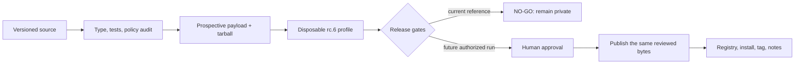

# Module 11 — Package, Publish, and Maintain

## Outcome

After this module, you can:

- distinguish a Cordis plugin module, a DSH bundle package, and a runnable DSH
  profile;
- define a narrow public contract for package exports, Tool schemas,
  configuration, permissions, and bundle composition;
- inspect the prospective npm payload instead of reviewing only the Git tree;
- keep source-host installation, registry installation, and tarball installation
  as different trust and build paths;
- test the exact packed artifact in a disposable DSH profile before release;
- separate credential-free verification from the privileged registry write;
- choose a SemVer increment from user-visible compatibility, not effort;
- write install, removal, upgrade, rollback, security, and migration guidance;
- use the `dsh-plugin` repository topic without implying official endorsement;
- monitor an immutable upstream reference and open a migration record when its
  contracts move; and
- issue an evidence-backed **GO** or **NO-GO** decision without publishing.

Estimated time: **110–150 minutes**.

## Verification status

This lesson is a **source-reviewed and locally tested draft**, not a verified
release.

- Bundle/profile packaging, profile reconciliation, git-install build
  permission, discovery, and upstream release automation were reviewed at
  immutable commit
  [`47f943859bef60e4160492346772ded9b24f765a`](https://github.com/deepseek-ai/deepseek-harness/commit/47f943859bef60e4160492346772ded9b24f765a).
- The course install package remains `@deepseek-ai/dsh@0.1.0-rc.6`; the reviewed
  source manifests still declare rc.5. Package execution and source review are
  therefore recorded as separate evidence.
- The maintained Repository Inspector release candidate passed strict type,
  keyless unit/runtime, prospective-payload, real tarball, exact rc.6 profile
  install/config/Loader-Web boot/removal, and offline lockfile checks on the
  recorded Linux runner.
- No npm package was published. The strict gate intentionally returns
  **NO-GO** because the manifest remains private; the course repository is also
  private at the reference date.
- Registry scope ownership, package-name reservation, protected publisher
  identity, public security reporting, provenance, public repository topic,
  clean macOS/Windows installs, authenticated model use, browser behavior,
  upgrade from a previously published version, and independent learner review
  remain unverified.

Do not change this module to `status: verified` until the applicable gates in
the [verification policy](../../../docs/VERSIONING.md) pass.

## The artifact

Module 11 promotes the existing
[`Repository Inspector`](../../../plugins/repository-inspector/)
from a build exercise to an auditable **release candidate**. It does not promote
it to a published release.



The deliverable contains:

- a machine-readable release contract and CLI audit;
- a prospective npm packlist with bounded inclusion and exclusion rules;
- a [release-readiness checklist](RELEASE-READINESS-CHECKLIST.md);
- [draft release notes](RELEASE-NOTES-DRAFT.md); and
- a dated [release audit record](RELEASE-AUDIT-RECORD.md).

The maintained outcome is deliberately blocked. A useful release gate prevents
a write when authority or evidence is missing.

## Prerequisites

- Complete [Module 10](../10-tracing-evaluation-failure-recovery/README.md).
- Use Node.js `^22.19.0 || >=24.0.0`, npm `11.9.0`, and pnpm `11.19.0`.
- Install the exact `@deepseek-ai/dsh@0.1.0-rc.6` CLI for the optional profile
  smoke.
- Work from `plugins/repository-inspector/` in a disposable clone or branch.
- Use only the included synthetic repository fixture.
- Do not log in to npm for this lab. No registry write is required or allowed.

Dependency installation contacts the configured registry unless every exact
package is already in a trusted cache. Build, tests, release audit, pack,
tarball install, config dump, and local Loader/Web smoke require no model
credential.

## Lesson 1 — Package the user contract, not the repository

The official DSH guide separates two package-shaped concepts:

| Concept | Owned by | Manifest key | Question answered |
|---|---|---|---|
| Bundle | Extension author | `dsh.bundle` | What configuration layer does this package contribute? |
| Profile | DSH user/CLI | `dsh.profile` | Which bundles compose this runnable setup, and in what order? |

A bundle is distributed. A profile is installed state under the user's
`DSH_HOME`. They are not interchangeable.

For an installable bundle, the public contract includes more than the root
JavaScript export:

- package name, version, module type, engines, and package manager;
- every `exports` and `types` target;
- `dsh.bundle.patch` and every plugin row it contributes;
- Tool names, argument schemas, result shapes, renderers, and error classes;
- configuration fields, defaults, bounds, and required services;
- permission and data-flow behavior;
- peer and runtime dependency expectations;
- install, removal, upgrade, and rollback behavior; and
- the support and deprecation policy.

Changing a Tool field, default root, patch row id, export, or required injection
can break a consumer even when the internal implementation became “cleaner.”
Inventory the public surface before choosing a version.

### Repository layout is not the payload

npm builds an archive from package metadata and packlist rules. A Git checkout
may contain source, tests, fixtures, lockfiles, local evidence, and build
configuration that should never be installed by a consumer. Conversely, an
export may point at generated `lib/` output that is absent from Git but required
inside the archive.

Use a positive `files` allowlist and inspect `npm pack --dry-run --json`. Verify
the archive contains every export and bundle patch, while excluding:

- `.env` and credential-like files;
- source and test fixtures not required at runtime;
- lockfiles that are not part of the consumer contract;
- sourcemaps or build metadata that disclose local paths;
- prior tarballs and generated profiles; and
- private evidence or production traces.

The maintained audit also caps file count and unpacked bytes. A size bound does
not prove safety, but it makes the payload review finite and detects surprising
growth.

## Lesson 2 — Make installation runnable and removable

Documentation is part of the release. A consumer should be able to answer:

1. What capability appears after installation?
2. What can it read, write, execute, or send over the network?
3. Which DSH and Node versions were actually tested?
4. Which configuration must the deployer supply?
5. How can the composed config be inspected before boot?
6. How is success and structured failure tested?
7. How is the bundle removed completely?
8. What state or external effects survive removal?

For a DSH bundle, a minimal artifact smoke is:

```text
pack exact candidate
  -> install tarball into disposable profile
  -> inspect profile manifest and --dump-config
  -> start Loader/application locally
  -> exercise one success and one denial
  -> unload or stop
  -> remove bundle
  -> prove dependency and layer are absent
```

Do not use a source checkout as the only release test. It can import files that
the archive forgot to include.

### Registry, tarball, and git are different channels

| Channel | What arrives | Build behavior | Primary risk |
|---|---|---|---|
| npm registry | Published archive | Prebuilt when the publisher packed it correctly | Wrong bytes, tag, access, or publisher |
| Local tarball | Exact reviewed archive | Prebuilt | Local file substitution or stale digest |
| Git host | Source checkout | Needs a `prepare`-style build for generated output | Install-time code execution and moving ref |

The official DSH guide warns that a TypeScript git dependency receives source,
not built `lib/`. A self-contained `prepare` script can build it, but pnpm 10+
requires the consumer to allow that build. That allowance authorizes package
code to execute during installation, outside the agent sandbox.

The course candidate chooses registry/tarball distribution and deliberately
ships no `prepare` hook. Git-host installation is unsupported. If another
package chooses the git channel, pin an immutable commit, review the build
script and transitive toolchain, and document the `allowBuilds` permission.

## Lesson 3 — Treat security notes as an interface

A release page that says “read-only” is incomplete. State the boundary in
operational terms:

- who selects the accessible root;
- which input the model controls;
- whether symlinks, traversal, and concurrent mutation are handled;
- which metadata may be returned to the model;
- whether the package writes, executes, or uses the network;
- what cancellation guarantees;
- what the process privilege can still access;
- which strings are untrusted data; and
- which limits bound acquisition and output.

Also document installation-time code. A runtime Tool with no subprocess access
can still have a powerful `prepare`, `preinstall`, or native build hook.

### Disclosure is not mitigation

Security documentation cannot replace containment, tests, or least privilege.
It establishes what maintainers promise and where a report can be sent without
publicly disclosing an exploit.

Before public release, provide:

- supported version ranges;
- a private vulnerability-reporting route;
- severity and response ownership;
- a coordinated disclosure rule;
- credential and private-data handling guidance; and
- a plan for deprecation, patched release, and consumer notification.

If the repository is not publicly reachable and no external security route
exists, public publication is a NO-GO.

## Lesson 4 — Gate the packed artifact

The upstream release workflow demonstrates a useful separation:

1. verify version and publishability;
2. build without registry credentials;
3. pack the whole release set;
4. install and exercise the packed artifacts;
5. retain the packed bytes as an artifact;
6. require a tagged, protected, human-authorized publish job; and
7. publish those exact bytes without rebuilding.

The important boundary is **artifact first, authority later**. Tests before a
second build do not prove the bytes uploaded by that second build.

For a course-owned plugin, use these gate families:

| Gate | Evidence |
|---|---|
| Source | typecheck, unit tests, negative tests, lifecycle cleanup |
| Manifest | name/version/license/author/repository/engines/dependencies |
| Bundle | patch exists, package-name resolution, config dump |
| Payload | exact packlist, export closure, legal files, no forbidden path |
| Consumer | tarball install, boot, success, denial, removal |
| Security | permission model, install scripts, dependency and secret review |
| Compatibility | exact DSH package and immutable source reference |
| Publication | publisher identity, protected environment, tag, dist-tag, same bytes |
| Operations | notes, migration, rollback, deprecation, owner, monitoring |

“CI passed” should name which row passed. It does not grant publication
authority.

### Never hide an expected blocker

The maintained audit has two modes:

- `release:audit` records all checks and exits zero in draft mode, even when the
  decision is NO-GO;
- `release:verify` is strict and exits non-zero on any blocker or unresolved
  external warning.

The draft command lets a course test preserve an expected negative result. The
strict command belongs in `prepublishOnly`. This offline candidate has no
mechanism to convert external warnings into protected attestations, so a future
release workflow must add and verify that evidence rather than suppressing it.
Removing or bypassing the strict gate to get a green terminal defeats the
exercise.

## Lesson 5 — Publish is a privileged, mostly irreversible action

npm identifies a release by package name and version. Once that combination is
used, it cannot be reused for different bytes. A failed partial release, wrong
dist-tag, or leaked credential is an operations incident, not a reason to
overwrite history.

A defensible workflow:

1. merge the version and release notes;
2. create an immutable candidate artifact in credential-free CI;
3. record its digest and all gate evidence;
4. test that artifact in a clean consumer;
5. require an authorized human approval;
6. publish the exact retained archive from protected CI;
7. query the registry for name, version, integrity, access, and dist-tag;
8. install by exact version from the registry into a clean profile;
9. tag the source commit and publish final notes; and
10. retain rollback, deprecation, and incident instructions.

The upstream scripts additionally compare a packed archive's integrity with an
existing registry version: missing publishes, identical skips, different bytes
under the same version fail. That makes retrying the same artifact safer and
detects content changes without a version bump.

### Dist-tags are mutable routing state

An npm tag such as `latest` or `next` is not a version. A bare install follows a
tag, so moving it changes what future users receive. Use prerelease versions and
`next` for rehearsals; install exact versions in compatibility evidence.

### Discovery is not endorsement

DeepSeek Harness asks community plugins to add the `dsh-plugin` GitHub topic.
That makes a public plugin repository discoverable. It does not mean DeepSeek
reviewed, secured, or supports the package.

The npm `keywords` array and the GitHub repository topic are separate surfaces.
Set both only when accurate. In this monorepo, do not label the entire private
course repository as a public plugin until the maintainers choose the intended
repository boundary.

## Lesson 6 — Version the contract you actually support

Semantic Versioning begins with a declared public API. For this plugin, include
Tool and config schemas, result meaning, package exports, patch rows, lifecycle,
and documented permission behavior in that API.

The course-owned pre-1.0 policy is deliberately conservative:

| Change | Example | Next version from `0.1.0` |
|---|---|---|
| Backward-compatible correction | Fix traversal rejection without changing valid input | `0.1.1` |
| Backward-compatible additive capability | Add an optional bounded field | `0.2.0` |
| Breaking pre-1.0 contract change | Rename Tool, remove field, widen privilege, change patch id | `0.2.0` plus migration note |
| Release rehearsal | Test intended `0.2.0` bytes | `0.2.0-rc.1` under `next` |

SemVer permits anything to change in `0.y.z`, but consumers still need useful
signals. This project never hides a breaking pre-1.0 change in a patch release.
After `1.0.0`, incompatible public-API changes require a major increment.

### Upstream versions do not choose your version automatically

A DeepSeek Harness prerelease change may be irrelevant, additive, or breaking
for this plugin. Run the compatibility corpus and classify the observed public
effect. Do not mirror the upstream version blindly.

Exact peer pins make this course's evidence narrow and honest. A real package
may support a range only after its lower and upper boundaries are tested. A
moving tag or untested caret range is not a compatibility statement.

## Lesson 7 — Maintenance begins before release

Record an upstream watch target:

- exact installed DSH package;
- immutable source commit reviewed;
- package manifests and public exports used;
- bundle/profile and CLI installation contract;
- Tool Runtime, Cordis, and Schemastery versions;
- Node and package-manager ranges; and
- known gaps between source and registry artifacts.

When a new DSH release appears:

1. open a compatibility review before changing pins;
2. diff the watched upstream paths and release notes;
3. reproduce the old package at the old pins;
4. install the candidate in a disposable profile;
5. rerun source, payload, consumer, security, and regression gates;
6. classify every public effect;
7. update the version, compatibility table, migration guide, and notes together;
8. retain the old supported line or deprecate it explicitly; and
9. publish only after the same-byte artifact is approved.

### Migration notes answer consumer questions

For each breaking or operational change, state:

- who is affected;
- the old and new contracts;
- required config/profile changes;
- state or Session implications;
- a detection command;
- the exact migration sequence;
- rollback limits; and
- the last supported version and deadline.

“Updated for the latest Harness” is not a migration note.

## Lab — Audit the Repository Inspector candidate

Work from:

```sh
cd plugins/repository-inspector
```

### Step 1 — Install the exact graph

```sh
pnpm install --frozen-lockfile
```

Confirm the lockfile resolves the exact versions in the README compatibility
table. Do not replace them with moving tags.

### Step 2 — Re-run source gates

```sh
pnpm typecheck
pnpm test
```

Expected maintained result:

```text
13 passed
0 failed
```

The five release-contract tests cover a complete candidate held for external
evidence, the intentional private blocker, absent exports and forbidden payload
paths, moving runtime ranges and incomplete disclosure, and a git-install build
warning.

### Step 3 — Produce the draft audit

```sh
pnpm release:audit
```

Expected decision:

```text
Decision: NO-GO
```

The only offline blocker should be `publication.enabled`, because
`private: true` remains. Four external warnings still require protected human
evidence and keep the overall decision at NO-GO.

Generate machine-readable evidence:

```sh
node scripts/release-audit.mjs --draft --json
```

Do not edit the JSON to say GO. Fix or satisfy gates, then regenerate it.

### Step 4 — Prove the strict gate stops

```sh
pnpm release:verify
```

Expected result: non-zero exit with the same private-publication blocker and
unresolved external evidence. This is an intentional negative test. If it exits
zero while either remains, the release gate is broken.

### Step 5 — Inspect and pack the candidate

First inspect without creating an archive:

```sh
npm pack --dry-run --json --ignore-scripts
```

Then create the exact local candidate:

```sh
export MODULE11_PACK_DIR="$(mktemp -d)"
npm pack --pack-destination "$MODULE11_PACK_DIR"
```

Record the filename, file count, packed and unpacked bytes, and a SHA-256 digest.
Do not commit the tarball.

### Step 6 — Install the exact archive

Use an isolated profile and the synthetic repository only:

```sh
export MODULE11_DSH_HOME="$(mktemp -d)"
export DSH_HOME="$MODULE11_DSH_HOME"
export DSH_REPOSITORY_INSPECTOR_ROOT="$PWD/test/fixtures/sample-repository"
dsh plugin --profile web add \
  "$MODULE11_PACK_DIR/borealbit-dsh-repository-inspector-0.1.0.tgz"
dsh --profile web --dump-config
```

Verify the profile dependency points to the tarball, the bundle list contains
`@borealbit/dsh-repository-inspector`, and the dumped layer resolves the package
by name. Start the local Web profile only after inspecting the config:

```sh
dsh --profile web
```

This proves Loader/application boot, not authenticated Tool use or browser UI.
Stop the process cleanly.

### Step 7 — Remove and verify absence

```sh
dsh plugin --profile web remove @borealbit/dsh-repository-inspector
dsh --profile web --dump-config
```

The dependency and bundle layer must both be absent. Unset the exercise values:

```sh
unset DSH_REPOSITORY_INSPECTOR_ROOT DSH_HOME MODULE11_DSH_HOME
```

Inspect the pack directory and remove only the exact temporary directories you
created. Never pass an empty or unresolved variable to a recursive cleanup
command.

### Step 8 — Make the release decision

Complete [RELEASE-READINESS-CHECKLIST.md](RELEASE-READINESS-CHECKLIST.md) and
review [RELEASE-NOTES-DRAFT.md](RELEASE-NOTES-DRAFT.md). The maintained decision
is NO-GO. List every remaining owner and the evidence that would close each
gate.

Do not run `npm publish`, remove `private: true`, create a public tag, change
repository visibility, or add a GitHub topic during this lab.

## Exercises

### Exercise A — Break an export

Change one `exports` target to an absent file, run the draft audit, and confirm
`payload.exports` blocks. Restore the manifest.

### Exercise B — Leak a synthetic file

Temporarily include a file named `.env.example-release-test` containing only a
fake sentinel. Confirm `payload.exclusions` blocks. Remove it; never use a real
credential.

### Exercise C — Classify three changes

Choose versions for:

1. a documentation typo with no contract effect;
2. a new optional result field; and
3. renaming `inspect_repository`.

State the public contract used in each decision.

### Exercise D — Write an upstream migration note

Assume a future DSH version changes bundle manifest shape. Draft affected
versions, detection, new config, install sequence, rollback, and support window.
Do not claim the hypothetical change occurred.

## Common failure patterns

### “The repository looks clean”

The registry receives a tarball. Inspect the packlist and exact archive.

### “Tests passed before pack”

Install and drive the archive. Generated exports may be absent or stale.

### “`npm pack` succeeded, so publish is safe”

Pack proves archive creation, not permissions, compatibility, publisher
identity, registry access, notes, or rollback readiness.

### “A README says read-only”

Review runtime code, configuration root, symlinks, output, install hooks, and
process privilege. Documentation alone is not containment.

### “Install from GitHub is equivalent”

Git dependencies may run a build from source and require an explicit pnpm build
allowance. Pin commits and treat install scripts as code execution.

### “`latest` is the current version”

It is mutable routing state. Record and test exact versions.

### “We can overwrite a bad version”

Publish a new version, correct the tag, deprecate the bad release, and write an
incident note. Do not try to reuse name/version identity.

### “Private means secure”

It prevents npm publication when set in `package.json`; it does not scan the
payload, authorize a future publisher, or define a vulnerability channel.

### “Adding `dsh-plugin` means official”

It is a discovery topic, not an endorsement or audit badge.

## Knowledge check

1. How do `dsh.bundle` and `dsh.profile` differ?
2. Why can a source checkout work while its npm archive fails?
3. Which channel can require a `prepare` build, and why is that permissionful?
4. Why should pack and publish be separate jobs?
5. What does a successful strict release gate prove—and not prove?
6. Why is `private: true` a useful intentional blocker here?
7. Which DSH surfaces belong to the plugin's public API?
8. Why should exact peers be broadened only after boundary testing?
9. Why is a dist-tag not compatibility evidence?
10. What must a clean-consumer smoke remove at the end?
11. When does a pre-1.0 change require a migration note in this project?
12. What evidence should trigger an upstream compatibility review?

## Completion checklist

- [ ] I can distinguish bundle, profile, plugin module, and package archive.
- [ ] I reviewed the manifest, bundle patch, exports, and packed files.
- [ ] Typecheck and all thirteen tests pass locally.
- [ ] Draft audit reports the intentional NO-GO decision.
- [ ] Strict verification fails on the private blocker.
- [ ] The exact tarball installs into a disposable rc.6 profile.
- [ ] Config dump and local Loader/application boot succeed.
- [ ] Removal deletes both dependency and bundle layer.
- [ ] I recorded archive identity and did not commit the tarball.
- [ ] I can explain every external release warning.
- [ ] I chose a version from public compatibility.
- [ ] I wrote usable install, removal, rollback, security, and migration notes.
- [ ] I did not publish, alter repository visibility, or expose credentials.

## Deliverable

Submit a sanitized release package containing:

- package name, proposed version, exact DSH package, and immutable source ref;
- public API and permission inventory;
- test, payload, tarball, clean-profile, and removal evidence;
- exact archive filename, inventory, size, and digest;
- completed release-readiness checklist with owners for open gates;
- draft release notes and migration/rollback position;
- GO or NO-GO decision with blockers;
- registry, repository, security, provenance, and cross-platform gaps; and
- cleanup confirmation.

Start from [RELEASE-READINESS-CHECKLIST.md](RELEASE-READINESS-CHECKLIST.md),
[RELEASE-NOTES-DRAFT.md](RELEASE-NOTES-DRAFT.md), and
[RELEASE-AUDIT-RECORD.md](RELEASE-AUDIT-RECORD.md). Do not include tokens,
`.npmrc`, private paths, customer data, production traces, generated profiles,
or package tarballs.

## Official sources

- [Official package-and-install guide](https://github.com/deepseek-ai/deepseek-harness/blob/47f943859bef60e4160492346772ded9b24f765a/docs/user/develop/basic/publish.md)
- [Official plugin CLI implementation](https://github.com/deepseek-ai/deepseek-harness/blob/47f943859bef60e4160492346772ded9b24f765a/apps/cli/src/plugin.ts)
- [Official community discovery guidance](https://github.com/deepseek-ai/deepseek-harness/blob/47f943859bef60e4160492346772ded9b24f765a/README.md#community-and-support)
- [Official DSH release workflow](https://github.com/deepseek-ai/deepseek-harness/blob/47f943859bef60e4160492346772ded9b24f765a/.github/workflows/release.yml)
- [Official release verification](https://github.com/deepseek-ai/deepseek-harness/blob/47f943859bef60e4160492346772ded9b24f765a/scripts/release/verify.ts)
- [Official release packing](https://github.com/deepseek-ai/deepseek-harness/blob/47f943859bef60e4160492346772ded9b24f765a/scripts/release/pack.ts)
- [Official artifact-first publication](https://github.com/deepseek-ai/deepseek-harness/blob/47f943859bef60e4160492346772ded9b24f765a/scripts/release/publish.ts)
- [Official release-sequence rationale](https://github.com/deepseek-ai/deepseek-harness/blob/47f943859bef60e4160492346772ded9b24f765a/.agents/notes/implemented/process/2026-08-10-npm-release-sequences.md)
- [npm package manifest rules](https://docs.npmjs.com/cli/v11/configuring-npm/package-json/)
- [npm pack](https://docs.npmjs.com/cli/v11/commands/npm-pack/)
- [npm publish](https://docs.npmjs.com/cli/v11/commands/npm-publish/)
- [Semantic Versioning 2.0.0](https://semver.org/spec/v2.0.0.html)
- [GitHub repository topics](https://docs.github.com/en/repositories/managing-your-repositorys-settings-and-features/customizing-your-repository/classifying-your-repository-with-topics)

## Next

Continue with **Module 12 — Capstone: Release Readiness Agent** when its draft
is published.
