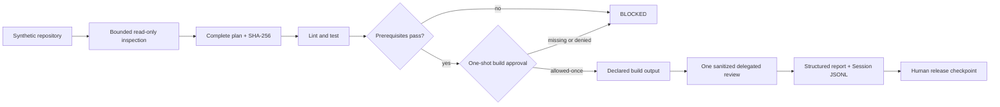

# Module 12 — Capstone: Release Readiness Agent

## Outcome

After this module, you can integrate the course into one practical, auditable
agent that:

- inspects a repository without modifying it by default;
- discovers scoped instructions, declared checks, and release metadata;
- presents a complete, digest-bound plan before execution;
- runs only declared lint, test, and build commands with bounded output;
- identifies missing release documents and obvious secret risks without
  retaining matched values;
- delegates one sanitized risk summary when a useful provider is available;
- requests one action-specific approval before a declared mutation;
- returns a structured readiness decision without claiming release authority;
- emits an append-only, validated Session evidence stream; and
- degrades to an honest `INCOMPLETE` or `BLOCKED` result when approval,
  delegation, or required evidence is unavailable.

Estimated time: **150–210 minutes**.

## Verification status

This lesson is a **source-reviewed and locally tested draft**, not a verified
production agent.

- Agent lifecycle, Tool execution, instructions, approval, Session, subagent,
  workflow, persistence, and telemetry contracts were reviewed at immutable
  upstream commit
  [`47f943859bef60e4160492346772ded9b24f765a`](https://github.com/deepseek-ai/deepseek-harness/commit/47f943859bef60e4160492346772ded9b24f765a).
- The course install target is `@deepseek-ai/dsh@0.1.0-rc.6`; the reviewed
  upstream source manifests still declare rc.5. Package execution and source
  review remain separate evidence.
- The maintained project passed syntax checks and thirteen keyless Node tests.
  Its deterministic success and blocked scenarios passed through the real
  rc.6 Session validator, real worker-thread workflow engine, and real
  subagent service seam on the recorded Linux runner.
- The write-capable evidence command was tested both without authorization,
  where it refused and wrote nothing, and with its explicit authoring flag,
  where it reproduced exactly four declared files.
- No authenticated model, browser, public registry, real publication,
  provenance service, production repository, OS-enforced sandbox, clean
  macOS/Windows install, security audit, or independent learner run is claimed.

Do not change this module to `status: verified` until the applicable gates in
the [verification policy](../../../docs/VERSIONING.md) pass.

## The capstone

The maintained
[`Release Readiness Agent`](../../../projects/release-readiness-agent/)
reviews a synthetic release candidate. It is deliberately narrower than a
general coding agent and deliberately weaker than a release authority.



The strongest maintained result is `READY_FOR_HUMAN_REVIEW`. Every report
also says:

```json
{
  "releaseAuthorized": false,
  "humanApprovalRequired": true
}
```

There is no `GO` state, publishing credential, registry client, tag operation,
or publish function in the capstone.

## Prerequisites

- Complete [Module 11](../11-package-publish-maintain/README.md).
- Use Node.js `^22.19.0 || >=24.0.0` and npm `11.9.0`.
- Work only from `projects/release-readiness-agent/` for the maintained lab.
- Use the included synthetic fixture; do not point the project at a private or
  production repository.
- Keep model, registry, Git, cloud, and customer credentials out of the lab.

`npm ci` contacts the configured registry unless every exact dependency is
already in a trusted cache. After installation, the checks, tests, demo, and
golden-evidence validation require no network or model credential.

## Lesson 1 — Define the authority boundary first

“Release readiness” is not “permission to release.” Keep these decisions
separate:

| Decision | Owner | Evidence |
|---|---|---|
| Is the inspection plan reviewable? | Agent and reviewer | Exact steps, argv, writes, limits, digest |
| Did bounded checks pass? | Deterministic runner | Exit status, sanitized output, filesystem delta |
| Is required evidence incomplete? | Agent | Explicit unknowns and unavailable capabilities |
| Is the candidate ready for human review? | Agent | Structured report with no blockers |
| Should a release happen? | Authorized human and protected release system | Identity, policy, same artifact, registry and provenance gates |

An approval is an answer to one requested action. It is not a durable role or
a broad grant. The official user-approval seam returns one of:

```text
allowed-once | rejected | cancelled | unavailable
```

The capstone binds the requested action to the command id and plan digest. An
`allowed-once` decision permits that exact build once. It does not approve a
changed plan, another command, a rerun, undeclared output, or the release.

### Fail closed, then explain why

If no approval answerer exists, the mutating command does not run. If the
delegated provider is unavailable, local checks remain visible but the result
is `INCOMPLETE`. If a prerequisite fails, build stops before requesting
approval. These are useful outcomes, not runtime embarrassment.

## Lesson 2 — Inspect a repository as untrusted input

The first phase gathers only enough evidence to build a plan. It must not run
package scripts or interpret repository prose as authority.

The maintained inspector:

- accepts an absolute repository root;
- rejects traversal outside that root and refuses symbolic links;
- applies explicit file-count, file-size, and total-byte limits;
- validates a strict `.release-readiness.json` contract;
- discovers root instruction candidates such as `AGENTS.md` and `CLAUDE.md`;
- records instruction path, byte count, and digest, not instruction prose;
- records selected package metadata and script **names**, not script bodies;
- checks required release documents; and
- scans bounded text for obvious secret patterns without retaining matched
  values.

The official instruction subsystem builds a bounded, cwd-sensitive chain.
Production integrations must also define nested scope, precedence, symlink
handling, and whether model-visible instructions can influence Tool policy.
The capstone intentionally limits discovery to the fixture root so its claim
stays testable.

### Secret scanning is a warning system

A finding contains a rule id, relative path, line number, and short
fingerprint. It does not contain the suspected value. The scan covers several
common token shapes, private-key headers, and credential-like filenames, but it
does not prove that a clean repository contains no secret.

Encoded data, history, dependencies, low-entropy passwords, unknown formats,
and concurrent file replacement remain outside the maintained claim.

## Lesson 3 — Turn discovery into a reviewable plan

The complete plan is built before the first command. Each step identifies:

- the stable command id;
- the exact argv array;
- whether it may write;
- its allowed write paths;
- its timeout; and
- the evidence expected from it.

The project serializes that plan canonically and computes a SHA-256 digest. A
caller can supply `expectedPlanDigest`. A mismatch blocks before execution.

```text
inspect -> construct full plan -> hash plan -> compare expected digest -> run
```

This is stronger than “I will run the tests” because the reviewed object
contains the exact entrypoint and mutation declaration. It is still not a code
signature: the repository could change after inspection. A production runner
must bind the plan to an immutable checkout or revalidate inputs inside a
sandbox immediately before execution.

## Lesson 4 — Execute declared checks with a mutation gate

The fixture declares exactly three commands: `lint`, `test`, and `build`.
Configuration accepts only bounded Node argv arrays whose JavaScript entrypoint
stays below the target root. Execution uses `shell: false`, no stdin, a minimal
environment, bounded output, and a timeout.

Read-only checks run first. Build is eligible only when they pass. The runner
then asks for its digest-bound action id and consumes `allowed-once` at the call
site.

```text
lint pass -> test pass -> ask once -> build once
lint fail -> test result retained -> build skipped -> no approval request
```

The runner snapshots files before and after each command. A change from a
declared read-only command, or a changed path outside a mutating command's
allowlist, becomes a blocker.

### Detection is not containment

Snapshots detect a filesystem violation after it happened. They cannot prevent
network access, out-of-tree writes, child processes, device access, or damage
performed before cancellation. Worker threads are also not a security
boundary. Run untrusted checks inside an OS sandbox with explicit filesystem,
process, environment, and network policy.

## Lesson 5 — Inspect release metadata without overclaiming

The agent checks a narrow release surface:

- package name, version, private flag, license, Node range, and declared script
  names;
- required `README`, `SECURITY`, `CHANGELOG`, and `NOTICE` files;
- bounded repository inventory;
- obvious secret-risk findings;
- command outcomes and unexpected mutations; and
- evidence limitations.

This integrates the artifact-first reasoning from Module 11 but does not pack
or publish. A real release gate must separately inspect the exact archive,
consumer install, publisher identity, protected environment, provenance,
registry state, rollback, and support route.

Never convert “all maintained checks passed” into “safe to publish.” Report the
claim that the evidence supports: `READY_FOR_HUMAN_REVIEW`.

## Lesson 6 — Delegate one bounded question

Delegation is useful only when the child receives a clear contract and less
authority than the parent-owned release checkpoint. The capstone delegates one
risk-synthesis request containing only:

- target label;
- instruction count;
- missing metadata or document names;
- secret rule ids, never matched values;
- command ids and outcomes;
- blocker ids; and
- explicit unknowns.

The real rc.6 worker-thread workflow engine runs a fixed script with a maximum
of one child. A deterministic provider implements the real subagent seam but
has no model, filesystem, process, environment, network, continuation,
mutation, or nested-delegation interface. The owner pairs start/end evidence
and disposes the child on every settled path.

This validates composition and lifecycle, not model reasoning. A future
provider integration must fix model, Tool, cwd, sandbox, network, token, time,
and depth policies. Upstream also warns that filtering a child's Tools is not
by itself an authority ceiling.

### Safe degradation

When delegation is unavailable, do not substitute a fabricated review. Keep
the local evidence, name the missing capability, return `INCOMPLETE`, and keep
`releaseAuthorized: false`.

## Lesson 7 — Make the Session the evidence authority

The official Session is an append-only log with contiguous sequence numbers.
Model-visible messages are a projection of events, not a second mutable source
of truth. The capstone records one synthetic turn with paired calls and results
for inspection, planning, commands, delegation, and report production.

Committed JSONL contains:

- one versioned Session header;
- balanced turn and step boundaries;
- contiguous `seq` values;
- paired Tool calls and Tool results;
- bounded, sanitized JSON values; and
- a SHA-256 recorded in the report.

The validator reconstructs the log with the real
`@deepseek-ai/dsh-session@0.1.0-rc.6` implementation. It rejects malformed JSON
and sequence gaps instead of repairing golden evidence silently.

The trace is synthetic. It proves the event and validation mechanics; it does
not imply that an authenticated model performed the review.

### Treat telemetry as a separate disclosure boundary

The upstream telemetry seam does not promise built-in redaction for arbitrary
event data. Do not attach a production exporter until redaction, access,
retention, deletion, and external sharing have been tested. A locally sanitized
report does not prove that every downstream telemetry sink is safe.

## Lesson 8 — Produce an auditable decision

Use a small terminal vocabulary:

| Decision | Required interpretation |
|---|---|
| `READY_FOR_HUMAN_REVIEW` | All maintained bounded checks completed without a blocker; release is still unauthorized |
| `INCOMPLETE` | No completed check proved a blocker, but required evidence or capability is missing |
| `BLOCKED` | Metadata, secret, command, approval, mutation, or delegated-review evidence failed |

The report must expose blockers, warnings, limitations, plan identity, command
results, approval events, delegation lifecycle, Session identity, and explicit
non-authorization. A downstream system should branch on the structured fields,
not scrape prose.

The final human should be able to answer:

1. Which repository and plan were reviewed?
2. Which operations executed and which could mutate?
3. Who or what answered the approval request?
4. Which files changed?
5. Which evidence was unavailable?
6. Was delegation bounded and disposed?
7. Does the Session validate?
8. What additional release gates remain?

## Lab — Run and audit the capstone

### Step 1 — Install exactly

```sh
cd projects/release-readiness-agent
npm ci
```

Review `package-lock.json`. Do not replace exact rc.6 dependencies with moving
tags.

### Step 2 — Check source and run tests

```sh
npm run check
npm test
```

Expected maintained summary:

```text
13 passed
0 failed
```

The tests include unavailable approval, one-shot success, secret-value
non-retention, prerequisite failure, unavailable delegation, output redaction,
undeclared mutation, changed-plan refusal, Session corruption, and child
disposal.

### Step 3 — Run the disposable success demo

```sh
npm run demo
```

Expected semantic result:

```text
decision: READY_FOR_HUMAN_REVIEW
releaseAuthorized: false
sessionEvents: 19
```

The plan and Session digests are identities, not values to memorize. The demo
uses a fresh Session id, so its Session digest may differ from the committed
golden file while its structure and decision remain equivalent.

### Step 4 — Audit maintained success and failure

Open:

- [`golden-success.report.json`](../../../projects/release-readiness-agent/evidence/golden-success.report.json)
- [`golden-success.session.jsonl`](../../../projects/release-readiness-agent/evidence/golden-success.session.jsonl)
- [`golden-blocked.report.json`](../../../projects/release-readiness-agent/evidence/golden-blocked.report.json)
- [`golden-blocked.session.jsonl`](../../../projects/release-readiness-agent/evidence/golden-blocked.session.jsonl)

Confirm that the success case authorizes only the fixture build output and
still refuses to authorize release. Confirm that the blocked case retains the
secret rule and failing check but not the fake secret value, then skips build
before approval.

### Step 5 — Prove evidence writing is gated

First run the command without authoring authority:

```sh
npm run evidence
```

It must exit non-zero and write nothing. Only if you intentionally want to
reproduce the four synthetic files, run:

```sh
npm run evidence -- --approve-write-evidence
```

Review every diff and digest. Do not accept changed golden evidence merely
because the generator completed.

### Step 6 — Complete the evidence review

Use [CAPSTONE-EVIDENCE.md](CAPSTONE-EVIDENCE.md) to map each capstone behavior
to source, test, success evidence, blocked evidence, and remaining uncertainty.
Then complete [FINAL-RETROSPECTIVE.md](FINAL-RETROSPECTIVE.md).

## Exercises

### Exercise A — Remove the approval answerer

Run the fixture with the unavailable approval controller. Confirm that build
does not start, the approval event records `unavailable`, and the report stays
unauthorized.

### Exercise B — Change the reviewed plan

Capture a plan digest, change one command timeout or argv field in a temporary
fixture copy, and pass the old digest as `expectedPlanDigest`. Confirm that no
command starts.

### Exercise C — Make delegation unavailable

Use `delegationMode: 'unavailable'`. Confirm that completed local results remain
visible, the missing review is explicit, and the decision is `INCOMPLETE`.

### Exercise D — Attempt an undeclared write

Modify only a disposable fixture check so a read-only step writes one file.
Confirm that the after-snapshot records a blocker. Explain why detection is not
enough to run untrusted code safely.

### Exercise E — Add a synthetic secret risk

Use a fake sentinel in a disposable copy. Confirm the report records rule,
path, line, and fingerprint but not the value. Remove the copy afterward.

### Exercise F — Draft a production hardening plan

Choose one real repository type and write the required sandbox, command
registry, provider, human identity, persistence, telemetry, artifact,
provenance, rollback, and incident gates. Do not execute against the repository.

## Common failure patterns

### “The build approval means GO”

It permits one build action. Release authority belongs to a separate protected
system and human identity.

### “Read-only scripts cannot mutate”

A label is not containment. Verify deltas and use an OS sandbox.

### “The child has fewer Tools, so it is safe”

Tool presentation alone is not an authority ceiling. Fix all inherited and
external capabilities.

### “A clean secret scan proves there are no secrets”

Pattern scans are incomplete. Add history, dependency, entropy, and policy
review appropriate to the repository.

### “A worker thread is a sandbox”

It isolates execution mechanics, not filesystem, process, environment, or
network authority.

### “The final report is enough”

Validate the append-only event evidence and the actual filesystem outcome.

### “Unavailable means probably fine”

Missing evidence must remain missing. Use `INCOMPLETE`, not inferred success.

### “Regenerating golden files fixes the test”

It changes the evidence. Explain the semantic difference and retain expected
failure cases.

## Knowledge check

1. Why is release readiness different from release authorization?
2. What exactly does `allowed-once` permit?
3. Why is the plan digest checked before command execution?
4. Why are package script names recorded but their values not trusted?
5. What can an after-snapshot detect, and what can it not prevent?
6. Why does the blocked fixture stop before requesting build approval?
7. What data may cross the capstone's delegation boundary?
8. Why is a Tool filter not necessarily a child authority ceiling?
9. What does the real Session validator establish?
10. Why may a demo Session digest differ from golden evidence?
11. When should the result be `INCOMPLETE` instead of `BLOCKED`?
12. Which gates still belong to a protected release workflow?

## Completion checklist

- [ ] I can explain the agent's authority and non-authority boundaries.
- [ ] I inspected the strict repository and command contract.
- [ ] Syntax checks and all thirteen tests pass locally.
- [ ] The demo ends `READY_FOR_HUMAN_REVIEW` and unauthorized.
- [ ] I compared the success and blocked golden reports.
- [ ] I validated that matched secret values do not enter evidence.
- [ ] I can identify the exact command that requires approval.
- [ ] I can explain why file snapshots are not a sandbox.
- [ ] I observed safe degradation for missing approval or delegation.
- [ ] I checked paired child lifecycle and disposal evidence.
- [ ] I checked contiguous, paired Session evidence.
- [ ] I proved evidence materialization refuses without its explicit flag.
- [ ] I listed every production-hardening and independent-verification gap.
- [ ] I did not publish, tag, push a package, or use a real credential.

## Deliverable

Submit a sanitized capstone review containing:

- exact course package and immutable source references;
- target label, repository contract, instruction and metadata inventory;
- complete plan and digest;
- command outcomes and filesystem deltas;
- approval request, answer, scope, and consumption evidence;
- bounded delegation handoff, result, and disposal evidence;
- structured decision with blockers, unknowns, and non-authorization fields;
- validated Session JSONL and its digest;
- one passing and one blocked scenario;
- threat model and production-hardening backlog;
- install, cleanup, and removal steps; and
- final retrospective stating what the evidence does and does not prove.

Start from [CAPSTONE-EVIDENCE.md](CAPSTONE-EVIDENCE.md),
[FINAL-RETROSPECTIVE.md](FINAL-RETROSPECTIVE.md), and the maintained
[`evidence/` directory](../../../projects/release-readiness-agent/evidence/).
Do not include real credentials, private paths, customer data, production
repositories, production traces, generated dependency directories, or release
tokens.

## Official sources

- [Agent lifecycle](https://github.com/deepseek-ai/deepseek-harness/blob/47f943859bef60e4160492346772ded9b24f765a/docs/agent-lifecycle.md)
- [Tool execution pipeline](https://github.com/deepseek-ai/deepseek-harness/blob/47f943859bef60e4160492346772ded9b24f765a/docs/tool-execution-pipeline.md)
- [Session subsystem](https://github.com/deepseek-ai/deepseek-harness/blob/47f943859bef60e4160492346772ded9b24f765a/docs/subsystems/session.md)
- [Workspace instructions](https://github.com/deepseek-ai/deepseek-harness/blob/47f943859bef60e4160492346772ded9b24f765a/packages/context/agent-instructions/README.md)
- [One-shot user approval](https://github.com/deepseek-ai/deepseek-harness/blob/47f943859bef60e4160492346772ded9b24f765a/packages/interaction/user-approval/README.md)
- [Permission presets](https://github.com/deepseek-ai/deepseek-harness/blob/47f943859bef60e4160492346772ded9b24f765a/packages/interaction/permission-presets/README.md)
- [Sandbox service](https://github.com/deepseek-ai/deepseek-harness/blob/47f943859bef60e4160492346772ded9b24f765a/packages/sandbox/README.md)
- [Subagent subsystem](https://github.com/deepseek-ai/deepseek-harness/blob/47f943859bef60e4160492346772ded9b24f765a/docs/subsystems/subagent.md)
- [Subagent Tool](https://github.com/deepseek-ai/deepseek-harness/blob/47f943859bef60e4160492346772ded9b24f765a/packages/subagent/tool-subagent/README.md)
- [Workflow subsystem](https://github.com/deepseek-ai/deepseek-harness/blob/47f943859bef60e4160492346772ded9b24f765a/docs/subsystems/workflow.md)
- [Worker-thread workflow](https://github.com/deepseek-ai/deepseek-harness/blob/47f943859bef60e4160492346772ded9b24f765a/packages/workflow/workflow-worker-thread/README.md)
- [Session persistence](https://github.com/deepseek-ai/deepseek-harness/blob/47f943859bef60e4160492346772ded9b24f765a/packages/session/session-persistence/README.md)
- [Session telemetry](https://github.com/deepseek-ai/deepseek-harness/blob/47f943859bef60e4160492346772ded9b24f765a/packages/session/session-telemetry/README.md)

## Course completion

Module 12 completes the planned English **draft** sequence from Module 00
through Module 12. It does not make English v1 verified. Continue with the
[roadmap](../../../ROADMAP.md): close the recorded platform, authenticated,
browser, provider, persistence, publication, security, and independent-learner
gates before reopening localization.
