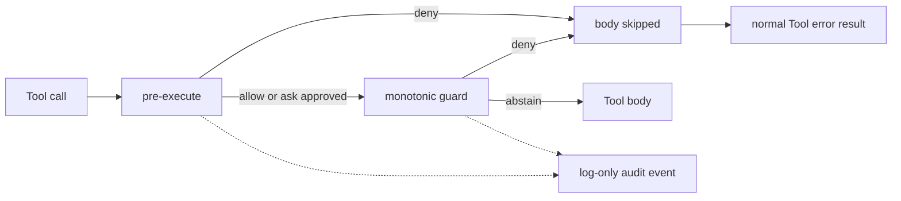

# Tool Policy Gate

> Copyright © 2026 Borealbit Technology Limited. Created by Dom Liu. This
> package documentation and its code samples are licensed under Apache-2.0.

`@borealbit/dsh-tool-policy-gate` is the native policy plugin built in
[Module 08 — Hooks, Context, and Session Engineering](../../course/en/08-hooks-context-session-engineering/README.md).
It denies configured exact Tool names before their bodies run and records a
typed, log-only decision when the execution belongs to an Agent Session.

This is a private course fixture. It is not a production authorization engine,
an operating-system sandbox, or a published package.

## Capability

For every Tool execution, the plugin:

1. checks a deployment-owned exact-name deny-list in the
   `tools/pre-execute` waterfall;
2. repeats that decision in a monotonic Tool guard so an earlier cooperative
   listener cannot short-circuit with allow;
3. returns the configured denial reason before the Tool body runs;
4. appends one `borealbit-policy/tool-decision` event when `exec.agent` exists;
5. omits Tool arguments and canonical result values from that custom event; and
6. releases its execution-token correlation state at `tools/result`.



## Why two enforcement registrations

`tools/pre-execute` is a cooperative waterfall. A listener can call `next()`,
return allow, deny, or ask, and intentionally take ownership of the downstream
decision. If a prepended listener returns allow without calling `next()`, a
later denial listener does not run.

Registered Tool guards run after pre-execute approval resolution and combine
monotonically: each guard may deny or abstain; another allow cannot override a
denial. The gate uses both points as defense in depth around one policy. A
per-execution token prevents duplicate audit records.

## Configuration

| Field | Required | Default | Constraint | Meaning |
|---|---:|---|---|---|
| `blockedTools` | Yes | — | 1–64 unique exact Tool names | Case-sensitive deny-list |
| `ruleId` | No | `course.blocked-tool` | Lowercase identifier, at most 64 characters | Stable policy rule identifier |
| `reason` | No | Deployment-owned default | 1–300 characters, no control characters | Model- and operator-visible denial reason |

Tool names accept letters, digits, `_`, `.`, `:`, `/`, and `-`, beginning with
an alphanumeric character. The normalized list is copied, sorted, and frozen.
Wildcards, regular expressions, argument inspection, identities, roles, and
time-based rules are intentionally unsupported.

The committed bundle patch blocks the Module 07 Tool:

```yaml
- insert:
    - id: borealbit-tool-policy-gate
      name: '@borealbit/dsh-tool-policy-gate'
      config:
        blockedTools:
          - inspect_repository
        ruleId: course.block.inspect-repository
        reason: The Module 08 practice policy blocks this Tool.
```

## Audit event

The plugin declaration-merges this event into `SessionEventMap`:

```json
{
  "type": "borealbit-policy/tool-decision",
  "data": {
    "policy": "tool-policy-gate",
    "ruleId": "course.no-unsafe-operation",
    "decision": "deny",
    "enforcementPoint": "pre-execute",
    "callId": "module08-audited-denial",
    "rootCallId": "module08-audited-denial",
    "tool": "course_unsafe_operation",
    "reason": "The Module 08 practice policy denies this synthetic operation.",
    "argumentsRecorded": false
  }
}
```

The event is log-only. `Session.deriveMessages()` does not project it into
model history. It is intended to sit beside core Tool events, which own the
canonical call and result. The custom record contains no argument object,
canonical Tool value, rendered content, environment data, or credential.

This privacy boundary is narrow: the core `tool/call` event can still own Tool
arguments. Protect raw Session logs according to their actual contents.

Appending a typed event does not create a UI renderer or durable store. A
persistence backend must save and reload it, and a client must deliberately
present it. Review custom-event compatibility whenever the pre-release Session
format changes.

## Agent-less calls

`ctx.tools.execute()` may be called without an Agent. Policy denial still
applies, but `exec.agent` is absent and there is no Session on which to append
the event. The plugin does not create a global fallback audit sink.

If a deployment requires durable coverage for direct programmatic calls, add a
separate scoped audit service with an explicit retention, privacy, and failure
policy. Do not disguise console output as a durable audit guarantee.

## Compatibility

| Component | Pinned version or reference |
|---|---|
| Node.js | `^22.19.0 \|\| >=24.0.0` |
| pnpm | `11.19.0` |
| `@deepseek-ai/dsh-tools` | `0.1.0-rc.6` |
| `@deepseek-ai/dsh-session` | `0.1.0-rc.6` |
| `@deepseek-ai/cordis` | `4.0.1` |
| `@deepseek-ai/schemastery` | `3.18.1` |
| Reviewed Harness source | `47f943859bef60e4160492346772ded9b24f765a` |

The reviewed source manifests declared rc.5 while the executed registry
packages were rc.6. The immutable source review and exact package pins are
separate evidence; byte identity between them is not claimed.

## Build and test

From this directory:

```sh
pnpm install --frozen-lockfile
pnpm typecheck
pnpm test
```

The six keyless tests exercise configuration normalization, pre-body denial,
exact case-sensitive matching, audit privacy and model-history exclusion, the
monotonic guard fallback, and plugin disposal. The tests use real Cordis,
System Prompt, Tool Runtime, and Session packages. The only Tool body is a
synthetic counter; it performs no filesystem, process, environment, or network
operation.

Inspect the prospective package without publishing:

```sh
pnpm build
npm pack --dry-run --ignore-scripts
```

## Temporary source overlay

Build the package, copy `cordis.patch.yml` outside the repository, and replace
the package name with the absolute path to `lib/index.js`. Inspect the generated
overlay and use a disposable DSH home:

```sh
pnpm build
export MODULE08_DSH_HOME="$(mktemp -d)"
export DSH_HOME="$MODULE08_DSH_HOME"
dsh --profile web --patch /absolute/path/to/module08.patch.yml --dump-config
dsh --profile web --patch /absolute/path/to/module08.patch.yml
```

Stop the process before rebuilding. Unset `DSH_HOME` afterward and delete only
the disposable directory you created. Do not commit an absolute runner path or
generated profile.

## Local bundle installation

The package declares `dsh.bundle.patch`. After building, it can be added to an
isolated Web profile:

```sh
export MODULE08_DSH_HOME="$(mktemp -d)"
export DSH_HOME="$MODULE08_DSH_HOME"
dsh plugin --profile web add /absolute/path/to/tool-policy-gate
dsh --profile web --dump-config
```

Remove it with the exact package name:

```sh
dsh plugin --profile web remove @borealbit/dsh-tool-policy-gate
unset DSH_HOME MODULE08_DSH_HOME
```

The reference Module 08 run verified the source-overlay configuration and real
Loader/Web HTTP boot. Local bundle addition remains a learner verification
step. This fixture intentionally has no `prepare` script and does not commit
build output.

## Package anatomy

| Path | Role |
|---|---|
| `src/index.ts` | Config schema, normalization, hooks, guard, and event type |
| `test/tool-policy-gate.test.js` | Six keyless contract and lifecycle tests |
| `cordis.patch.yml` | Local installable bundle layer |
| `scripts/clean.mjs` | Removes generated `lib` output before a build |
| `pnpm-lock.yaml` | Exact development dependency resolution |
| `LICENSE` and `NOTICE` | Apache-2.0 software terms and attribution |

## Lifecycle and failure behavior

All listeners and guards are registered as Cordis-owned effects. Disposing the
plugin fiber removes both enforcement registrations. Execution-token state is
cleared after every materialized Tool outcome, and fiber disposal releases the
closures holding the set.

If audit append throws for an agent-owned call, the teaching fixture lets that
failure propagate and the normal Tool pipeline converts the failure to an
error outcome. This is a fail-closed bias, but a production deployment must
choose and test its own audit availability policy.

## Known limitations

- Policy matches exact case-sensitive Tool names only.
- It does not inspect arguments, user identity, roles, workspace, time, or
  Tool semantics.
- A renamed or aliased capability needs another explicit list entry.
- It protects calls routed through the same Tool Runtime, not arbitrary code or
  another process.
- It is not an OS sandbox and cannot hard-kill same-process work.
- Agent-less calls are denied without a durable Session audit event.
- The custom event has no built-in browser renderer.
- Persistence and resumed-Session replay of the custom event have not been
  verified in the reference run.
- A post-execute listener may change visible error content, although it cannot
  make the skipped Tool body run retroactively.
- Authenticated model use, clean macOS/Windows runs, and independent learner
  reproduction remain unverified.

See the module's
[policy audit record](../../course/en/08-hooks-context-session-engineering/POLICY-AUDIT-RECORD.md)
for dated evidence and remaining promotion gates.
